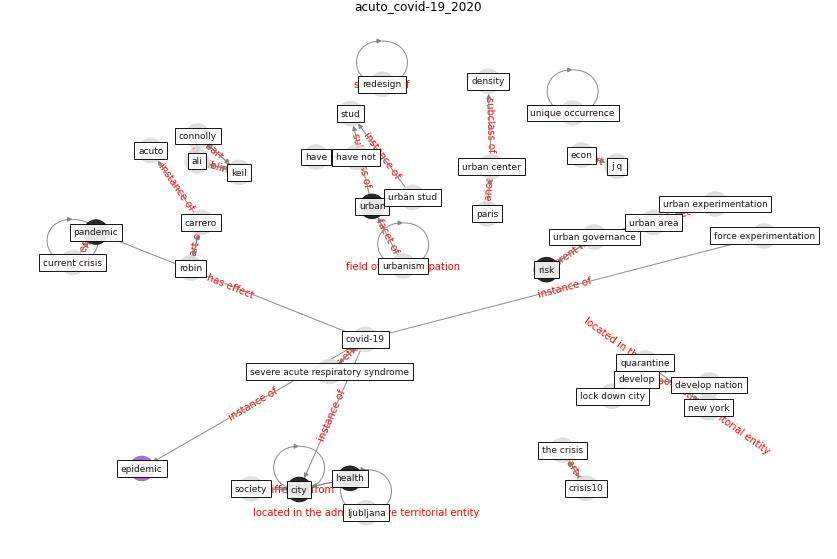

# Article: __COVID-19: Lessons for an Urban(izing) World__ (acuto_covid-19_2020)

* [10.1016/j.oneear.2020.04.004](https://doi.org/10.1016/j.oneear.2020.04.004)
* Cluster: [space-urban](cluster_13)

## Keywords

* [covid-19](keyword_covid-19), [city](keyword_city), [pandemic](keyword_pandemic), connolly, [urban center](keyword_urban_center), [urban governance](keyword_urban_governance), keil, [snyder](keyword_snyder), ali, [urban area](keyword_urban_area), stud, [urbanism](keyword_urbanism), current crisis, urban experimentation, have not

## Keywords at large

* [biophilic design](keyword_biophilic_design), [architecture](keyword_architecture), [sustainable architecture](keyword_sustainable_architecture), [nature](keyword_nature), [design](keyword_design), [biophilic](keyword_biophilic), [environ](keyword_environ), [biophilia](keyword_biophilia), [wellbeing](keyword_wellbeing), [health](keyword_health)

## Concepts

 

