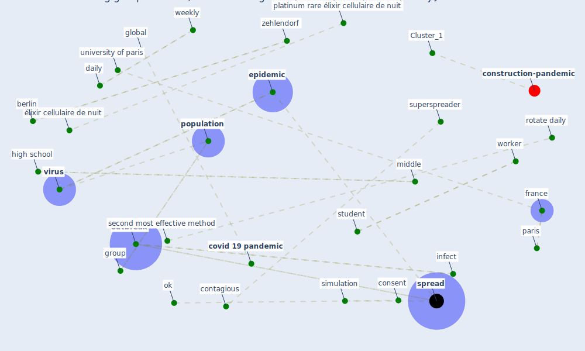

# Article: Rotating groups at work, school best against COVID-19 spread: Study (afp_rotating_2021)

* [https://www.dailysabah.com/life/health/rotating-groups-at-work-school-best-against-covid-19-spread-study](https://www.dailysabah.com/life/health/rotating-groups-at-work-school-best-against-covid-19-spread-study)
* Year: 2021
* Cluster: [construction-pandemic](cluster_1)

## Keywords

 * [berlin](keyword_berlin), cnrs, [consent](keyword_consent), contagious, corn, [coronavirus](keyword_coronavirus), [covid 19 pandemic](keyword_covid_19_pandemic), daily, [disease](keyword_disease), eau de parfum baume de nuit radia, eau de parfum perfectrice jeunesse, [education](keyword_education), [epidemic](keyword_epidemic), [france](keyword_france), full time telecommute, [germany](keyword_germany), global, group, high school, in person lesson, in person return to school, infect, [infection](keyword_infection), limit, middle, [ok](keyword_ok), online class, [outbreak](keyword_outbreak), paco rabanne, parfum, paris, platinum rare élixir cellulaire de nuit, [population](keyword_population), rotate, rotate daily, second most effective method, setting job privacy about we contact we rss, [simulation](keyword_simulation), [spread](keyword_spread), [student](keyword_student), superspreader, the cnrs, university of paris, [virus](keyword_virus), weekly, [worker](keyword_worker), zehlendorf, élixir, élixir cellulaire de nuit

## Concepts

 

## Neighbours

### Closest articles

* Multilevel Analysis of Personal, Non-Medical COVID-19-Related Impact Worldwide - [LINK](article_dye_multilevel_2020)
* Reframe how to serve your community in the midst of a pandemic - [LINK](article_sutton_reframe_2020)
* What has been the impact of the COVID-19 pandemic on immigrants? An update on recent evidence - [LINK](article_oecd_what_2022)
* How loneliness is talked about in social media during COVID-19 pandemic: Text mining of 4,492 Twitter feeds - [LINK](article_koh_how_2022)
* How Covid-19 Has Permanently Changed the Fitness Industry - [LINK](article_davalos_how_2021)
* 10 tech trends getting us through the COVID-19 pandemic - [LINK](article_yan_10_2020)
* Mental health economics: A prospective study on psychological flourishing and associations with healthcare costs and sickness benefit transfers in Denmark - [LINK](article_santini_mental_2021)
* COVID-19 and the rise of intimate partner violence - [LINK](article_aguero_covid-19_2021)
* A Platform for Citizen Cooperation during the COVID-19 Pandemic in RN, Brazil - [LINK](article_de_araujo_platform_2020)
* Assessing the health and hygiene performance of apartment buildings - [LINK](article_ho_assessing_2004)

### Closest BPs

* Blueprint: Resilience in staffing and skills training - [LINK](bp_12)
* Blueprint: Smart Locker System - [LINK](bp_1)
* Blueprint: Tracking and enforcing use of Personal Protective Equipment - [LINK](bp_23)
