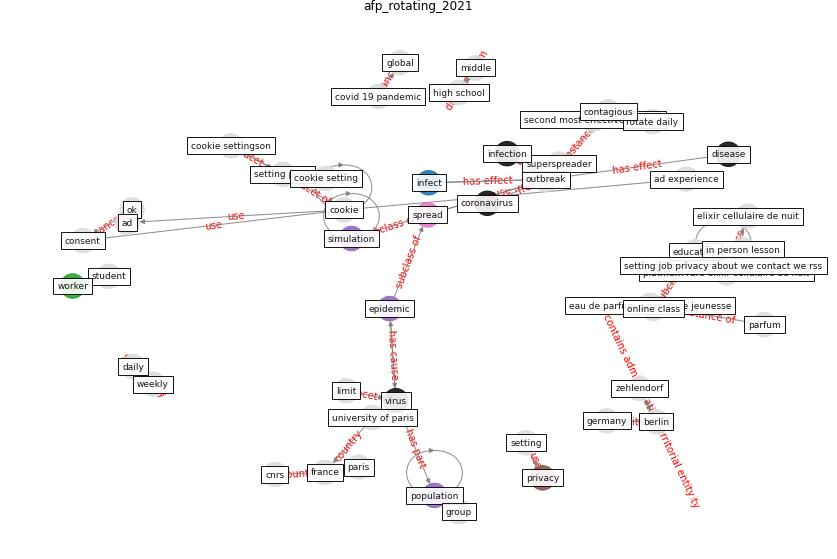

# Article: Rotating groups at work, school best against COVID-19spread: Study (afp_rotating_2021)

* [https://www.dailysabah.com/life/health/rotating-groups-at-work-school-best-against-covid-19-spread-study](https://www.dailysabah.com/life/health/rotating-groups-at-work-school-best-against-covid-19-spread-study)
* Year: 2021
* Cluster: [city-health](cluster_14)

## Keywords

 * [berlin](keyword_berlin), cnrs, [consent](keyword_consent), contagious, cookie settingson, corn, [coronavirus](keyword_coronavirus), [covid 19 pandemic](keyword_covid_19_pandemic), daily, [disease](keyword_disease), eau de parfum baume de nuit radia, eau de parfum perfectrice jeunesse, [education](keyword_education), [epidemic](keyword_epidemic), [france](keyword_france), full time telecommute, [germany](keyword_germany), [global](keyword_global), group, high school, in person lesson, in person return to school, infect, [infection](keyword_infection), [interaction](keyword_interaction), limit, middle, [ok](keyword_ok), online class, [outbreak](keyword_outbreak), paco rabanne, parfum, paris, platinum rare élixir cellulaire de nuit, [population](keyword_population), real world, rotate, rotate daily, second most effective method, setting job privacy about we contact we rss, setting page, [simulation](keyword_simulation), [spread](keyword_spread), [student](keyword_student), superspreader, the cnrs, university of paris, [virus](keyword_virus), weekly, [worker](keyword_worker), zehlendorf, élixir, élixir cellulaire de nuit

## Concepts

 

## Neighbours

### Closest articles

* How Covid-19 Has Permanently Changed the Fitness Industry - [LINK](article_davalos_how_2021)
* Reframe how to serve your community in the midst of a pandemic - [LINK](article_sutton_reframe_2020)
* 10 tech trends getting us through the COVID-19 pandemic - [LINK](article_yan_10_2020)
* Assessing the health and hygiene performance of apartment buildings - [LINK](article_ho_assessing_2004)
* Telehealth overpromises during the Covid-19 pandemic - [LINK](article_ostherr_telehealth_2020)
* A Platform for Citizen Cooperation during the COVID-19 Pandemic in RN, Brazil - [LINK](article_de_araujo_platform_2020)
* Covid-19 and community mitigation strategies in a pandemic - [LINK](article_ebrahim_covid-19_2020)
* Contributions to the mitigation of the COVID-19 pandemic - [LINK](article_pilz_contributions_2022)
* Construction of a Linked Data Set of COVID-19 Knowledge Graphs: Development and Applications - [LINK](article_wang_construction_2022)

### Closest BPs

* Blueprint: Resilience in staffing and skills training - [LINK](bp_12)
* Blueprint: Negative pressure rooms - [LINK](bp_13)
* Blueprint: Public places as information points - [LINK](bp_8)
