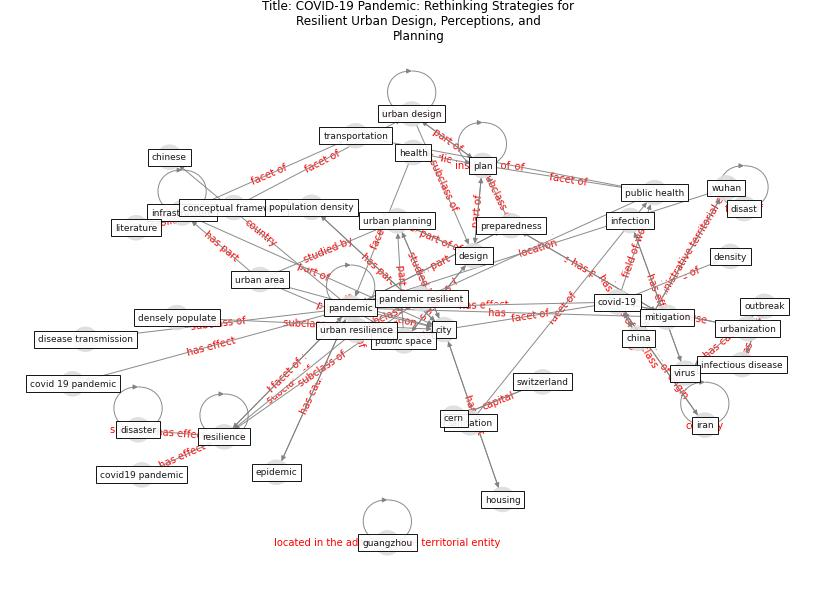

# Article: COVID-19 Pandemic: Rethinking Strategies forResilient Urban Design, Perceptions, andPlanning (afrin_covid-19_2021)

* [https://www.frontiersin.org/articles/10.3389/frsc.2021.668263](https://www.frontiersin.org/articles/10.3389/frsc.2021.668263)
* Year: 2021
* Cluster: [city-urban](cluster_7)

## Keywords

 * american, bodrud doza, cern, chief resilience officer, [china](keyword_china), [chinese](keyword_chinese), [city](keyword_city), city build environment, climate adaptation, [climate change](keyword_climate_change), conceptual framework, connolly, [control](keyword_control), [covid 19 pandemic](keyword_covid_19_pandemic), [covid-19](keyword_covid-19), covid19 pandemic, densely populate, [density](keyword_density), [design](keyword_design), develop country, dial, disast, disaster, disaster risk management, disease transmission, djalante, drm approach, earthquake, east mediterr, [economy](keyword_economy), emergency plan, environmental, [epidemic](keyword_epidemic), ewe, genre, guangzhou, hasankhan, [health](keyword_health), horizontal, [housing](keyword_housing), [infection](keyword_infection), [infectious disease](keyword_infectious_disease), [infrastructure](keyword_infrastructure), iran, [italy](keyword_italy), keil, kinsman, lak, literature, local, mitigation, mollalo, [monitor](keyword_monitor), mora, national, open space, [outbreak](keyword_outbreak), p l a n n I n g, [pandemic](keyword_pandemic), pandemic resilient, pandemic situation, person to person interaction, [plan](keyword_plan), population density, poverty, preparedness, preparedness phase, prog, [public](keyword_public), [public health](keyword_public_health), public health crisis, [public space](keyword_public_space), [resilience](keyword_resilience), response, sabouri, sanitation, science fiction, shaw, [shock](keyword_shock), [social](keyword_social), social capital, social life, social network, strategy, [surveillance](keyword_surveillance), [switzerland](keyword_switzerland), tay j ng y, [technology](keyword_technology), transportation, [united kingdom](keyword_united_kingdom), [urban area](keyword_urban_area), urban design, [urban planning](keyword_urban_planning), urban resilience, urbanization, [virus](keyword_virus), [vulnerability](keyword_vulnerability), [washington dc](keyword_washington_dc), [world bank](keyword_world_bank), [wuhan](keyword_wuhan)

## Concepts

 

## Neighbours

### Closest articles

* Respiratory pandemics, urban planning and design: A multidisciplinary rapid review of the literature - [LINK](article_harris_respiratory_2022)
* Learning from pandemics: Applying resilience thinking to identify priorities for planning urban settlements - [LINK](article_syal_learning_2021)
* Coronavirus questions that will not go away: interrogating urban and socio-spatial implications of COVID-19 measures - [LINK](article_salama_coronavirus_2020)
* The COVID-19 pandemic: Impacts on cities and major lessons for urban planning, design, and management - [LINK](article_sharifi_covid-19_2020)
* Epidemics, Planning and the City: A Special Issue of Planning Perspectives - [LINK](article_davis_epidemics_2022)
* COVID-19: Lessons for an Urban(izing) World - [LINK](article_acuto_covid-19_2020)
* Urban design attributes and resilience: COVID-19 evidence from New York City - [LINK](article_yang_urban_2021)
* Pandemic stricken cities on lockdown. Where are our planning and design professionals [now, then and into the future]? - [LINK](article_allam_pandemic_2020)
* Effects of the COVID-19 pandemic on the use and perceptions of urban green space: An international exploratory study - [LINK](article_ugolini_effects_2020)

### Closest BPs

* Building Adaptation during a pandemic - [LINK](bp_14)
* Architecture design - [LINK](bp_2)
* Tender support at building stage - [LINK](bp_9)
