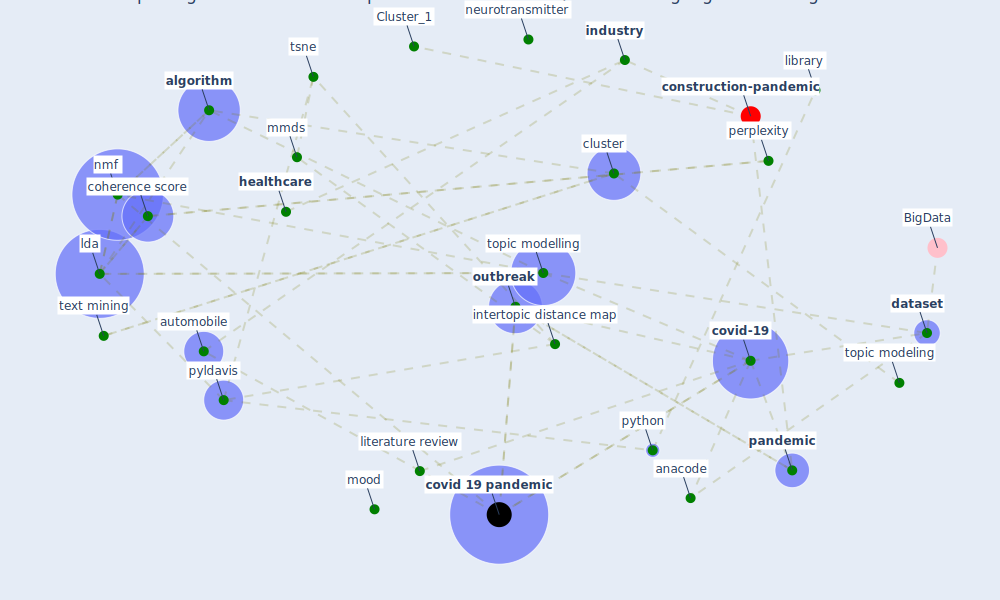

# Article: Exploring the Non-Medical impacts of Covid-19 using Natural Language Processing (agade_exploring_2020)

* Source: [10.5120/ijca2020920923](https://doi.org/10.5120/ijca2020920923)
* Year: 2020
* Cluster: [construction-pandemic](cluster_1)

## Keywords

 * 4thquadrant, acm, [algorithm](keyword_algorithm), alostad, anacode, automobile, bag of word, bigram, birla l, bubble, [business](keyword_business), classify, cluster, coherence score, consistency, content, [covid 19 pandemic](keyword_covid_19_pandemic), covid 19 public medium dataset, [covid-19](keyword_covid-19), covwe 19 outbreak, [dataset](keyword_dataset), dimension reduction, dimensionality reduction, dirichlet distribution, distribution, document clustering, [domain](keyword_domain), elon musk, emotion, finance, finding of paper, first, gensim, [government](keyword_government), [healthcare](keyword_healthcare), hegazi m, hegde a, [hiv](keyword_hiv), ijca, [impact](keyword_impact), [industry](keyword_industry), information retrieval, interactive chart, [internet](keyword_internet), intertopic distance map, ipv7, kalepalli y, [lda](keyword_lda), lda algorithm, lda model, library, literature review, mankind, [marketing](keyword_marketing), masthi r, metric, mmds, mood, neurotransmitter, nghiem s, nlp, nltk, nmf, nmf algorithm, non negative matrix factorization, [nurse](keyword_nurse), oakland university, [outbreak](keyword_outbreak), [pandemic](keyword_pandemic), past pandemic, perplexity, ppi, public domain, public medium, pyldavis, python, rbf kernel, realtime update, regex, semantic cluster, software engineering, source code, [state](keyword_state), strategic, sun z, tasneem s, text mining, tf idf, tokenize, topic 0, topic area, topic modeling, [topic modelling](keyword_topic_modelling), tran b, tsne, [usa](keyword_usa), word, zhao x, ḍus, ḯpesk

## Concepts

 

## Neighbours

### Closest articles

* COVID19-Routes: A Safe Pedestrian Navigation Service - [LINK](article_cantarero_covid19-routes_2021)
* Social distancing enhanced automated optimal design of physical spaces in the wake of the COVID-19 pandemic - [LINK](article_ugail_social_2021)
* COVID-ABS: An agent-based model of COVID-19 epidemic to simulate health and economic effects of social distancing interventions - [LINK](article_silva_covid-abs_2020)
* Risk Diagnosis and Mitigation System of COVID-19 Using Expert System and Web Scraping - [LINK](article_mufid_risk_2020)
* Digital Twin of COVID-19 Mass Vaccination Centers - [LINK](article_pilati_digital_2021)
* COVID-19 Bulletin 1: Alterations to BREEAM assessment requirements as a result of the Coronavirus pandemic – Knowledge Base - [LINK](article_breeam_covid-19_2020)
* EXPOSED: An occupant exposure model for confined spaces to retrofit crowd models during a pandemic - [LINK](article_ronchi_exposed_2020)
* Construction of a Linked Data Set of COVID-19 Knowledge Graphs: Development and Applications - [LINK](article_wang_construction_2022)
* Building occupancy estimation with people flow modeling in AnyLogic - [LINK](article_li_building_2016)
* A Platform for Citizen Cooperation during the COVID-19 Pandemic in RN, Brazil - [LINK](article_de_araujo_platform_2020)

### Closest BPs

* Blueprint: Resilience in staffing and skills training - [LINK](bp_12)
* Blueprint: Tracking and enforcing use of Personal Protective Equipment - [LINK](bp_23)
* Blueprint: Public places as information points - [LINK](bp_8)
