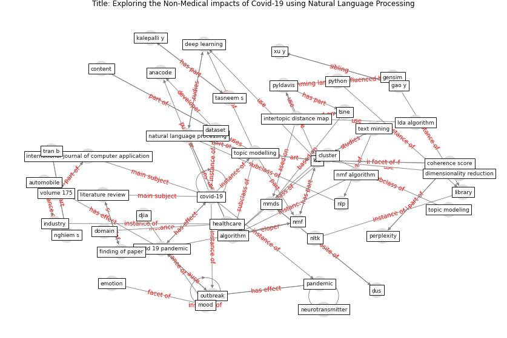

# Article: Exploring the Non-Medical impacts of Covid-19 using Natural Language Processing (agade_exploring_2020)

* Source: [10.5120/ijca2020920923](https://doi.org/10.5120/ijca2020920923)
* Year: 2020
* Cluster: [building-space](cluster_9)

## Keywords

 * 4thquadrant, acm, [algorithm](keyword_algorithm), alostad, anacode, asmussen, automobile, bag of word, birla l, bubble, [business](keyword_business), c b, classify, cluster, coherence score, consistency, content, [covid 19 pandemic](keyword_covid_19_pandemic), covid 19 public medium dataset, [covid-19](keyword_covid-19), covwe 19 outbreak, [dataset](keyword_dataset), [deep learning](keyword_deep_learning), dimension reduction, dimensionality reduction, dirichlet distribution, distribution, djia, document clustering, [domain](keyword_domain), ecosystem, elon musk, emotion, finance, finding of paper, first, gao y, gensim, global economy, [government](keyword_government), [healthcare](keyword_healthcare), hegde a, [impact](keyword_impact), [industry](keyword_industry), international journal of computer application, international relationship, [internet](keyword_internet), intertopic distance map, ipv7, kalepalli y, [lda](keyword_lda), lda algorithm, lda model, li y, library, literature review, mankind, [marketing](keyword_marketing), masthi r, metric, mmds, mood, natural language processing, neurotransmitter, nghiem s, nlp, nltk, nmf, nmf algorithm, non negative matrix factorization, [nurse](keyword_nurse), oakland university, [outbreak](keyword_outbreak), [pandemic](keyword_pandemic), past pandemic, perplexity, ppi, pyldavis, python, [social medium](keyword_social_medium), software engineering, source code, strategic, sun z, tasneem s, technical report, [technology](keyword_technology), text mining, tf idf, topic modeling, [topic modelling](keyword_topic_modelling), tran b, tsne, usa, volume 175, word, xu y, zhao x, ḍus, ḯpesk

## Concepts

 

## Neighbours

### Closest articles

* Social distancing enhanced automated optimal design of physical spaces in the wake of the COVID-19 pandemic - [LINK](article_ugail_social_2021)
* Risk Diagnosis and Mitigation System of COVID-19 Using Expert System and Web Scraping - [LINK](article_mufid_risk_2020)
* COVID19-Routes: A Safe Pedestrian Navigation Service - [LINK](article_cantarero_covid19-routes_2021)
* Construction of a Linked Data Set of COVID-19 Knowledge Graphs: Development and Applications - [LINK](article_wang_construction_2022)
* Digital Twin of COVID-19 Mass Vaccination Centers - [LINK](article_pilati_digital_2021)
* Infodemic and the spread of fake news in the COVID-19-era - [LINK](article_orso_infodemic_2020)
* Coronavirus: Can artificial intelligence be smart enough to detect fake news? - [LINK](article_tong_coronavirus_2020)
* COVID-ABS: An agent-based model of COVID-19 epidemic to simulate health and economic effects of social distancing interventions - [LINK](article_silva_covid-abs_2020)
* A Platform for Citizen Cooperation during the COVID-19 Pandemic in RN, Brazil - [LINK](article_de_araujo_platform_2020)
* Building occupancy estimation with people flow modeling in AnyLogic - [LINK](article_li_building_2016)

### Closest BPs

* Resilience in staffing and skills training - [LINK](bp_12)
* Public places as information points - [LINK](bp_8)
* Smart Locker System - [LINK](bp_1)
