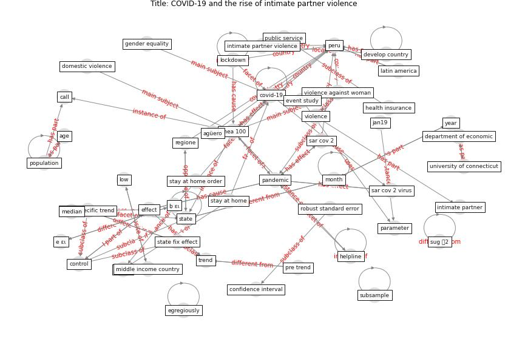

# Article: COVID-19 and the rise of intimate partner violence (aguero_covid-19_2021)

* Source: [10.1016/j.worlddev.2020.105217](https://doi.org/10.1016/j.worlddev.2020.105217)
* Year: 2021
* Cluster: [health-pandemic](cluster_4)

## Keywords

 * access to public service, [africa](keyword_africa), age, agüero, analysis, bleck j, broad welfare index, call, confidence interval, constitutional right, [control](keyword_control), count datum, [covid-19](keyword_covid-19), department of economic, develop country, domestic violence, e ει, effect, egregiously, eq, event study, [evidence](keyword_evidence), flexible model, focalize lockdown, freeãâãâãâãâãâãâãâãâãâãâãâãâãâãâãâãâãâãâãâãâãâãâãâãâãâãâãâãâãâãâãâãâmobility, gender base violence, gender equality, general assembly, health insurance, helpline, heterogenousanalysis, imai, interim, international organization, intimate partner, intimate partner violence, intimatepartner violence, jan19, jan20, landline, latin america, lima, [lockdown](keyword_lockdown), low, línea 100, median, middle income country, mimeo, [month](keyword_month), mukherjee, national, national level, [neighborhood](keyword_neighborhood), office of justice program, ongoing pandemic, [pandemic](keyword_pandemic), parameter, [peru](keyword_peru), peterman a, phone, [physical](keyword_physical), [policy](keyword_policy), policy note, [population](keyword_population), postm, pre trend, public service, regione, regression analysis, restrict model, restrict one, robust, robust standard error, robustness check, [sar cov 2](keyword_sar_cov_2), sar cov 2 virus, standard error, [state](keyword_state), state fix effect, state specific trend, stay at home, stay at home order, subsample, sug 裸2, sug 製2, trend, uganda, unfpa, unintended consequence, [united nations](keyword_united_nations), [united states](keyword_united_states), university of connecticut, university of oxford, variable, violence, violence against woman, woman, [world bank](keyword_world_bank), [year](keyword_year), ḅ ει

## Concepts

 

## Neighbours

### Closest articles

* Multilevel Analysis of Personal, Non-Medical COVID-19-Related Impact Worldwide - [LINK](article_dye_multilevel_2020)
* The impact of COVID-19 and strategies for mitigation and suppression in low- and middle-income countries - [LINK](article_walker_impact_2020)
* What has been the impact of the COVID-19 pandemic on immigrants? An update on recent evidence - [LINK](article_oecd_what_2022)
* COVID-19 and social inequalities: a complex and dynamic interaction - [LINK](article_quantin_covid-19_2022)
* The socio-economic determinants of COVID-19: A spatial analysis of German county level data - [LINK](article_ehlert_socio-economic_2021)
* Treating two pandemics for the price of one: Chronic and infectious disease impacts of the built and natural environment - [LINK](article_frank_treating_2021)
* The Socio-Spatial Determinants of COVID-19 Diffusion: The Impact of Globalisation, Settlement Characteristics and Population - [LINK](article_sigler_socio-spatial_2020)
* Mental health economics: A prospective study on psychological flourishing and associations with healthcare costs and sickness benefit transfers in Denmark - [LINK](article_santini_mental_2021)
* Assessment of COVID-19 precautionary measures in sports facilities: A case study on a health club in Saudi Arabia - [LINK](article_ibrahim_assessment_2022)
* Rotating groups at work, school best against COVID-19 spread: Study - [LINK](article_afp_rotating_2021)

### Closest BPs

* Resilience in staffing and skills training - [LINK](bp_12)
* Air Cleaning Plants - [LINK](bp_15)
* Tender support at building stage - [LINK](bp_9)
