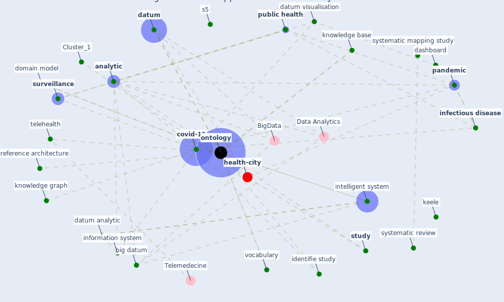

# Article: An Overview of Ontologies and Tool Support for COVID-19 Analytics (ahmad_overview_2021)

* Source: [10.1109/EDOCW52865.2021.00026](https://doi.org/10.1109/EDOCW52865.2021.00026)
* Year: 2021
* Cluster: [health-city](cluster_1)

## Keywords

 * america, [analysis](keyword_analysis), [analytic](keyword_analytic), automation, bias, [big datum](keyword_big_datum), bioinformatic, c wang, coronavirus infectious disease ontology, [covid 19 pandemic](keyword_covid_19_pandemic), [covid-19](keyword_covid-19), dashboard, [datum](keyword_datum), datum analytic, datum mining, datum visualisation, domain model, [europe](keyword_europe), evidence base medicine, exclusion criterion, exist ontology, expert recommendation, fractal, gaussian mixture, genetic, health analytic, health monitoring, health status, humanitarian crisis, identifie study, identified, [infectious disease](keyword_infectious_disease), information retrieval, information system, [intelligence](keyword_intelligence), intelligent system, [iot](keyword_iot), keele, [knowledge](keyword_knowledge), knowledge base, knowledge graph, library, [lockdown](keyword_lockdown), methodology, model pandemic datum, molecular process, most recent outbreak, multiple epidemic wave model, nature preceding, new ontology, news article, [ontology](keyword_ontology), ontology model, open source, [outbreak](keyword_outbreak), [pandemic](keyword_pandemic), pandemic hotspot, pandemic management, pandemic spread, pandemic surveillance, paper, [patient](keyword_patient), physician, predictive analytic, presentation layer, proprietary open source, [public health](keyword_public_health), reference architecture, [research](keyword_research), rq2, rq3, s1, s2, s5, s6, s8, sar cov 2 pandemic, search phase, section, semantic web, seneviratne, [smart city](keyword_smart_city), sniffing layer, snowball, software system, specification, [spread](keyword_spread), statistic, [study](keyword_study), [surveillance](keyword_surveillance), [symptom](keyword_symptom), synthesis, systematic mapping study, systematic review, [taiwan](keyword_taiwan), [telehealth](keyword_telehealth), three layer architecture, use case, vocabulary, wikidata

## Concepts

 

## Neighbours

### Closest articles

* CIDO, a community-based ontology for coronavirus disease knowledge and data integration, sharing, and analysis - [LINK](article_he_cido_2020)
* The COVID-19 epidemiology and monitoring ontology - [LINK](article_queralt-rosinach_covid-19_2021)
* An Overview of Biomedical Ontologies for Pandemics and Infectious Diseases Representation - [LINK](article_bayoudhi_overview_2021)
* Biophilic design in architecture and its contributions to health, well-being, and sustainability: A critical review - [LINK](article_zhong_biophilic_2022)
* Disinfection technology of hospital wastes and wastewater: Suggestions for disinfection strategy during coronavirus Disease 2019 (COVID-19) pandemic in China - [LINK](article_wang_disinfection_2020)
* COVID-19 could be a seasonal illness with higher risk in winter: Reduced humidity linked to increased COVID-19 risk - [LINK](article_university_of_sydney_covid-19_2020)
* Architectural design strategies for infection prevention and control (IPC) in health-care facilities: towards curbing the spread of Covid-19 \textbar SpringerLink - [LINK](article_udomiaye_architectural_2020)
* Mechanistic insights into the effect of humidity on airborne influenza virus survival, transmission and incidence - [LINK](article_marr_mechanistic_2019)
* Indirect effects of COVID-19 on the environment - [LINK](article_zambrano-monserrate_indirect_2020)

### Closest BPs

* Blueprint: Installing UV in ductwork - [LINK](bp_10)
* Blueprint: Resilience in staffing and skills training - [LINK](bp_12)
* Blueprint: Negative pressure rooms - [LINK](bp_13)
