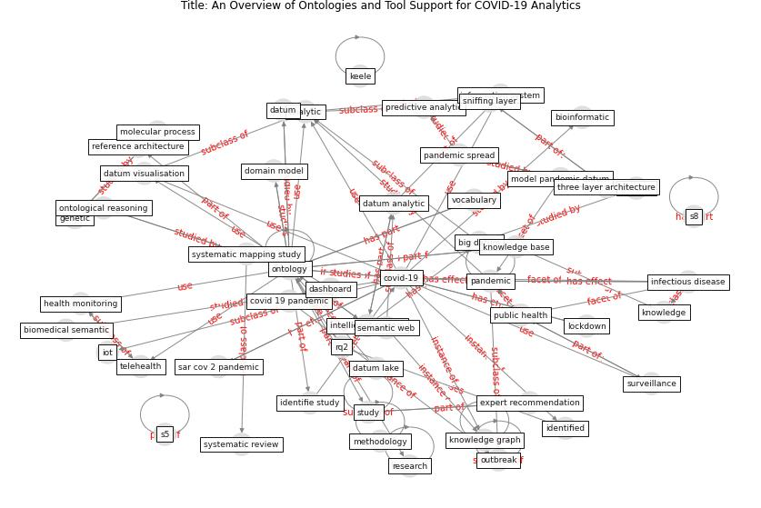

# Article: __An Overview of Ontologies and Tool Support for COVID-19 Analytics__ (ahmad_overview_2021)

* [10.1109/EDOCW52865.2021.00026](https://doi.org/10.1109/EDOCW52865.2021.00026)
* Cluster: [city-smart](cluster_10)

## Keywords

* [ontology](keyword_ontology), [covid-19](keyword_covid-19), [analytic](keyword_analytic), [pandemic](keyword_pandemic), [study](keyword_study), [telehealth](keyword_telehealth), [knowledge graph](keyword_knowledge_graph), [identify study](keyword_identify_study), [public health](keyword_public_health), [intelligent system](keyword_intelligent_system), [infectious disease](keyword_infectious_disease), [big datum](keyword_big_datum), reference architecture, utc, ieee xplore

## Keywords at large

* [ontology](keyword_ontology), [covid-19](keyword_covid-19), [analytic](keyword_analytic), [pandemic](keyword_pandemic), [knowledge graph](keyword_knowledge_graph), [study](keyword_study), [telehealth](keyword_telehealth), [intelligent system](keyword_intelligent_system), [public health](keyword_public_health), [identify study](keyword_identify_study)

## Abstract

Context: The outbreak of the SARS-CoV-2 pandemic of the
new COVID-19 disease (COVID-19 for short) demands
empowering existing medical, economic, and social emergency
backend systems with data analytics capabilities. An
impediment in taking advantages of data analytics in these
systems is the lack of a unified framework or reference
model. Ontologies are highlighted as a promising solution
to bridge this gap by providing a formal representation of
COVID-19 concepts such as symptoms, infections rate,
contact tracing, and drug modelling. Ontology-based
solutions enable the integration of diverse data sources
that leads to a better understanding of pandemic data,
management of smart lockdowns by identifying pandemic
hotspots, and knowledge-driven inference, reasoning, and
recommendations to tackle surrounding issues.Objective:
This study aims to investigate COVID-19 related challenges
that can benefit from ontology-based solutions, analyse
available tool support, and identify emerging challenges
that impact research and development of ontologies for
COVID-19. Moreover, reference architecture models are
presented to facilitate the design and development of
innovative solutions that rely on ontology-based solutions
and relevant tool support to address a multitude of
challenges related to COVID-19.Method: We followed the
formal guidelines of systematic mapping studies and
systematic reviews to identify a total of 56 solutions –
published research on ontology models for COVID-19 – and
qualitatively selected 10 of them for the review.Results:
Thematic analysis of the investigated solutions pinpoints
five research themes including telehealth, health
monitoring, disease modelling, data intelligence, and drug
modelling. Each theme is supported by tool(s) enabling
automation and user-decision support. Furthermore, we
present four reference architectures that can address
recurring challenges towards the development of the next
generation of ontology-based solutions for COVID-19
analytics.

## Concepts

 

### Closest articles 

* [CIDO, a community-based ontology for coronavirus disease knowledge and data integration, sharing, and analysis](article_he_cido_2020)
* [The COVID-19 epidemiology and monitoring ontology](article_queralt-rosinach_covid-19_2021)
* [An Overview of Biomedical Ontologies for Pandemics and Infectious Diseases Representation](article_bayoudhi_overview_2021)
* [Exploring the Potential of Artificial Intelligence and Machine Learning to Combat COVID-19 and Existing Opportunities for LMIC: A Scoping Review](article_naseem_exploring_2020)
* [Pandemic Analytics: How Countries are Leveraging Big Data Analytics and Artificial Intelligence to Fight COVID-19?](article_mehta_pandemic_2021)
* [Digital technology and COVID-19](article_ting_digital_2020)
* [Air pollution linked with higher COVID-19 death rates](article_harvard_th_chan_schoold_of_public_health_air_2020)
* [COVID-19 Higher Mortality in Chinese Regions With Chronic Exposure to Lower Air Quality](article_pansini_covid-19_2021)
* [The Smart City and Covid‐19](article_webb_smart_2020)
* [The Emergence of Anti-Privacy and Control at the Nexus between the Concepts of Safe City and Smart City](article_allam_emergence_2019)

### References 

* [Response to COVID-19 in Taiwan: Big Data
Analytics, New Technology, and Proactive
Testing](article_wang_response_2020)

### Cited by 

