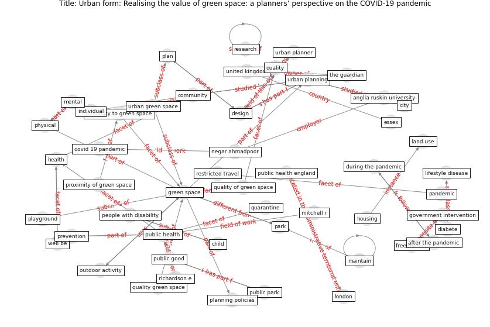

# Article: Urban form: Realising the value of green space: a planners’ perspective on the COVID-19 pandemic (ahmadpoor_urban_2021)

* Source: [10.3828/tpr.2020.37](https://doi.org/10.3828/tpr.2020.37)
* Year: 2021
* Cluster: [building-space](cluster_1)

## Keywords

 * after the pandemic, anglia ruskin university, [anxiety](keyword_anxiety), barton h, bench, [build](keyword_build), [building](keyword_building), chelmsford, [child](keyword_child), [city](keyword_city), [community](keyword_community), [covid 19 pandemic](keyword_covid_19_pandemic), [design](keyword_design), design intervention, [diabete](keyword_diabete), during the pandemic, england, essex, free market, gile corti, government intervention, grant m, [green space](keyword_green_space), [health](keyword_health), healthy new towns programme, heart disease, [housing](keyword_housing), individual, isolate, jordan h c, land use, large park, lee a, lee a c, leslie, liamputtong p, lifestyle, lifestyle disease, living habits, living standard, [london](keyword_london), maintain, [mental](keyword_mental), mitchell r, negar ahmadpoor, neighbourhood, nhs england, outdoor activity, [outlet](keyword_outlet), [pandemic](keyword_pandemic), park, pearce j, people with disability, [physical](keyword_physical), [plan](keyword_plan), planning policies, playground, prevention, prohibit, proximity of green space, proximity to green space, public good, [public health](keyword_public_health), public health england, public park, public service, [quality](keyword_quality), quality green space, quality of green space, quarantine, [research](keyword_research), restricted travel, restrictions travel, richardson e, sanchez e, [school](keyword_school), self isolation, shortage of green space, skyscraper, socio economic status, [space](keyword_space), [stress](keyword_stress), sugiyama, [sustainable development goal](keyword_sustainable_development_goal), the guardian, trail, travelling outside people s locality, [united kingdom](keyword_united_kingdom), [united nations](keyword_united_nations), urban context, [urban green space](keyword_urban_green_space), urban green space interventions and health, urban green space interventions and health a review of impacts and effectiveness, urban planner, [urban planning](keyword_urban_planning), urbanisation, various degrees of travel restriction, walk, [well be](keyword_well_be), who

## Concepts

 

## Neighbours

### Closest articles

* The impact of the COVID-19 pandemic on the importance of urban green spaces to the public - [LINK](article_noszczyk_impact_2022)
* Green infrastructure through the lens of “One Health”: A systematic review and integrative framework uncovering synergies and trade-offs between mental health and wildlife support in cities - [LINK](article_felappi_green_2020)
* Urban Green Infrastructure and Green Open Spaces: An Issue of Social Fairness in Times of COVID-19 Crisis - [LINK](article_reinwald_urban_2021)
* The role of green roofs in post COVID-19 confinement: An analysis of willingness to pay - [LINK](article_manso_role_2021)
* Association between indoor-outdoor green features and psychological health during the COVID-19 lockdown in Italy: A cross-sectional nationwide study - [LINK](article_spano_association_2021)
* Green spaces, especially forest, linked to lower SARS-CoV-2 infection rates: A one-year nationwide study - [LINK](article_jiang_green_2021)
* Effects of the COVID-19 pandemic on the use and perceptions of urban green space: An international exploratory study - [LINK](article_ugolini_effects_2020)
* Green in times of COVID-19: urban green space relevance during the COVID-19 pandemic in Buenos Aires City - [LINK](article_marconi_green_2022)
* The Impact of COVID-19 on Public Space: A Review of the Emerging Questions - [LINK](article_honey-roses_impact_2020)
* Impact of Covid-19 on the built environment - [LINK](article_mahima_impact_2022)

### Closest BPs

* Blueprint: Mental health – Act: Do something - [LINK](bp_18)
* Blueprint: Mental health – Commit: Do something meaningfull - [LINK](bp_20)
* Blueprint: Mental health – Belong: Do something with someone - [LINK](bp_19)
