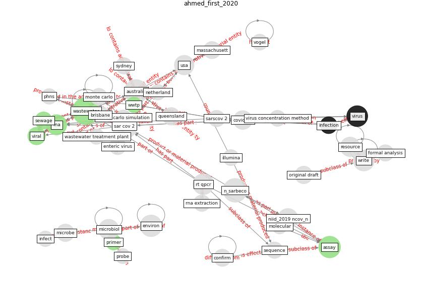

# Article: __First confirmed detection of SARS-CoV-2 in untreated wastewater in Australia: A proof of concept for the wastewater surveillance of COVID-19 in the community__ (ahmed_first_2020)

* [10.1016/j.scitotenv.2020.138764](https://doi.org/10.1016/j.scitotenv.2020.138764)
* Cluster: [wastewater-sars](cluster_12)

## Keywords

* [wastewater](keyword_wastewater), [sar cov 2](keyword_sar_cov_2), [australia](keyword_australia), [environ](keyword_environ), [assay](keyword_assay), [rt qpcr](keyword_rt_qpcr), [write](keyword_write), [virus](keyword_virus), [n_sarbeco](keyword_n_sarbeco), [microbiol](keyword_microbiol), [rna](keyword_rna), resource, usa, [covid-19](keyword_covid-19), [coronavirus](keyword_coronavirus)

## Keywords at large

* [biophilic design](keyword_biophilic_design), [architecture](keyword_architecture), [sustainable architecture](keyword_sustainable_architecture), [nature](keyword_nature), [design](keyword_design), [biophilic](keyword_biophilic), [environ](keyword_environ), [biophilia](keyword_biophilia), [wellbeing](keyword_wellbeing), [health](keyword_health)

## Concepts

 

