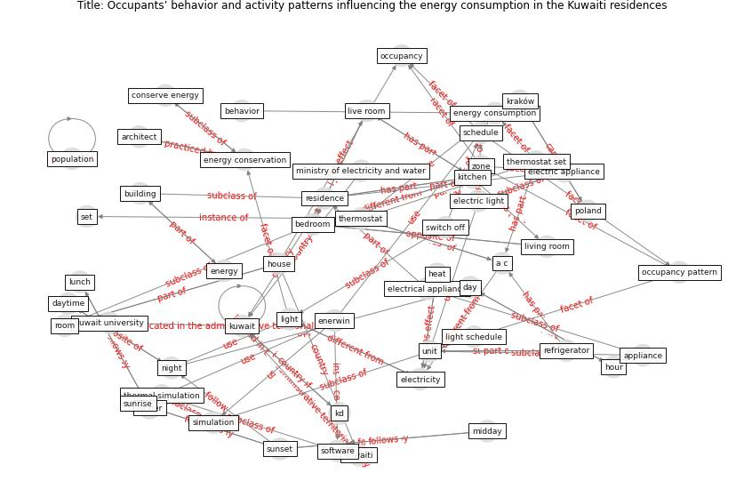

# Article: __Occupants’ behavior and activity patterns influencing the energy consumption in the Kuwaiti residences__ (al-mumin_occupants_2003)

* [10.1016/S0378-7788(02)00167-6](https://doi.org/10.1016/S0378-7788(02)00167-6)
* Cluster: [health-building](cluster_9)

## Keywords

* [kuwait](keyword_kuwait), [thermostat](keyword_thermostat), [bedroom](keyword_bedroom), [kuwaiti](keyword_kuwaiti), [a c](keyword_a_c), [live room](keyword_live_room), [kitchen](keyword_kitchen), [electricity](keyword_electricity), [residence](keyword_residence), [electric appliance](keyword_electric_appliance), sunset, enerwin, [energy](keyword_energy), living room, [energy consumption](keyword_energy_consumption)

## Keywords at large

* [kuwait](keyword_kuwait), [thermostat](keyword_thermostat), [bedroom](keyword_bedroom), [kuwaiti](keyword_kuwaiti), [a c](keyword_a_c), [live room](keyword_live_room), [kitchen](keyword_kitchen), [electricity](keyword_electricity), [residence](keyword_residence), [electric appliance](keyword_electric_appliance)

## Concepts

 

### Closest articles 

* [Impacts of COVID-19 on residential building energy use and performance](article_kawka_impacts_2021)
* [The effect of occupant distribution on energy consumption and COVID-19 infection in buildings: A case study of university building](article_mokhtari_effect_2021)
* [Addressing the impact of COVID-19 lockdown on energy use in municipal buildings: A case study in Florianópolis, Brazil](article_geraldi_addressing_2021)
* [Assessment of Building Automation and Control Systems in Danish Healthcare Facilities in the COVID-19 Era](article_pedersen_assessment_2022)
* [Reflecting on Impacts of COVID19 on Sustainable Buildings and Cities](article_gonzalez_reflecting_2021)
* [p15-lee-vor](article_p15-lee-vor)
* [Designing a Multi-Agent Occupant Simulation System to Support Facility Planning and Analysis for COVID-19](article_lee_designing_2021)
* [Will a pandemic change building codes?](article_rozgus_will_2020)
* [The Effect of Opening Windows on Air Change Rates in Two Homes](article_howard-reed_effect_2002)
* [Characterization and performance evaluation of a full-scale activated carbon-based dynamic botanical air filtration system for improving indoor air quality](article_wang_characterization_2011)

