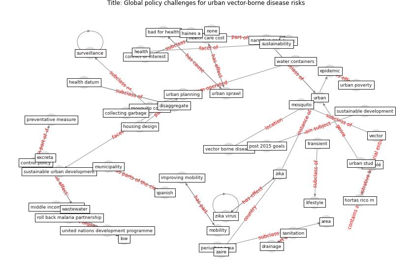

# Article: Global policy challenges for urban vector-borne disease risks (alabaster_global_2016)

* Source: [10.14745/ccdr.v42i10a05](https://doi.org/10.14745/ccdr.v42i10a05)
* Year: 2016
* Cluster: [city-health](cluster_14)

## Keywords

 * aedes vector, agency, [area](keyword_area), bad for health, [brazil](keyword_brazil), ccdr, ch, citizen cooperation, [city](keyword_city), collecting garbage, community participation, conditions that give rise to epidemics, [conflict of interest](keyword_conflict_of_interest), container bred, control policy, cooperation, decades of efforts, decades of efforts to reduce the spread, dengue virus, development agenda, development programme, disaggregate, dora c, drainage, efforts to reduce the spread, [epidemic](keyword_epidemic), [epidemiology](keyword_epidemiology), evidence from spanish municipalities, excreta, fletcher e, haines a, [health](keyword_health), health care cost, health datum, hortas rico m, housing design, improving mobility, issuu, lifestyle, long term, long term approaches, [low](keyword_low), low income, low income area, microcephaly, middle income country, mitigating epidemics, [mitigation](keyword_mitigation), [mobility](keyword_mobility), [mosquito](keyword_mosquito), mosquito control, multisectoral, multisectoral_action_frameowkr_for, municipality, narrative poor, none, periurban, periurban area, [policy](keyword_policy), post 2015 goals, preventative measure, public service, public transit, public transit lines, reasons why urban sprawl is bad for health, roll back malaria partnership, sanitation, solé olé, spanish, spanish municipalities, [surveillance](keyword_surveillance), [sustainability](keyword_sustainability), [sustainable development](keyword_sustainable_development), sustainable development agenda, sustainable urban development, transient, [transmission](keyword_transmission), trust, trust in authority, un habitat, underdeveloped, [united nations](keyword_united_nations), united nations development programme, united nations human settlements programme, [urban](keyword_urban), [urban area](keyword_urban_area), urban community, urban density, [urban planning](keyword_urban_planning), urban poverty, [urban sprawl](keyword_urban_sprawl), urban stud, [vector](keyword_vector), [vector borne disease](keyword_vector_borne_disease), [wastewater](keyword_wastewater), water container, water containers, zaire, [zika](keyword_zika), zika virus

## Concepts

 

## Neighbours

### Closest articles

* Making green infrastructure healthier infrastructure - [LINK](article_lohmus_making_2015)
* Learning from pandemics: Applying resilience thinking to identify priorities for planning urban settlements - [LINK](article_syal_learning_2021)
* COVID-19 Pandemic: Rethinking Strategies for Resilient Urban Design, Perceptions, and Planning - [LINK](article_afrin_covid-19_2021)
* Respiratory pandemics, urban planning and design: A multidisciplinary rapid review of the literature - [LINK](article_harris_respiratory_2022)
* Coronavirus questions that will not go away: interrogating urban and socio-spatial implications of COVID-19 measures - [LINK](article_salama_coronavirus_2020)
* Proximity and post-COVID-19 urban development: Reflections from Milan, Italy - [LINK](article_tricarico_proximity_2021)
* Urban planning after COVID-19 - [LINK](article_rtpi_urban_2021)
* COVID-19: Lessons for an Urban(izing) World - [LINK](article_acuto_covid-19_2020)
* The Role of Architecture and Urbanism in Preventing Pandemics - [LINK](article_kumar_role_2021)

### Closest BPs

* Blueprint: Architecture design - [LINK](bp_2)
* Blueprint: Building Adaptation during a pandemic - [LINK](bp_14)
* Blueprint: Tender support at building stage - [LINK](bp_9)
