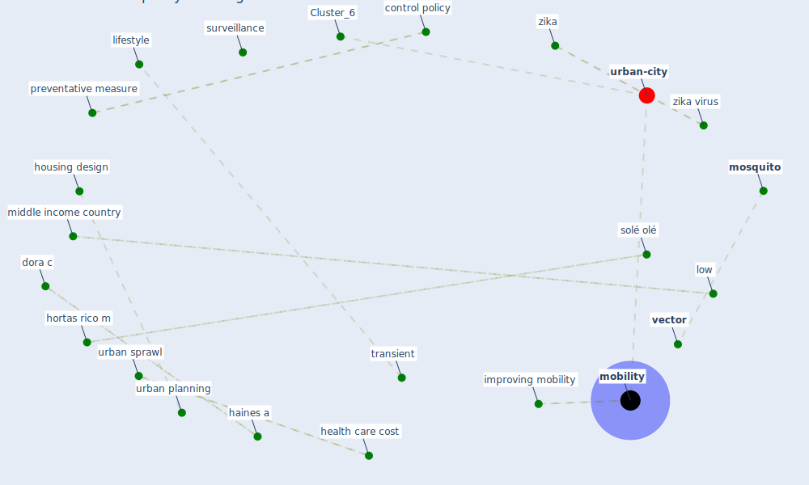

# Article: Global policy challenges for urban vector-borne disease risks (alabaster_global_2016)

* Source: [10.14745/ccdr.v42i10a05](https://doi.org/10.14745/ccdr.v42i10a05)
* Year: 2016
* Cluster: [urban-city](cluster_6)

## Keywords

 * aedes vector, agency, [area](keyword_area), bad for health, [brazil](keyword_brazil), ccdr, ch, citizen cooperation, [city](keyword_city), collecting garbage, community participation, conditions that give rise to epidemics, [conflict of interest](keyword_conflict_of_interest), container bred, control policy, cooperation, decades of efforts, decades of efforts to reduce the spread, dengue virus, development agenda, development programme, disaggregate, dora c, drainage, efforts to reduce the spread, [epidemic](keyword_epidemic), [epidemiology](keyword_epidemiology), evidence from spanish municipalities, excreta, fletcher e, haines a, [health](keyword_health), health care cost, health datum, hortas rico m, housing design, improving mobility, issuu, lifestyle, long term, long term approaches, [low](keyword_low), low income, low income area, microcephaly, middle income country, mitigating epidemics, [mitigation](keyword_mitigation), [mobility](keyword_mobility), [mosquito](keyword_mosquito), mosquito control, multisectoral, multisectoral_action_frameowkr_for, municipality, narrative poor, none, periurban, periurban area, [policy](keyword_policy), post 2015 goals, preventative measure, public service, public transit, public transit lines, reasons why urban sprawl is bad for health, roll back malaria partnership, [sanitation](keyword_sanitation), solé olé, spanish, spanish municipalities, [surveillance](keyword_surveillance), [sustainability](keyword_sustainability), [sustainable development](keyword_sustainable_development), sustainable development agenda, sustainable urban development, transient, [transmission](keyword_transmission), trust, trust in authority, un habitat, underdeveloped, [united nations](keyword_united_nations), united nations development programme, united nations human settlements programme, [urban](keyword_urban), urban area, urban community, urban density, [urban planning](keyword_urban_planning), urban poverty, [urban sprawl](keyword_urban_sprawl), urban stud, [vector](keyword_vector), [vector borne disease](keyword_vector_borne_disease), [wastewater](keyword_wastewater), water container, water containers, zaire, [zika](keyword_zika), zika virus

## Concepts

 

## Neighbours

### Closest articles

* Making green infrastructure healthier infrastructure - [LINK](article_lohmus_making_2015)
* Challenges to Mitigating the Urban Health Burden of Mosquito-Borne Diseases in the Face of Climate Change - [LINK](article_ligsay_challenges_2021)
* Vector-borne disease, climate change and urban design - [LINK](article_ogden_vector-borne_2016)
* The impact of climate change on the epidemiology and control of Rift Valley fever - PubMed - [LINK](article_martin_impact_2008)
* Prototype Early Warning Systems for Vector-Borne Diseases in Europe - [LINK](article_semenza_prototype_2015)
* Addressing vulnerability, building resilience: community-based adaptation to vector-borne diseases in the context of global change - [LINK](article_bardosh_addressing_2017)
* Decision Making within the Built Environment as a Strategy for Mitigating the Risk of Malaria and Other Vector-Borne Diseases - [LINK](article_obonyo_decision_2018)
* Integrating rapid risk mapping and mobile phone call record data for strategic malaria elimination planning - [LINK](article_tatem_integrating_2014)
* Green infrastructure through the lens of “One Health”: A systematic review and integrative framework uncovering synergies and trade-offs between mental health and wildlife support in cities - [LINK](article_felappi_green_2020)
* Urban Green Infrastructure and Green Open Spaces: An Issue of Social Fairness in Times of COVID-19 Crisis - [LINK](article_reinwald_urban_2021)

### Closest BPs

* Blueprint: Mental health – Act: Do something - [LINK](bp_18)
* Blueprint: Mental health – Belong: Do something with someone - [LINK](bp_19)
* Blueprint: Mental health – Commit: Do something meaningfull - [LINK](bp_20)
