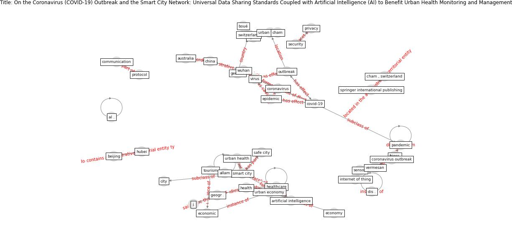

# Article: __On the Coronavirus (COVID-19) Outbreak and the Smart City Network: Universal Data Sharing Standards Coupled with Artificial Intelligence (AI) to Benefit Urban Health Monitoring and Management__ (allam_coronavirus_2020)

* [10.3390/healthcare8010046](https://doi.org/10.3390/healthcare8010046)
* Cluster: [city-smart](cluster_10)

## Keywords

* [covid-19](keyword_covid-19), [china](keyword_china), [coronavirus](keyword_coronavirus), [smart city](keyword_smart_city), [outbreak](keyword_outbreak), [switzerland](keyword_switzerland), [wuhan](keyword_wuhan), [coronavirus outbreak](keyword_coronavirus_outbreak), [virus](keyword_virus), [healthcare](keyword_healthcare), [city](keyword_city), j., [privacy](keyword_privacy), [pandemic](keyword_pandemic), geogr .

## Keywords at large

* [covid-19](keyword_covid-19), [china](keyword_china), [coronavirus](keyword_coronavirus), [smart city](keyword_smart_city), [outbreak](keyword_outbreak), [switzerland](keyword_switzerland), [pandemic](keyword_pandemic), [wuhan](keyword_wuhan), [healthcare](keyword_healthcare), [coronavirus outbreak](keyword_coronavirus_outbreak)

## Abstract

As the Coronavirus (COVID-19) expands its impact from
China, expanding its catchment into surrounding regions and
other countries, increased national and international
measures are being taken to contain the outbreak. The
placing of entire cities in ‘lockdown’ directly affects
urban economies on a multi-lateral level, including from
social and economic standpoints. This is being emphasised
as the outbreak gains ground in other countries, leading
towards a global health emergency, and as global
collaboration is sought in numerous quarters. However,
while effective protocols in regard to the sharing of
health data is emphasised, urban data, on the other hand,
specifically relating to urban health and safe city
concepts, is still viewed from a nationalist perspective as
solely benefiting a nation’s economy and its economic and
political influence. This perspective paper, written one
month after detection and during the outbreak, surveys the
virus outbreak from an urban standpoint and advances how
smart city networks should work towards enhancing
standardization protocols for increased data sharing in the
event of outbreaks or disasters, leading to better global
understanding and management of the same.

## Concepts

 

### Closest articles 

* [Pandemic stricken cities on lockdown. Where are our planning and design professionals [now, then and into the future]?](article_allam_pandemic_2020)
* [Future (post-COVID) digital, smart and sustainable cities in the wake of 6G: Digital twins, immersive realities and new urban economies](article_allam_future_2021)
* [Smart cities and the pandemic: digital technologies on the urban management of Brazilian cities](article_fariniuk_smart_2020)
* [Learning from the COVID-19 pandemic in governing smart cities](article_bolivar_learning_2022)
* [Smart cities and a data-driven response to COVID-19](article_james_smart_2020)
* [Contributions of Smart City Solutions and Technologies to Resilience against the COVID-19 Pandemic: A Literature Review](article_sharifi_contributions_2021)
* [The COVID-19 pandemic: Impacts on cities and major lessons for urban planning, design, and management](article_sharifi_covid-19_2020)
* [The three modes of existence of the pandemic smart city](article_soderstrom_three_2021)
* [Impact of COVID-19 on IoT Adoption in Healthcare, Smart Homes, Smart Buildings, Smart Cities, Transportation and Industrial IoT](article_umair_impact_2021)
* [The Emergence of Anti-Privacy and Control at the Nexus between the Concepts of Safe City and Smart City](article_allam_emergence_2019)

### References 

* [The Emergence of Anti-Privacy and Control at the
Nexus between the Concepts of Safe City and Smart
City](article_allam_emergence_2019)

### Cited by 

* [Future (post-COVID) digital, smart and sustainable
cities in the wake of 6G: Digital twins, immersive
realities and new urban economies](article_allam_future_2021)
* [Pandemic stricken cities on lockdown. Where are our
planning and design professionals [now, then and into the
future]?](article_allam_pandemic_2020)
* [Exploring the Potential of Artificial Intelligence
and Machine Learning to Combat COVID-19 and
Existing Opportunities for LMIC: A Scoping
Review](article_naseem_exploring_2020)
* [An Automated System to Limit COVID-19 Using
Facial Mask Detection in Smart City Network](article_rahman_automated_2020)
* [Contributions of Smart City Solutions and
Technologies to Resilience against the COVID-19
Pandemic: A Literature Review](article_sharifi_contributions_2021)
* [Internet of things (IoT) applications to fight against
COVID-19 pandemic](article_singh_internet_2020)
