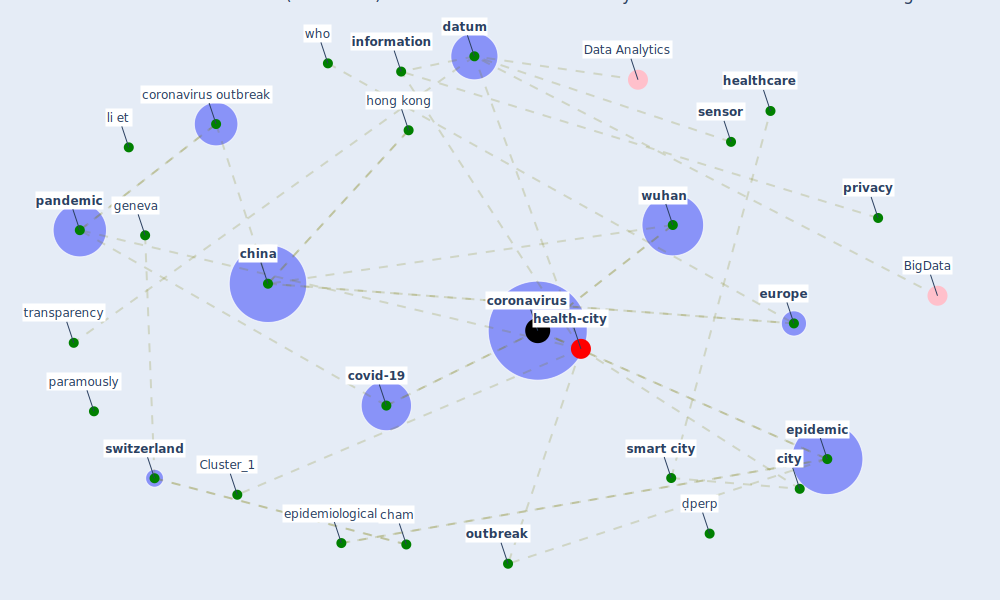

# Article: On the Coronavirus (COVID-19) Outbreak and the Smart City Network: Universal Data Sharing Standards Coupled with Artificial Intelligence (AI) to Benefit Urban Health Monitoring and Management (allam_coronavirus_2020)

* Source: [10.3390/healthcare8010046](https://doi.org/10.3390/healthcare8010046)
* Year: 2020
* Cluster: [health-city](cluster_1)

## Keywords

 * [airport](keyword_airport), allam, [australia](keyword_australia), bbc, [beijing](keyword_beijing), biotechnol, boué s, bus terminal, byrne m, cham, [china](keyword_china), [city](keyword_city), communication, [conflict of interest](keyword_conflict_of_interest), [coronavirus](keyword_coronavirus), [coronavirus outbreak](keyword_coronavirus_outbreak), corporation, [country](keyword_country), covid 19 virus, [covid-19](keyword_covid-19), current outbreak, current psynetepidemic, [datum](keyword_datum), datum processing, [datum sharing](keyword_datum_sharing), deakin university, [diagnosis](keyword_diagnosis), disaster, early detection, [economic](keyword_economic), [economy](keyword_economy), effect of coronavirus begin echo far from wuhan epicenter, [epidemic](keyword_epidemic), [epidemiological](keyword_epidemiological), [europe](keyword_europe), exabyte, friess, geelong, geneva, geography, gigabyte, grand view research, guinea, [health](keyword_health), [health care](keyword_health_care), health status, health wise, [healthcare](keyword_healthcare), healthcare professional, [hong kong](keyword_hong_kong), inform, [information](keyword_information), [iot](keyword_iot), lawpoolsri, li et, liberia, ljubljana, meko t, nation, [outbreak](keyword_outbreak), [pandemic](keyword_pandemic), paramously, person to person, podnar žarko I, [policy](keyword_policy), previous case, [privacy](keyword_privacy), [protocol](keyword_protocol), [public health](keyword_public_health), regulation, [research](keyword_research), [safe city](keyword_safe_city), [security](keyword_security), [sensor](keyword_sensor), sierra leone, singapore, [smart city](keyword_smart_city), smart device, [social](keyword_social), stanford medicine, subway, [switzerland](keyword_switzerland), tierney l, [tourism](keyword_tourism), transparency, traveler, u s, urban economy, urban fabric, urban safety, vermesan, [virus](keyword_virus), [wearable](keyword_wearable), weber m, west africa, who, world health organisation, [wuhan](keyword_wuhan), zika virus outbreak, ḍperp

## Concepts

 

## Neighbours

### Closest articles

* Smart cities and a data-driven response to COVID-19 - [LINK](article_james_smart_2020)
* Smart cities and the pandemic: digital technologies on the urban management of Brazilian cities - [LINK](article_fariniuk_smart_2020)
* Pandemic stricken cities on lockdown. Where are our planning and design professionals [now, then and into the future]? - [LINK](article_allam_pandemic_2020)
* Future (post-COVID) digital, smart and sustainable cities in the wake of 6G: Digital twins, immersive realities and new urban economies - [LINK](article_allam_future_2021)
* The Emergence of Anti-Privacy and Control at the Nexus between the Concepts of Safe City and Smart City - [LINK](article_allam_emergence_2019)
* Learning from the COVID-19 pandemic in governing smart cities - [LINK](article_bolivar_learning_2022)
* The three modes of existence of the pandemic smart city - [LINK](article_soderstrom_three_2021)
* Contributions of Smart City Solutions and Technologies to Resilience against the COVID-19 Pandemic: A Literature Review - [LINK](article_sharifi_contributions_2021)
* The Smart City and Covid‐19 - [LINK](article_webb_smart_2020)
* The COVID-19 pandemic: Impacts on cities and major lessons for urban planning, design, and management - [LINK](article_sharifi_covid-19_2020)

### Closest BPs

* Blueprint: Monitoring of wastewater - [LINK](bp_21)
* Blueprint: Resilience in staffing and skills training - [LINK](bp_12)
* Blueprint: Air Cleaning Plants - [LINK](bp_15)
