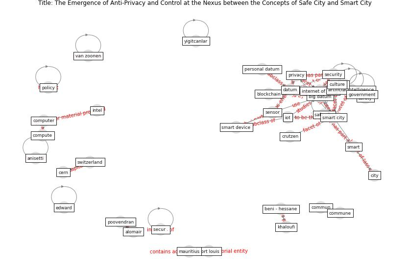

# Article: The Emergence of Anti-Privacy and Control at the Nexus between the Concepts of Safe City and Smart City (allam_emergence_2019)

* Source: [10.3390/smartcities2010007](https://doi.org/10.3390/smartcities2010007)
* Year: 2019
* Cluster: [city-health](cluster_14)

## Keywords

 * abouelmehdi, agriculture, allam z, alomair, [artificial intelligence](keyword_artificial_intelligence), [australia](keyword_australia), beni hessane, bhadani, [big datum](keyword_big_datum), [blockchain](keyword_blockchain), chen x, [china](keyword_china), [city](keyword_city), conflict, crime, [croatia](keyword_croatia), crutzen, curtin university, cyber security, datapriv, [datum](keyword_datum), datum collection, [ecol](keyword_ecol), [economic](keyword_economic), elmaghraby, governance, [government](keyword_government), guerrini, hacker, huawei, ict, [india](keyword_india), institution, internet of thing, [iot](keyword_iot), j netw, [japan](keyword_japan), khaloufi, kummitha, li z, [london](keyword_london), losavio, ma s, [machine learning](keyword_machine_learning), martínez ballesté, mauritius, mckinsey and company, microsoft, milenkovic, mob, netw, [network](keyword_network), [new york](keyword_new_york), [new york city](keyword_new_york_city), newman p, opatija, [organisation](keyword_organisation), pamplona, personal datum, [perspective](keyword_perspective), perth, [plan](keyword_plan), [policy](keyword_policy), poovendran, port louis, ppp, [privacy](keyword_privacy), privacy concern, private company, private partner, private sector, propaganda, public private partnership, public sector, [safe city](keyword_safe_city), [safety](keyword_safety), [security](keyword_security), [sensor](keyword_sensor), [singapore](keyword_singapore), [smart](keyword_smart), [smart city](keyword_smart_city), smart device, smartness, [social](keyword_social), sustain, [sustainability](keyword_sustainability), [switzerland](keyword_switzerland), [technology](keyword_technology), top, transparency, [united kingdom](keyword_united_kingdom), [urban](keyword_urban), [usa](keyword_usa), [violence](keyword_violence), vulnerably, [washington dc](keyword_washington_dc), yang y, yigitcanlar, [چہ](keyword_چہ), ḍperp

## Concepts

 

## Neighbours

### Closest articles

* The three modes of existence of the pandemic smart city - [LINK](article_soderstrom_three_2021)
* The Smart City and Covid‐19 - [LINK](article_webb_smart_2020)
* Learning from the COVID-19 pandemic in governing smart cities - [LINK](article_bolivar_learning_2022)
* Contributions of Smart City Solutions and Technologies to Resilience against the COVID-19 Pandemic: A Literature Review - [LINK](article_sharifi_contributions_2021)
* Smart cities and the pandemic: digital technologies on the urban management of Brazilian cities - [LINK](article_fariniuk_smart_2020)
* Future (post-COVID) digital, smart and sustainable cities in the wake of 6G: Digital twins, immersive realities and new urban economies - [LINK](article_allam_future_2021)
* Impact of COVID-19 on IoT Adoption in Healthcare, Smart Homes, Smart Buildings, Smart Cities, Transportation and Industrial IoT - [LINK](article_umair_impact_2021)
* On the Coronavirus (COVID-19) Outbreak and the Smart City Network: Universal Data Sharing Standards Coupled with Artificial Intelligence (AI) to Benefit Urban Health Monitoring and Management - [LINK](article_allam_coronavirus_2020)
* Smart cities and a data-driven response to COVID-19 - [LINK](article_james_smart_2020)
* Pandemic stricken cities on lockdown. Where are our planning and design professionals [now, then and into the future]? - [LINK](article_allam_pandemic_2020)

### Closest BPs

* Blueprint: Smart Locker System - [LINK](bp_1)
* Blueprint: One-way mobility circulation - [LINK](bp_4)
* Blueprint: Rotational Shift System - [LINK](bp_0)
