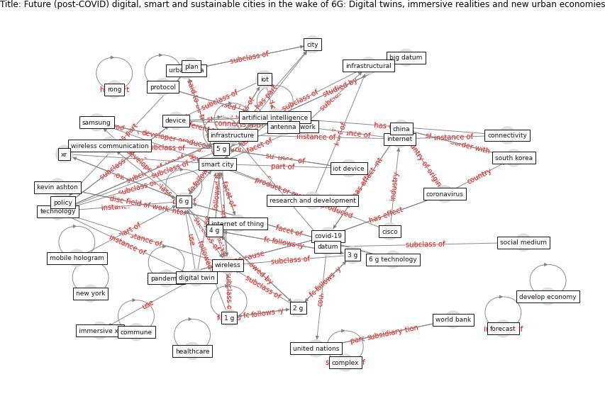

# Article: __Future (post-COVID) digital, smart and sustainable cities in the wake of 6G: Digital twins, immersive realities and new urban economies__ (allam_future_2021)

* [10.1016/j.landusepol.2020.105201](https://doi.org/10.1016/j.landusepol.2020.105201)
* Cluster: [city-smart](cluster_10)

## Keywords

* [smart city](keyword_smart_city), [5 g](keyword_5_g), [technology](keyword_technology), [covid-19](keyword_covid-19), [6 g](keyword_6_g), [city](keyword_city), [6g](keyword_6g), [network](keyword_network), [5g](keyword_5g), [china](keyword_china), [australia](keyword_australia), [pandemic](keyword_pandemic), 4 g, [infrastructure](keyword_infrastructure), [covid 19 pandemic](keyword_covid_19_pandemic)

## Keywords at large

* [smart city](keyword_smart_city), [5 g](keyword_5_g), [covid-19](keyword_covid-19), [technology](keyword_technology), [6 g](keyword_6_g), [city](keyword_city), [6g](keyword_6g), [pandemic](keyword_pandemic), [network](keyword_network), [5g](keyword_5g)

## Abstract

With the advance of 5G technologies by both academia and
industry, 5G adoption is gaining widespread acceptance in
numerous cities, prompting further innovations in Smart
City technologies riding on the wave of the Internet of
Things (IoT). However, even in its infancy stage, the speed
of technological advancement is already highlighting the
limitations of 5G, and its potentially short lifespan as
new technologies are rendered obsolete faster. This
fast-moving field is coupled with an ongoing and increasing
funding into Research \& Development (R\&D) efforts by
private corporations, to potentially commercialise on the
surge in demand for ‘smarter’ cities’, This paper
aims to chart the major directions and scope emerging
dimensions inherent to 6G technology, including Digital
Twins and Immersive Realities (XR) that, when applied to
cities that are currently being equipped with digital
infrastructural backbones, may have direct socio-economic
impacts upon our lives while responding to the tenets of
the Sustainable Development Goal 11. Looking at the future
6G technology this article considers the prospects of 6G,
and its associated concepts, and its relations as they
pertain to Future, Smart, Digital and Sustainable Cities.

## Concepts

 

### Closest articles 

* [Learning from the COVID-19 pandemic in governing smart cities](article_bolivar_learning_2022)
* [Contributions of Smart City Solutions and Technologies to Resilience against the COVID-19 Pandemic: A Literature Review](article_sharifi_contributions_2021)
* [On the Coronavirus (COVID-19) Outbreak and the Smart City Network: Universal Data Sharing Standards Coupled with Artificial Intelligence (AI) to Benefit Urban Health Monitoring and Management](article_allam_coronavirus_2020)
* [Smart cities and the pandemic: digital technologies on the urban management of Brazilian cities](article_fariniuk_smart_2020)
* [The Emergence of Anti-Privacy and Control at the Nexus between the Concepts of Safe City and Smart City](article_allam_emergence_2019)
* [Impact of COVID-19 on IoT Adoption in Healthcare, Smart Homes, Smart Buildings, Smart Cities, Transportation and Industrial IoT](article_umair_impact_2021)
* [The three modes of existence of the pandemic smart city](article_soderstrom_three_2021)
* [Pandemic stricken cities on lockdown. Where are our planning and design professionals [now, then and into the future]?](article_allam_pandemic_2020)
* [Smart cities and a data-driven response to COVID-19](article_james_smart_2020)
* [The Smart City and Covid‐19](article_webb_smart_2020)

### References 

* [The Emergence of Anti-Privacy and Control at the
Nexus between the Concepts of Safe City and Smart
City](article_allam_emergence_2019)
* [On the Coronavirus (COVID-19) Outbreak and the
Smart City Network: Universal Data Sharing
Standards Coupled with Artificial Intelligence
(AI) to Benefit Urban Health Monitoring and
Management](article_allam_coronavirus_2020)
* [Pandemic stricken cities on lockdown. Where are our
planning and design professionals [now, then and into the
future]?](article_allam_pandemic_2020)
* [A Comprehensive Review of the COVID-19 Pandemic
and the Role of IoT, Drones, AI, Blockchain, and
5G in Managing its Impact](article_chamola_comprehensive_2020)

### Cited by 

* [Contributions of Smart City Solutions and
Technologies to Resilience against the COVID-19
Pandemic: A Literature Review](article_sharifi_contributions_2021)
