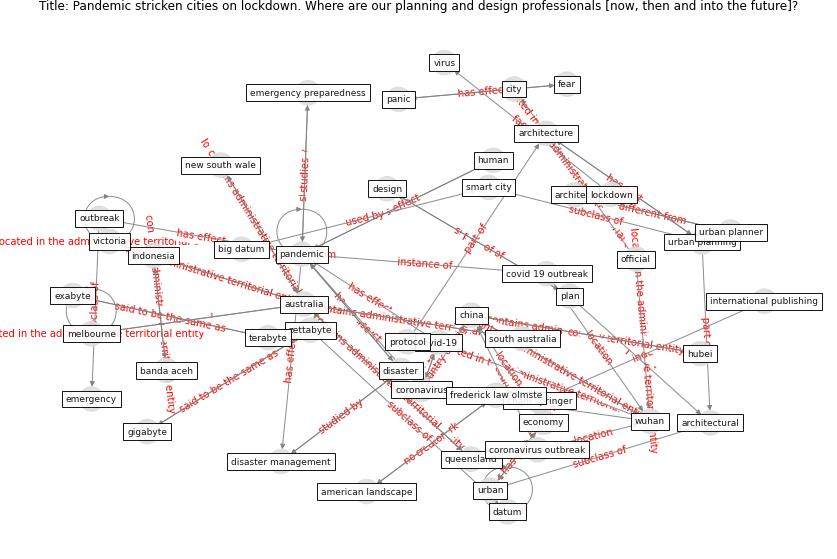

# Article: Pandemic stricken cities on lockdown. Where are our planning and design professionals [now, then and into the future]? (allam_pandemic_2020)

* Source: [10.1016/j.landusepol.2020.104805](https://doi.org/10.1016/j.landusepol.2020.104805)
* Year: 2020
* Cluster: [city-health](cluster_14)

## Keywords

 * allam, american landscape, [architect](keyword_architect), architectural, [architecture](keyword_architecture), [australia](keyword_australia), affecte, banda aceh, [big datum](keyword_big_datum), cham springer, chikungunya, chikungunya virus, [china](keyword_china), [city](keyword_city), city and the digital revolution, citylab, [climate change](keyword_climate_change), collapse of the economy, community dispersal, conscious, [coronavirus](keyword_coronavirus), [coronavirus outbreak](keyword_coronavirus_outbreak), covid 19 outbreak, [covid-19](keyword_covid-19), cruise ship, [datum](keyword_datum), datum management, de lockdown, deakin university, [design](keyword_design), design professional, develop economy, disaster, disaster management, disaster preparedness, [disease](keyword_disease), [economy](keyword_economy), emerg, emergency, emergency preparedness, [epidemic](keyword_epidemic), essential, exabyte, fear, frederick law olmste, gigabyte, griffith, h1n1, [hospital](keyword_hospital), how much be that, [hubei](keyword_hubei), [human](keyword_human), [indonesia](keyword_indonesia), international monetary fund, international publishing, landscape architecture, [lockdown](keyword_lockdown), lockdown measure, [melbourne](keyword_melbourne), [mitigation](keyword_mitigation), [model](keyword_model), modern paris, mumbai, [new south wale](keyword_new_south_wale), [new york](keyword_new_york), [news](keyword_news), newspaper, [outbreak](keyword_outbreak), official, [pandemic](keyword_pandemic), panic, [plan](keyword_plan), problem, [protocol](keyword_protocol), public health crisis, quarantine measure, queensland, reform, [resilience](keyword_resilience), sierra leone, [smart city](keyword_smart_city), sonnenschein, south australia, [spain](keyword_spain), [sustainability](keyword_sustainability), [technology](keyword_technology), terabyte, transportation, tsunami, unconscious, [unesco](keyword_unesco), [urban](keyword_urban), urban planner, [urban planning](keyword_urban_planning), victoria, [virus](keyword_virus), world heritage council, [wuhan](keyword_wuhan), zettabyte, zettabyte era

## Concepts

 

## Neighbours

### Closest articles

* On the Coronavirus (COVID-19) Outbreak and the Smart City Network: Universal Data Sharing Standards Coupled with Artificial Intelligence (AI) to Benefit Urban Health Monitoring and Management - [LINK](article_allam_coronavirus_2020)
* COVID-19: Lessons for an Urban(izing) World - [LINK](article_acuto_covid-19_2020)
* Epidemics, Planning and the City: A Special Issue of Planning Perspectives - [LINK](article_davis_epidemics_2022)
* Proximity and post-COVID-19 urban development: Reflections from Milan, Italy - [LINK](article_tricarico_proximity_2021)
* Smart cities and a data-driven response to COVID-19 - [LINK](article_james_smart_2020)
* Urban planning after COVID-19 - [LINK](article_rtpi_urban_2021)
* The City Under COVID‐19: Podcasting As Digital Methodology - [LINK](article_rogers_city_2020)
* Smart cities and the pandemic: digital technologies on the urban management of Brazilian cities - [LINK](article_fariniuk_smart_2020)
* Coronavirus questions that will not go away: interrogating urban and socio-spatial implications of COVID-19 measures - [LINK](article_salama_coronavirus_2020)

### Closest BPs

* Blueprint: Architecture design - [LINK](bp_2)
* Blueprint: Building Adaptation during a pandemic - [LINK](bp_14)
* Blueprint: Tender support at building stage - [LINK](bp_9)
