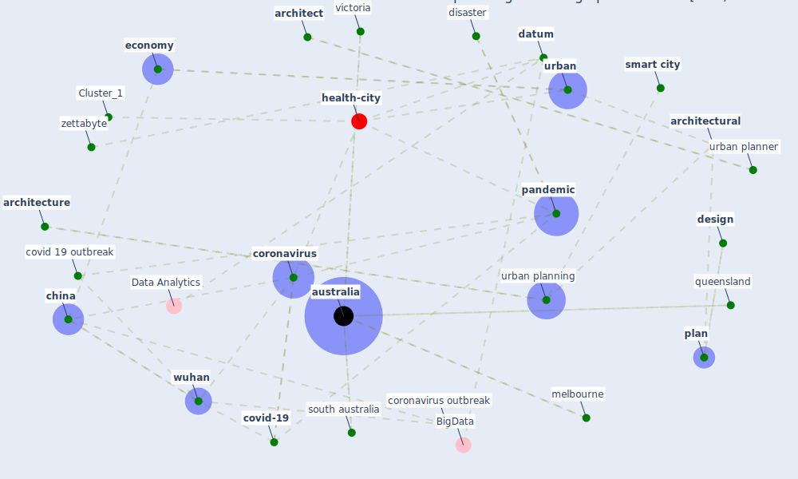

# Article: Pandemic stricken cities on lockdown. Where are our planning and design professionals [now, then and into the future]? (allam_pandemic_2020)

* Source: [10.1016/j.landusepol.2020.104805](https://doi.org/10.1016/j.landusepol.2020.104805)
* Year: 2020
* Cluster: [urban-city](cluster_6)

## Keywords

 * allam, american landscape, [architect](keyword_architect), architectural, [architecture](keyword_architecture), [australia](keyword_australia), affecte, banda aceh, [big datum](keyword_big_datum), chikungunya, chikungunya virus, [china](keyword_china), [city](keyword_city), citylab, [climate change](keyword_climate_change), collapse of the economy, community dispersal, conscious, [coronavirus](keyword_coronavirus), [coronavirus outbreak](keyword_coronavirus_outbreak), covid 19 outbreak, [covid-19](keyword_covid-19), cruise ship, [datum](keyword_datum), datum management, de lockdown, deakin university, [design](keyword_design), design professional, develop economy, disaster, disaster management, disaster preparedness, [disease](keyword_disease), drive gear, e mail address, economic performance, [economy](keyword_economy), emerg, emerg care, emerg emerg, emergency, emergency preparedness, [engineering](keyword_engineering), [epidemic](keyword_epidemic), exabyte, [fear](keyword_fear), frederick law olmste, gigabyte, h1n1, [hospital](keyword_hospital), how much be that, [hubei](keyword_hubei), [human](keyword_human), [indonesia](keyword_indonesia), land use analysis, landscape architecture, [lockdown](keyword_lockdown), lockdown measure, [melbourne](keyword_melbourne), mumbai, [network](keyword_network), [new south wale](keyword_new_south_wale), [new york](keyword_new_york), [news](keyword_news), newspaper, [outbreak](keyword_outbreak), official, [pandemic](keyword_pandemic), [panic](keyword_panic), pediatr, [plan](keyword_plan), problem, [protocol](keyword_protocol), pub, public health crisis, quarantine measure, queensland, reform, [resilience](keyword_resilience), sierra leone, [smart city](keyword_smart_city), sonnenschein, south australia, [spain](keyword_spain), [sustainability](keyword_sustainability), terabyte, transportation, tsunami, unconscious, [unesco](keyword_unesco), [urban](keyword_urban), urban planner, [urban planning](keyword_urban_planning), victoria, [virus](keyword_virus), world heritage council, [wuhan](keyword_wuhan), zettabyte, zettabyte era

## Concepts

 

## Neighbours

### Closest articles

* On the Coronavirus (COVID-19) Outbreak and the Smart City Network: Universal Data Sharing Standards Coupled with Artificial Intelligence (AI) to Benefit Urban Health Monitoring and Management - [LINK](article_allam_coronavirus_2020)
* The COVID-19 pandemic: Impacts on cities and major lessons for urban planning, design, and management - [LINK](article_sharifi_covid-19_2020)
* COVID-19: Lessons for an Urban(izing) World - [LINK](article_acuto_covid-19_2020)
* Epidemics, Planning and the City: A Special Issue of Planning Perspectives - [LINK](article_davis_epidemics_2022)
* Smart cities and a data-driven response to COVID-19 - [LINK](article_james_smart_2020)
* Respiratory pandemics, urban planning and design: A multidisciplinary rapid review of the literature - [LINK](article_harris_respiratory_2022)
* Proximity and post-COVID-19 urban development: Reflections from Milan, Italy - [LINK](article_tricarico_proximity_2021)
* Future (post-COVID) digital, smart and sustainable cities in the wake of 6G: Digital twins, immersive realities and new urban economies - [LINK](article_allam_future_2021)
* COVID-19 Pandemic: Rethinking Strategies for Resilient Urban Design, Perceptions, and Planning - [LINK](article_afrin_covid-19_2021)
* Smart cities and the pandemic: digital technologies on the urban management of Brazilian cities - [LINK](article_fariniuk_smart_2020)

### Closest BPs

* Blueprint: Smart Locker System - [LINK](bp_1)
* Blueprint: Mental health – Act: Do something - [LINK](bp_18)
* Blueprint: Mental health – Belong: Do something with someone - [LINK](bp_19)
