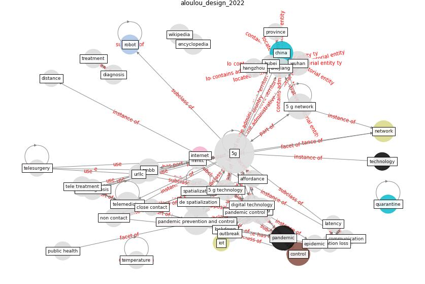

# Article: __Design COVID-19 Ontology: A Healthcare and Safety Perspective__ (aloulou_design_2022)

* [10.1007/978-3-031-09593-1_11](https://doi.org/10.1007/978-3-031-09593-1_11)
* Cluster: [blockchain-technology](cluster_13)

## Keywords

[pandemic](keyword_pandemic), [control](keyword_control), [china](keyword_china), [network](keyword_network)

## Abstract

Abstract The COVID-19 pandemic has flooded a vast amount
of information into the world. To help control this
situation, good utilization of the overflow in data is
required. However, data come in different forms, posing
numerous challenges in subsequent processing. Therefore, a
uniform knowledge representation of COVID-19 information is
needed, and ontology can play a role. The ontology will
model patient healthcare-related data, ranging from
symptoms to side effects and medical conditions, and the
necessary precautions, especially for healthcare workers,
to obtain protection from the COVID-19 virus. We followed
Sánchez’s methodology to build the vocabularies, which
include current ontology concepts, W3C standards RDF, OWL
and SWRL. This work shows promising results that can be
applied by different organizations.

## Concepts

 

