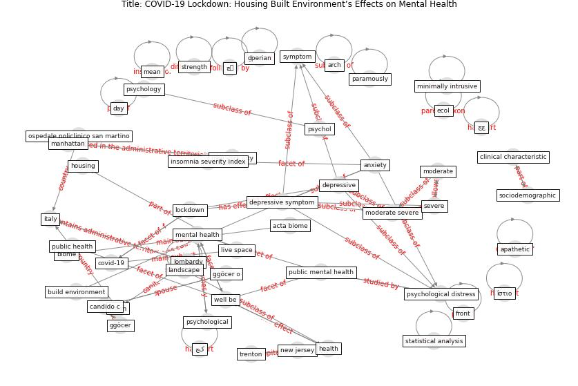

# Article: COVID-19 Lockdown: Housing Built Environment’s Effects on Mental Health (amerio_covid-19_2020)

* Source: [10.3390/ijerph17165973](https://doi.org/10.3390/ijerph17165973)
* Year: 2020
* Cluster: [health-mental](cluster_15)

## Keywords

 * acta biome, activity, affective temperament, [anxiety](keyword_anxiety), [apartment](keyword_apartment), apathetic, attachment style, [balcony](keyword_balcony), biome, bis 11, [build environment](keyword_build_environment), [building](keyword_building), builtenvironment, candido c, cortisol, covid 19 outbreak, covid 19 suicide prevention research collaboration, [covid-19](keyword_covid-19), day, [depression](keyword_depression), [depressive](keyword_depressive), [depressive symptom](keyword_depressive_symptom), depressive symptomatology, des, dinogmi, distraction, exercise, fax, front, gbenga, ggöcer, ggöcer o, göcer k, [health](keyword_health), [healthcare](keyword_healthcare), high, home office, [housing](keyword_housing), housing quality, [infrastructure](keyword_infrastructure), insomnia, insomnia severity index, [italy](keyword_italy), kellert r, landscape, live space, [lockdown](keyword_lockdown), lombardy, male, [manhattan](keyword_manhattan), mean, [mental](keyword_mental), method, [milan](keyword_milan), minimally intrusive, miur, moderate, moderate severe, mood, [new jersey](keyword_new_jersey), [new york city](keyword_new_york_city), [nurse](keyword_nurse), ospedale policlinico san martino, pain, [pandemic](keyword_pandemic), paramously, parmigiani, patient health questionnaire, [physical](keyword_physical), [psychological](keyword_psychological), [public health](keyword_public_health), quarantine, questionnaire, serafini, severe, sf 12, short form 12 item health survey, [social](keyword_social), socialize, standard deviation, strength, [stress](keyword_stress), survey, survey questionnaire, [symptom](keyword_symptom), thomas l, [trenton](keyword_trenton), ulrich, urban health planner, [usa](keyword_usa), validity, [well be](keyword_well_be), wessely s, wilson e o, [work](keyword_work), چچ, چک, [چہ](keyword_چہ), ḏperian, ḯστιο

## Concepts

 

## Neighbours

### Closest articles

* Home garden use during COVID-19: Associations with physical and mental wellbeing in older adults - [LINK](article_corley_home_2021)
* Psychological Effects of Home Confinement and Social Distancing Derived from COVID-19 in the General Population—A Systematic Review - [LINK](article_rodriguez-fernandez_psychological_2021)
* The psychological impact of COVID-19 on the mental health in the general population - [LINK](article_serafini_psychological_2020)
* Mental Health and the Covid-19 Pandemic - [LINK](article_pfefferbaum_mental_2020)
* How our homes impact our health: using a COVID-19 informed approach to examine urban apartment housing - [LINK](article_peters_how_2020)
* A Mixed Approach on Resilience of Spanish Dwellings and Households during COVID-19 Lockdown - [LINK](article_cuerdo-vilches_mixed_2020)
* Housing Experience in Gated Communities in the Time of Pandemics: Lessons Learned from COVID-19 - [LINK](article_asfour_housing_2022)
* Towards Resilient Residential Buildings and Neighborhoods in Light of COVID-19 Pandemic—The Scenario of Podgorica, Montenegro - [LINK](article_bojovic_towards_2022)
* Urban Community Sustainable Development Patterns under the Influence of COVID-19: A Case Study Based on the Non-Contact Interaction Perspective of Hangzhou City - [LINK](article_wang_urban_2021)
* Mental health and COVID-19 - [LINK](article_who_mental_2021)

### Closest BPs

* Blueprint: Architecture design - [LINK](bp_2)
* Blueprint: Building Adaptation during a pandemic - [LINK](bp_14)
* Blueprint: Tender support at building stage - [LINK](bp_9)
