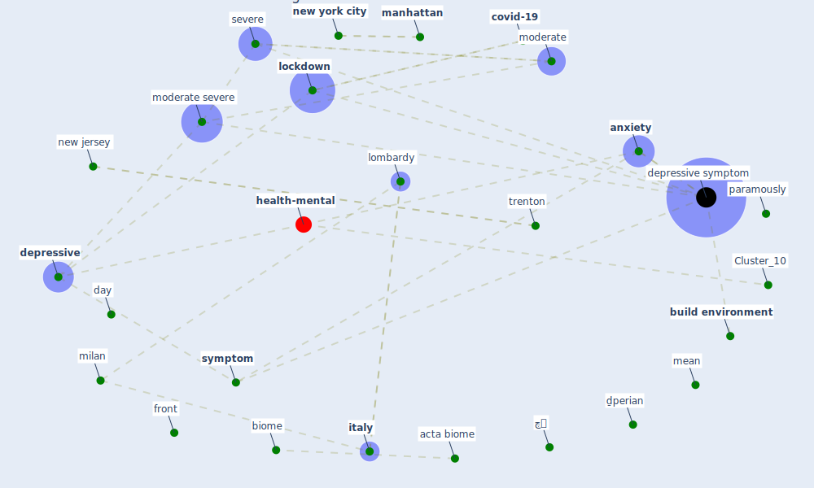

# Article: COVID-19 Lockdown: Housing Built Environment’s Effects on Mental Health (amerio_covid-19_2020)

* Source: [10.3390/ijerph17165973](https://doi.org/10.3390/ijerph17165973)
* Year: 2020
* Cluster: [health-mental](cluster_10)

## Keywords

 * acta biome, activity, affective temperament, [anxiety](keyword_anxiety), [apartment](keyword_apartment), apathetic, attachment style, [balcony](keyword_balcony), biome, bis 11, [build environment](keyword_build_environment), [building](keyword_building), builtenvironment, candido c, cortisol, covid 19 outbreak, covid 19 suicide prevention research collaboration, [covid-19](keyword_covid-19), day, [depression](keyword_depression), [depressive](keyword_depressive), [depressive symptom](keyword_depressive_symptom), depressive symptomatology, des, dinogmi, distraction, exercise, fax, front, gbenga, ggöcer, ggöcer o, göcer k, [health](keyword_health), [healthcare](keyword_healthcare), [high](keyword_high), home office, [housing](keyword_housing), housing quality, [infrastructure](keyword_infrastructure), insomnia, insomnia severity index, [italy](keyword_italy), kellert r, landscape, live space, [lockdown](keyword_lockdown), lombardy, male, [manhattan](keyword_manhattan), mean, [mental](keyword_mental), method, [milan](keyword_milan), minimally intrusive, miur, moderate, moderate severe, mood, [new jersey](keyword_new_jersey), [new york city](keyword_new_york_city), [nurse](keyword_nurse), ospedale policlinico san martino, pain, [pandemic](keyword_pandemic), paramously, parmigiani, patient health questionnaire, [physical](keyword_physical), [psychological](keyword_psychological), [public health](keyword_public_health), quarantine, questionnaire, serafini, severe, sf 12, short form 12 item health survey, [social](keyword_social), socialize, standard deviation, strength, [stress](keyword_stress), [survey](keyword_survey), survey questionnaire, [symptom](keyword_symptom), thomas l, [trenton](keyword_trenton), ulrich, urban health planner, [usa](keyword_usa), validity, [well be](keyword_well_be), wessely s, wilson e o, [work](keyword_work), چچ, چک, [چہ](keyword_چہ), ḏperian, ḯστιο

## Concepts

 

## Neighbours

### Closest articles

* Home garden use during COVID-19: Associations with physical and mental wellbeing in older adults - [LINK](article_corley_home_2021)
* Psychological Effects of Home Confinement and Social Distancing Derived from COVID-19 in the General Population—A Systematic Review - [LINK](article_rodriguez-fernandez_psychological_2021)
* Mental Health and the Covid-19 Pandemic - [LINK](article_pfefferbaum_mental_2020)
* The psychological impact of COVID-19 on the mental health in the general population - [LINK](article_serafini_psychological_2020)
* Mental health and COVID-19 - [LINK](article_who_mental_2021)
* Association between indoor-outdoor green features and psychological health during the COVID-19 lockdown in Italy: A cross-sectional nationwide study - [LINK](article_spano_association_2021)
* Green spaces, especially forest, linked to lower SARS-CoV-2 infection rates: A one-year nationwide study - [LINK](article_jiang_green_2021)
* The role of green roofs in post COVID-19 confinement: An analysis of willingness to pay - [LINK](article_manso_role_2021)
* COVID-19 and Green Housing: A Review of Relevant Literature - [LINK](article_kaklauskas_covid-19_2021)
* Urban form: Realising the value of green space: a planners’ perspective on the COVID-19 pandemic - [LINK](article_ahmadpoor_urban_2021)

### Closest BPs

* Blueprint: Building Adaptation during a pandemic - [LINK](bp_14)
* Blueprint: Architecture design - [LINK](bp_2)
* Blueprint: Tracking and enforcing use of Personal Protective Equipment - [LINK](bp_23)
