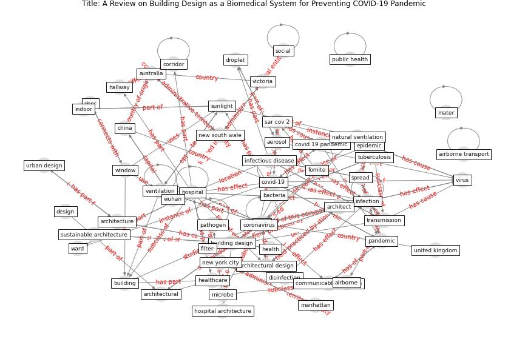

# Article: __A Review on Building Design as a Biomedical System for Preventing COVID-19 Pandemic__ (amran_review_2022)

* [10.3390/buildings12050582](https://doi.org/10.3390/buildings12050582)
* Cluster: [air-sars](cluster_2)

## Keywords

[infection](keyword_infection), [ventilation](keyword_ventilation), [virus](keyword_virus), [build](keyword_build), [transmission](keyword_transmission), [health](keyword_health), [aerosol](keyword_aerosol)

## Abstract

Sustainable design methods aim to obtain architectural
solutions that assure the coexistence and welfare of human
beings, inorganic structures, and living things that
constitute ecosystems. The novel coronavirus emergence,
inadequate vaccines against the present severe acute
respiratory syndrome-coronavirus-(SARS-CoV-2), and
increases in microbial resistance have made it essential to
review the preventative approaches used during
pre-antibiotic periods. Apart from low carbon emissions and
energy, sustainable architecture for facilities, building
designs, and digital modeling should incorporate design
approaches to confront the impacts of communicable
infections. This review aims to determine how architectural
design can protect people and employees from harm; it
models viewpoints to highlight the architects’ roles in
combating coronavirus disease 2019 (COVID-19) and designing
guidelines as a biomedical system for policymakers. The
goals include exploring the hospital architecture evolution
and the connection between architectural space and
communicable infections and recommending design and digital
modeling strategies to improve infection prevention and
controls. Based on a wide-ranging literature review, it was
found that design methods have often played important roles
in the prevention and control of infectious diseases and
could be a solution for combating the wide spread of the
novel coronavirus or coronavirus variants or delta.

## Concepts

 

### References 

* [Mobility Behaviour in View of the Impact of the
COVID-19 Pandemic—Public Transport Users in
Gdansk Case Study](article_przybylowski_mobility_2021)
* [COVID-19 Could Leverage a Sustainable Built
Environment](article_pinheiro_covid-19_2020)
* [The COVID-19 pandemic: Impacts on cities and major
lessons for urban planning, design, and management](article_sharifi_covid-19_2020)
* [Vancouver Convention Health Centre (COVID-19
Response): Planning, implementation, and four lessons
learned](article_d_ross_brown_vancouver_2020)
* [Characterization and performance evaluation of a
full-scale activated carbon-based dynamic botanical air
filtration system for improving indoor air quality](article_wang_characterization_2011)
* [Aerosol and Surface Stability of SARS-CoV-2 as
Compared with SARS-CoV-1](article_van_doremalen_aerosol_2020)
* [Applications of ultraviolet germicidal irradiation
disinfection in health care facilities: Effective
adjunct, but not stand-alone technology](article_memarzadeh_applications_2010)
* [Methods for air cleaning and protection of building
occupants from airborne pathogens](article_bolashikov_methods_2009)
* [Predicted Inactivation of Viruses of Relevance to
Biodefense by Solar Radiation](article_lytle_predicted_2005)
* [Ten questions concerning occupant health in buildings
during normal operations and extreme events including the
COVID-19 pandemic](article_awada_ten_2021)
* [How is COVID-19 Experience Transforming
Sustainability Requirements of Residential
Buildings? A Review](article_tokazhanov_how_2020)
* [Antivirus-built environment: Lessons learned from
Covid-19 pandemic](article_megahed_antivirus-built_2020)
* [Designing Post COVID-19 Buildings: Approaches for
Achieving Healthy Buildings](article_navaratnam_designing_2022)
* [COVID-19 and Green Housing: A Review of
Relevant Literature](article_kaklauskas_covid-19_2021)
* [The effect of human mobility and control measures on the
COVID-19 epidemic in China](article_kraemer_effect_2020)
* [Coronavirus questions that will not go away: interrogating
urban and socio-spatial implications of COVID-19
measures](article_salama_coronavirus_2020)
* [Indoor Air Quality: Rethinking rules of building
design strategies in post-pandemic architecture](article_megahed_indoor_2021)

### Cited by 

* [Prophylactic Architecture: Formulating the Concept
of Pandemic-Resilient Homes](article_elrayies_prophylactic_2022)
