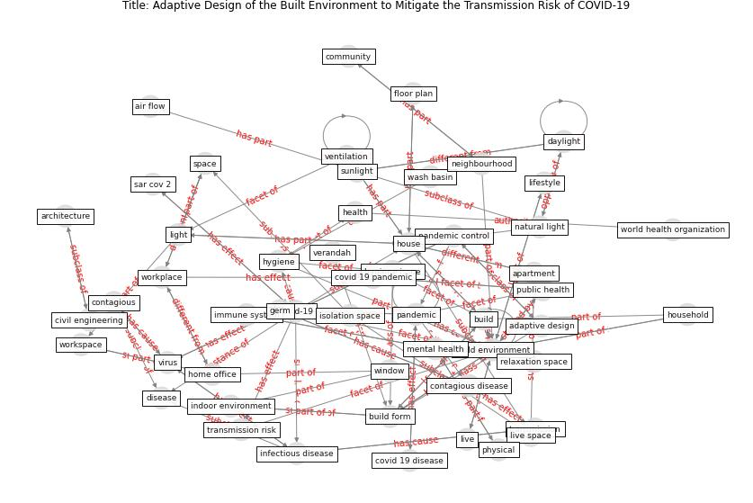

# Article: Adaptive Design of the Built Environment to Mitigate the Transmission Risk of COVID-19 (ara_dilshad_shangi_adaptive_2020)

* Source: [10.12691/ajcea-8-4-3](https://doi.org/10.12691/ajcea-8-4-3)
* Year: 2020
* Cluster: [building-space](cluster_1)

## Keywords

 * adaptive design, air flow, [apartment](keyword_apartment), [architecture](keyword_architecture), [area](keyword_area), bangladesh, [build](keyword_build), [build environment](keyword_build_environment), build form, building design, building factor, building sector, civil engineering, commission of the european community, communication, [community](keyword_community), contagious, contagious disease, covid 19 disease, [covid 19 pandemic](keyword_covid_19_pandemic), [covid-19](keyword_covid-19), [crisis](keyword_crisis), day, daylight, [disease](keyword_disease), european community, floor plan, foyer, germ, good health, [health](keyword_health), home office, [house](keyword_house), [household](keyword_household), hygiene, hygiene issue, illness, immune system, [india](keyword_india), indoor comfort, [indoor environment](keyword_indoor_environment), [infectious disease](keyword_infectious_disease), influenza a h1n1pdm09, inhabitant, isolation space, [knowledge](keyword_knowledge), level change, lifestyle, light, light exposure, lighting light, live, live space, live thing, local, [nature](keyword_nature), neighbourhood, new delhi, [occupant](keyword_occupant), [office](keyword_office), orientation, outer world, [pandemic](keyword_pandemic), pandemic control, [particle](keyword_particle), [public health](keyword_public_health), relaxation space, [research](keyword_research), [room](keyword_room), s s w, [sar cov 2](keyword_sar_cov_2), share workplace, shoe cleaning tray, side effect, [space](keyword_space), [spread](keyword_spread), spread fast, sunlight, surround, surround environment, transfer of the air, [transmission](keyword_transmission), transmission risk, unhygienic condition, [united nations](keyword_united_nations), [ventilation](keyword_ventilation), verandah, [virus](keyword_virus), wash basin, [well be](keyword_well_be), well health, [wellbee](keyword_wellbee), [window](keyword_window), [wong](keyword_wong), work from home, [workplace](keyword_workplace), workspace, [workstation](keyword_workstation), [world health organization](keyword_world_health_organization), zone

## Concepts

 

## Neighbours

### Closest articles

* RESIDENTIAL ARCHITECTURE IN A POST-PANDEMIC WORLD: IMPLICATIONS OF COVID-19 FOR NEW CONSTRUCTION AND FOR ADAPTING HERITAGE BUILDINGS - [LINK](article_spennemann_residential_2021)
* Designing for COVID-2x: Reflecting on Future-Proofing Human Habitation for the Inevitable Next Pandemic - [LINK](article_spennemann_designing_2022)
* How Architecture Fails in Conditions of Crisis: a Discussion on the Value of Interior Design over the COVID-19 Outbreak - [LINK](article_rassia_how_2020)
* How the Coronavirus Will Reshape Architecture - [LINK](article_chayka_how_2020)
* Biophilic design in architecture and its contributions to health, well-being, and sustainability: A critical review - [LINK](article_zhong_biophilic_2022)
* COVID-19 and Green Housing: A Review of Relevant Literature - [LINK](article_kaklauskas_covid-19_2021)
* Houses amid COVID-19: Environmental challenges and design adaptation - [LINK](article_hizra_houses_2021)
* COVID-19 Lessons for a Resilient Built Environment: A Roadmap - [LINK](article_hull_covid-19_2020)
* Prophylactic Architecture: Formulating the Concept of Pandemic-Resilient Homes - [LINK](article_elrayies_prophylactic_2022)

### Closest BPs

* Blueprint: Mental health – Act: Do something - [LINK](bp_18)
* Blueprint: Mental health – Belong: Do something with someone - [LINK](bp_19)
* Blueprint: Mental health – Commit: Do something meaningfull - [LINK](bp_20)
