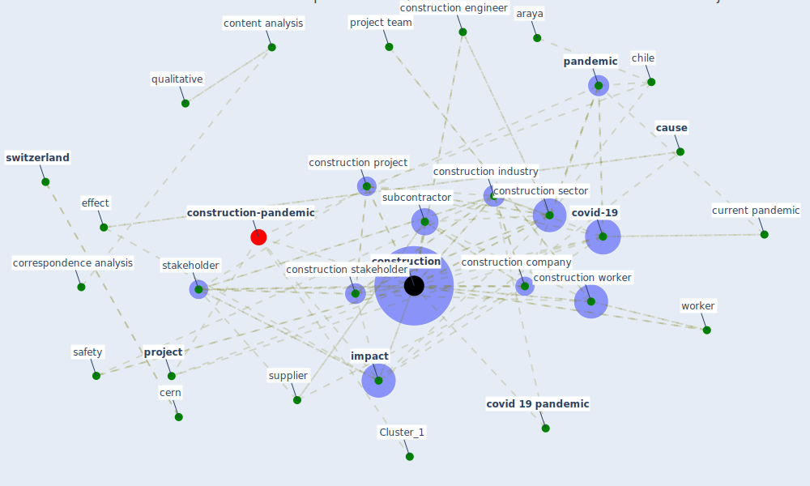

# Article: Influence between COVID-19 Impacts and Project Stakeholders in Chilean Construction Projects (araya_influence_2021)

* Source: [10.3390/su131810082](https://doi.org/10.3390/su131810082)
* Year: 2021
* Cluster: [construction-project](cluster_8)

## Keywords

 * accumulate inertia, amoah, araya, assaad, bal, basel, basualto, bryde, category, cause, cause and effect, central, centroid, cern, chi square, chile, chilean, [china](keyword_china), [clean](keyword_clean), cluster, code, cognitive map, column, [construction](keyword_construction), construction company, construction engineer, [construction industry](keyword_construction_industry), construction project, construction sector, construction site, construction stakeholder, [construction worker](keyword_construction_worker), content analysis, [contractor](keyword_contractor), correspondence analysis, correspondence plot, [covid 19 pandemic](keyword_covid_19_pandemic), [covid-19](keyword_covid-19), crossref carnevalli, current, current pandemic, datum analysis, decision make, distance, [effect](keyword_effect), el adaway, [engineer](keyword_engineer), ergon, factor ergon, front, [health and safety](keyword_health_and_safety), hypothesis, [impact](keyword_impact), impact category, [industry](keyword_industry), [infrastructure](keyword_infrastructure), interview, lingard, m garfinkele, macroeconomy, [manager](keyword_manager), mediterr, [method](keyword_method), microsoft window, morroco, [new york](keyword_new_york), nj, organ, [pandemic](keyword_pandemic), pirzadeh, [plan](keyword_plan), [project](keyword_project), project team, public agency, [qualitative](keyword_qualitative), qualitative analysis, qualitative research, rahman, row, [safety](keyword_safety), safety and health protocol, [sample](keyword_sample), saturation point, [sector](keyword_sector), sierra, simpeh, snowball sampling, [stakeholder](keyword_stakeholder), stock of material, [study](keyword_study), subcontractor, supplier, [supply chain](keyword_supply_chain), [sustainability](keyword_sustainability), [switzerland](keyword_switzerland), t s, theory, unemployment, [united states](keyword_united_states), [worker](keyword_worker)

## Concepts

 

## Neighbours

### Closest articles

* Identifying Actions to Control and Mitigate the Effects of the COVID-19 Pandemic on Construction Organizations: Preliminary Findings - [LINK](article_raoufi_identifying_2021)
* COVID-19 pandemic: the effects and prospects in the construction industry. - [LINK](article_ogunnusi_covid-19_2020)
* Perception of COVID-19 impacts on the construction industry over time - [LINK](article_rokooei_perception_2022)
* The Impact of Pandemic Crisis on the Survival of Construction Industry: A Case of COVID-19 - [LINK](article_gamil_impact_2020)
* Guidelines for Responding to COVID-19 Pandemic: Best Practices, Impacts, and Future Research Directions - [LINK](article_assaad_guidelines_2021)
* Analysis of COVID-19 Concerns Raised by the Construction Workforce and Development of Mitigation Practices - [LINK](article_bou_hatoum_analysis_2021)
* Strategies to Mitigate COVID-19 Pandemic Impacts on Health and Safety of Workers in Construction Projects - [LINK](article_kaushal_strategies_2021)
* Covid-19 Associated Risks and Mitigation Strategies relevant for the UK Construction Industry - [LINK](article_dan-jumbo_covid-19_2021)
* Effects to Construction Project Management Impacted Circular Economic of Covid-19 Pandemic - [LINK](article_paikan_effects_2021)
* Mechanisms for addressing the impact of COVID-19 on infrastructure projects - [LINK](article_king_mechanisms_2021)

### Closest BPs

* Blueprint: Installing UV in ductwork - [LINK](bp_10)
* Blueprint: Resilience in staffing and skills training - [LINK](bp_12)
* Blueprint: Monitoring of wastewater - [LINK](bp_21)
