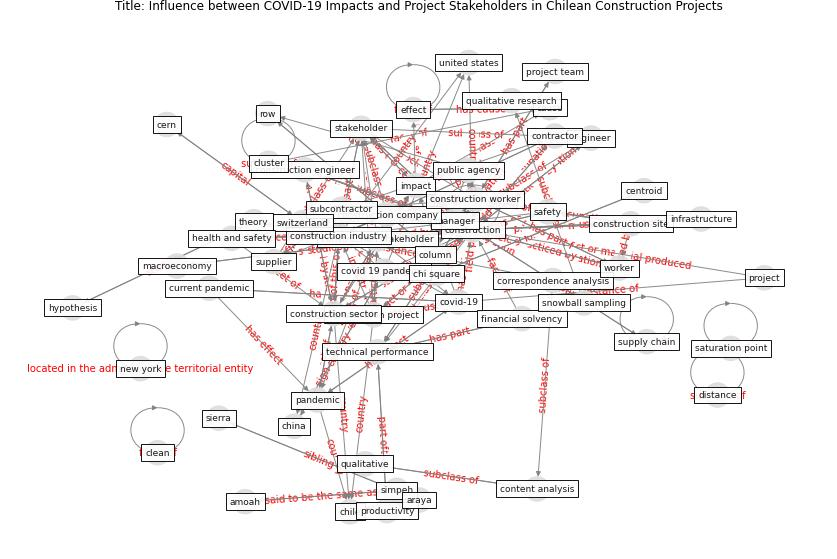

# Article: __Influence between COVID-19 Impacts and Project Stakeholders in Chilean Construction Projects__ (araya_influence_2021)

* [10.3390/su131810082](https://doi.org/10.3390/su131810082)
* Cluster: [construction-project](cluster_3.md)

## Keywords

[construction](keyword_construction.md), [pandemic](keyword_pandemic.md), [worker](keyword_worker.md)

## Abstract

The construction sector has been heavily impacted by
COVID-19 due to the restricted conditions required by
construction projects to perform physical activities. Given
this context, it is of interest for the industry to
identify the impacts that COVID-19 has had on the
development of construction projects. However, little is
known regarding how the impacts of COVID-19 have affected
multiple stakeholders in construction projects and whether
there is some interaction among such impacts. This study
aims to explore the impacts of COVID-19 and their influence
among different construction stakeholders (i.e., engineers
and managers, workers, suppliers). This study was enabled
by 40 semi-structured interviews that were performed with
stakeholders in construction projects in Chile. Content
analysis from the interviews led to the identification of
categories of impacts and stakeholders, to the development
of a cognitive map of the impacts, and to the application
of correspondence analysis. Fifteen categories of impacts
were identified, and six construction stakeholders were
identified as having been impacted by COVID-19. Identifying
the causes and effects of the impacts felt by multiple
stakeholders revealed that these impacts interacted among
each other. Understanding the impacts of COVID-19 on
construction stakeholders may facilitate the development of
effective mitigation strategies to reduce COVID-19 impacts
on the construction sector.

## Concepts

 

### References 

* [Guidelines for Responding to COVID-19 Pandemic:
Best Practices, Impacts, and Future Research
Directions](article_assaad_guidelines_2021.md)
* [Mechanisms for addressing the impact of COVID-19 on
infrastructure projects](article_king_mechanisms_2021.md)
* [The Impact of Pandemic Crisis on the Survival of
Construction Industry: A Case of COVID-19](article_gamil_impact_2020.md)
* [Identifying Actions to Control and Mitigate the
Effects of the COVID-19 Pandemic on Construction
Organizations: Preliminary Findings](article_raoufi_identifying_2021.md)
* [Analysis of COVID-19 Concerns Raised by the
Construction Workforce and Development of
Mitigation Practices](article_bou_hatoum_analysis_2021.md)

### Cited by 

* [Perception of COVID-19 impacts on the construction
industry over time](article_rokooei_perception_2022.md)
