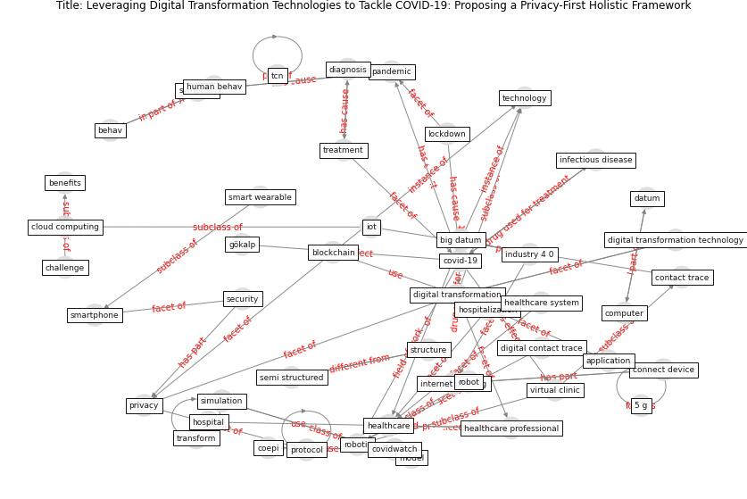

# Article: __Leveraging Digital Transformation Technologies to Tackle COVID-19: Proposing a Privacy-First Holistic Framework__ (arpaci_leveraging_2021)

* [10.1007/978-3-030-67716-9_10](https://doi.org/10.1007/978-3-030-67716-9_10)
* Cluster: [blockchain-ai](cluster_11)

## Keywords

* [covid-19](keyword_covid-19), [digital transformation](keyword_digital_transformation), [blockchain](keyword_blockchain), [healthcare system](keyword_healthcare_system), [technology](keyword_technology), [internet of thing](keyword_internet_of_thing), [lockdown](keyword_lockdown), [pandemic](keyword_pandemic), [treatment](keyword_treatment), [healthcare](keyword_healthcare), healthcare professional, computer, coepi, [cloud computing](keyword_cloud_computing), [protocol](keyword_protocol)

## Keywords at large

* [covid-19](keyword_covid-19), [digital transformation](keyword_digital_transformation), [blockchain](keyword_blockchain), [technology](keyword_technology), [healthcare system](keyword_healthcare_system), [protocol](keyword_protocol), [internet of thing](keyword_internet_of_thing), [lockdown](keyword_lockdown), [pandemic](keyword_pandemic), [treatment](keyword_treatment)

## Concepts

 

### Closest articles 

* [The role of 5G for digital healthcare against COVID-19 pandemic: Opportunities and challenges](article_siriwardhana_role_2021)
* [Mobile Technology Solution for COVID-19: Surveillance and Prevention](article_raza_mobile_2021)
* [Health Information Exchange with Blockchain amid Covid-19-like Pandemics](article_christodoulou_health_2020)
* [A Comprehensive Review of the COVID-19 Pandemic and the Role of IoT, Drones, AI, Blockchain, and 5G in Managing its Impact](article_chamola_comprehensive_2020)
* [Internet of things (IoT) applications to fight against COVID-19 pandemic](article_singh_internet_2020)
* [Emerging Technologies to Combat the COVID-19 Pandemic](article_vaishya_emerging_2020)
* [How Can Blockchain Help People in the Event of Pandemics Such as the COVID-19?](article_chang_how_2020)
* [Challenges of data sharing in European Covid-19 projects: A learning opportunity for advancing pandemic preparedness and response](article_tacconelli_challenges_2022)
* [Significant applications of virtual reality for COVID-19 pandemic](article_singh_significant_2020)
* [2020 Data Protection Report](article_council_of_europe_2020_2020)

### References 

* [Combating COVID-19—The role of robotics in managing
public health and infectious diseases](article_yang_combating_2020)
* [A Comprehensive Review of the COVID-19 Pandemic
and the Role of IoT, Drones, AI, Blockchain, and
5G in Managing its Impact](article_chamola_comprehensive_2020)

### Cited by 

