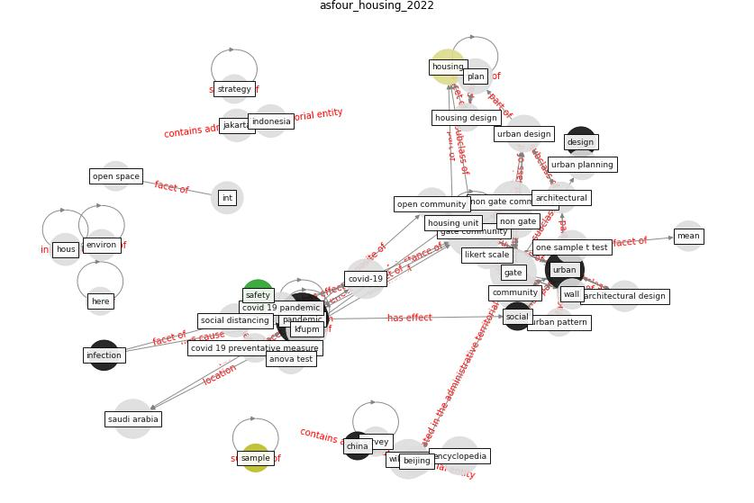

# Article: Housing Experience in Gated Communities in the Time of Pandemics: Lessons Learned from COVID-19 (asfour_housing_2022)

* Source: [10.3390/ijerph19041925](https://doi.org/10.3390/ijerph19041925)
* Year: 2022
* Cluster: [city-health](cluster_14)

## Keywords

 * al ferdaw, analysis of variance, anova test, architectural, [architectural design](keyword_architectural_design), [argentina](keyword_argentina), attach unit, [australia](keyword_australia), bariloche, basel, [beijing](keyword_beijing), [china](keyword_china), [community](keyword_community), confidence level, coronavirus disease, coronavirus question that will not go away, covid 19 infection, [covid 19 pandemic](keyword_covid_19_pandemic), covid 19 preventative measure, [covid-19](keyword_covid-19), [design](keyword_design), detach villa, dhahran, [evidence](keyword_evidence), fence, floor area, floor plan, [gate](keyword_gate), [gate community](keyword_gate_community), gate village, halleran, [housing](keyword_housing), housing design, housing preference, housing type, housing unit, human settlement, [indonesia](keyword_indonesia), indoor space, [infection](keyword_infection), infection prevention, influenza pandemic, informed consent statement, international, investigation, jakarta, kfupm, king fahd university of petroleum mineral, kingke fahd university of petroleum and mineral, likert scale, [lockdown](keyword_lockdown), mean, mineral, non gate, non gate commun, [non gate community](keyword_non_gate_community), one sample t test, open community, open space, outdoor space, [pandemic](keyword_pandemic), peter, petroleum, [plan](keyword_plan), play area, post covid 19, preventative measure, prevention, [province](keyword_province), [public health](keyword_public_health), [residential](keyword_residential), [risk](keyword_risk), row house, [safety](keyword_safety), [sample](keyword_sample), [saudi arabia](keyword_saudi_arabia), [security](keyword_security), self sufficiency, separation, [social](keyword_social), [social distancing](keyword_social_distancing), social support, [society](keyword_society), statistic, strategy, [study](keyword_study), survey, [switzerland](keyword_switzerland), t test, two sample t test, type 1, type 3, unit, [urban](keyword_urban), urban design, urban pattern, [urban planning](keyword_urban_planning), vegetation, wall, welfare

## Concepts

 

## Neighbours

### Closest articles

* Urban Community Sustainable Development Patterns under the Influence of COVID-19: A Case Study Based on the Non-Contact Interaction Perspective of Hangzhou City - [LINK](article_wang_urban_2021)
* Questioning the use of the balcony in apartments during the COVID-19 pandemic process - [LINK](article_aydin_questioning_2020)
* Assessment of COVID-19 precautionary measures in sports facilities: A case study on a health club in Saudi Arabia - [LINK](article_ibrahim_assessment_2022)
* A Mixed Approach on Resilience of Spanish Dwellings and Households during COVID-19 Lockdown - [LINK](article_cuerdo-vilches_mixed_2020)
* How our homes impact our health: using a COVID-19 informed approach to examine urban apartment housing - [LINK](article_peters_how_2020)
* Towards Resilient Residential Buildings and Neighborhoods in Light of COVID-19 Pandemic—The Scenario of Podgorica, Montenegro - [LINK](article_bojovic_towards_2022)
* Public housing and COVID-19: contestation, challenge and change - [LINK](article_power_public_2020)
* Dangerous liaisons? Applying the social harm perspective to the social inequality, housing and health trifecta during the Covid-19 pandemic - [LINK](article_gurney_dangerous_2021)
* COVID-19 and Green Housing: A Review of Relevant Literature - [LINK](article_kaklauskas_covid-19_2021)
* Urban design attributes and resilience: COVID-19 evidence from New York City - [LINK](article_yang_urban_2021)

### Closest BPs

* Blueprint: Public places as information points - [LINK](bp_8)
* Blueprint: Tender support at building stage - [LINK](bp_9)
* Blueprint: Architecture design - [LINK](bp_2)
