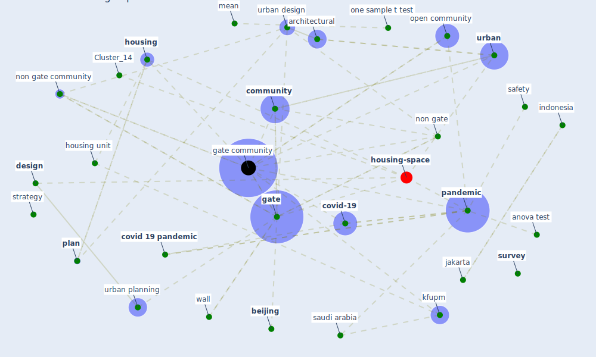

# Article: Housing Experience in Gated Communities in the Time of Pandemics: Lessons Learned from COVID-19 (asfour_housing_2022)

* Source: [10.3390/ijerph19041925](https://doi.org/10.3390/ijerph19041925)
* Year: 2022
* Cluster: [health-city](cluster_1)

## Keywords

 * analysis of variance, anova test, [architectural](keyword_architectural), [argentina](keyword_argentina), attach unit, bariloche, basel, [beijing](keyword_beijing), [china](keyword_china), [community](keyword_community), confidence level, [covid 19 pandemic](keyword_covid_19_pandemic), covid 19 preventative measure, [covid-19](keyword_covid-19), [design](keyword_design), detach villa, dhahran, eastern province, [evidence](keyword_evidence), [factor](keyword_factor), fence, five point with 5, floor area, floor plan, [gate](keyword_gate), [gate community](keyword_gate_community), gate village, halleran, [housing](keyword_housing), housing design, housing market dynamic, housing preference, housing type, housing unit, human settlement, [indonesia](keyword_indonesia), indoor space, [infection](keyword_infection), infection prevention, influenza pandemic, informed consent statement, international, investigation, jakarta, [kfupm](keyword_kfupm), king fahd university of petroleum mineral, likert scale, [lockdown](keyword_lockdown), map, mean, mineral, my house, national, nineteen eighty four, non gate, non gate commun, [non gate community](keyword_non_gate_community), one sample, one sample t test, open community, open space, outdoor space, [pandemic](keyword_pandemic), peter, petroleum, [plan](keyword_plan), play area, post covid 19, post pandemic era, post-pandemic, preventative measure, [prevention](keyword_prevention), [province](keyword_province), [public health](keyword_public_health), [residential](keyword_residential), [risk](keyword_risk), row house, [safety](keyword_safety), [sample](keyword_sample), [saudi arabia](keyword_saudi_arabia), [security](keyword_security), self sufficiency, separation, [social](keyword_social), [society](keyword_society), [strategy](keyword_strategy), [study](keyword_study), [survey](keyword_survey), [switzerland](keyword_switzerland), t test, two sample t test, type 1, type 3, unit, [urban](keyword_urban), urban design, urban pattern, [urban planning](keyword_urban_planning), vegetation, wall

## Concepts

 

## Neighbours

### Closest articles

* Urban Community Sustainable Development Patterns under the Influence of COVID-19: A Case Study Based on the Non-Contact Interaction Perspective of Hangzhou City - [LINK](article_wang_urban_2021)
* A Mixed Approach on Resilience of Spanish Dwellings and Households during COVID-19 Lockdown - [LINK](article_cuerdo-vilches_mixed_2020)
* Public housing and COVID-19: contestation, challenge and change - [LINK](article_power_public_2020)
* Dangerous liaisons? Applying the social harm perspective to the social inequality, housing and health trifecta during the Covid-19 pandemic - [LINK](article_gurney_dangerous_2021)
* Eviction, Health Inequity, and the Spread of COVID-19: Housing Policy as a Primary Pandemic Mitigation Strategy - [LINK](article_benfer_eviction_2021)
* Questioning the use of the balcony in apartments during the COVID-19 pandemic process - [LINK](article_aydin_questioning_2020)
* COVID-19 Lessons for a Resilient Built Environment: A Roadmap - [LINK](article_hull_covid-19_2020)
* Houses amid COVID-19: Environmental challenges and design adaptation - [LINK](article_hizra_houses_2021)
* How our homes impact our health: using a COVID-19 informed approach to examine urban apartment housing - [LINK](article_peters_how_2020)
* Towards Resilient Residential Buildings and Neighborhoods in Light of COVID-19 Pandemic—The Scenario of Podgorica, Montenegro - [LINK](article_bojovic_towards_2022)

### Closest BPs

* Blueprint: Monitoring of wastewater - [LINK](bp_21)
* Blueprint: Resilience in staffing and skills training - [LINK](bp_12)
* Blueprint: Air Cleaning Plants - [LINK](bp_15)
