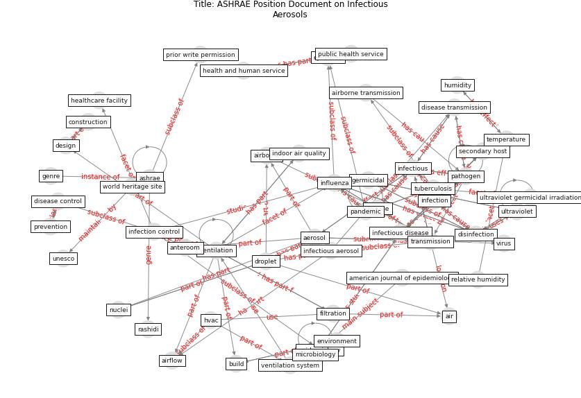

# Article: __ASHRAE Position Document on Infectious Aerosols__ (ashrae_ashrae_2022)

* URL: [https://www.ashrae.org/file%20library/about/position%20documents/pd_infectiousaerosols_2020.pdf](https://www.ashrae.org/file%20library/about/position%20documents/pd_infectiousaerosols_2020.pdf)
* Year: 2022

## Keywords

* [ashrae](keyword_ashrae), [ventilation](keyword_ventilation), [pathogen](keyword_pathogen), [aerosol](keyword_aerosol), [influenza](keyword_influenza), [transmission](keyword_transmission), [infectious disease](keyword_infectious_disease), [droplet](keyword_droplet), [infection control](keyword_infection_control), [infectious](keyword_infectious), [build](keyword_build), [ultraviolet](keyword_ultraviolet), prior write permission, [hvac](keyword_hvac), [disinfection](keyword_disinfection)

## Keywords at large

* [ashrae](keyword_ashrae), [ventilation](keyword_ventilation), [pathogen](keyword_pathogen), [aerosol](keyword_aerosol), [influenza](keyword_influenza), [transmission](keyword_transmission), [infectious disease](keyword_infectious_disease), [droplet](keyword_droplet), [infectious](keyword_infectious), [infection control](keyword_infection_control)

## Concepts

 

### Closest articles 

* [Ventilation use in nonmedical settings during COVID-19: Cleaning protocol, maintenance, and recommendations](article_nembhard_ventilation_2020)
* [Review and comparison of HVAC operation guidelines in different countries during the COVID-19 pandemic](article_guo_review_2021)
* [morawska_how_2020-1](article_morawska_how_2020-1)
* [Heating, ventilation and air-conditioning systems in the
context of COVID-19](article_ecdc_heating_2020)
* [How can airborne transmission of COVID-19 indoors be minimised?](article_morawska_how_2020)
* [Methods for air cleaning and protection of building occupants from airborne pathogens](article_bolashikov_methods_2009)
* [The ventilation of buildings and other mitigating measures for COVID-19: a focus on wintertime](article_burridge_ventilation_2021)
* [A review of facilities management interventions to mitigate respiratory infections in existing buildings](article_zhang_review_2022)
* [Air Disinfection for Airborne Infection Control with a Focus on COVID‐19: Why Germicidal UV is Essential
            †](article_nardell_air_2021)
* [Environmental factors involved in SARS-CoV-2 transmission: effect and role of indoor environmental quality in the strategy for COVID-19 infection control](article_azuma_environmental_2020)

