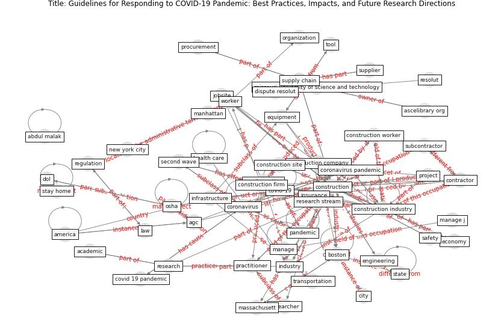

# Article: __Guidelines for Responding to COVID-19 Pandemic: Best Practices, Impacts, and Future Research Directions__ (assaad_guidelines_2021)

* [10.1061/(ASCE)ME.1943-5479.0000906](https://doi.org/10.1061/(ASCE)ME.1943-5479.0000906)
* Cluster: [construction-project](cluster_9)

## Keywords

[construction](keyword_construction), [pandemic](keyword_pandemic), [coronavirus](keyword_coronavirus), [industry](keyword_industry), [contractor](keyword_contractor), [engineering](keyword_engineering)

## Concepts

 

