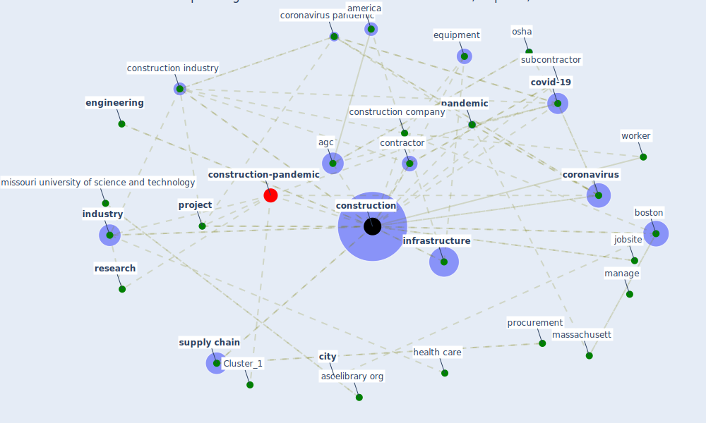

# Article: Guidelines for Responding to COVID-19 Pandemic: Best Practices, Impacts, and Future Research Directions (assaad_guidelines_2021)

* Source: [10.1061/(ASCE)ME.1943-5479.0000906](https://doi.org/10.1061/(ASCE)ME.1943-5479.0000906)
* Year: 2021
* Cluster: [construction-pandemic](cluster_1)

## Keywords

 * abdul malak, academic, adapt, agc, america, [analytic](keyword_analytic), ascelibrary org, [boston](keyword_boston), boston marathon, [build](keyword_build), [cdc](keyword_cdc), cern, change management, [city](keyword_city), [company](keyword_company), [construction](keyword_construction), construction company, construction firm, [construction industry](keyword_construction_industry), [construction professional](keyword_construction_professional), construction site, [construction worker](keyword_construction_worker), [contract](keyword_contract), contract language, [contractor](keyword_contractor), cooper, [coronavirus](keyword_coronavirus), coronavirus pandemic, [covid 19 pandemic](keyword_covid_19_pandemic), [covid-19](keyword_covid-19), [datum](keyword_datum), direct impact, disposable glove, dispute resolut, dol, [economy](keyword_economy), el adaway, [employee](keyword_employee), [employer](keyword_employer), [engineering](keyword_engineering), equipment, firm, good practice, [health](keyword_health), [health care](keyword_health_care), illness symptom, incidental, [industry](keyword_industry), [infrastructure](keyword_infrastructure), insurance, jobsite, labor, labor shortage, [law](keyword_law), legal, [lockdown](keyword_lockdown), low exposure risk, manage, manage j, [manhattan](keyword_manhattan), massachusett, melnik, methodology, missouri university of science and technology, new normal, [new york city](keyword_new_york_city), nonessential, organization, [osha](keyword_osha), [pandemic](keyword_pandemic), practitioner, procurement, [project](keyword_project), [project management](keyword_project_management), regulation, [research](keyword_research), research stream, [researcher](keyword_researcher), resolut, reusable glove, risk exposure, [safety](keyword_safety), [sanitation](keyword_sanitation), second wave, sick leave, [state](keyword_state), stay home, subcontractor, supplier, [supply chain](keyword_supply_chain), [symptom](keyword_symptom), [tool](keyword_tool), transportation, transportation engineering, union, [united kingdom](keyword_united_kingdom), we organization, [worker](keyword_worker), [workplace](keyword_workplace), [world health organization](keyword_world_health_organization)

## Concepts

 

## Neighbours

### Closest articles

* Influence between COVID-19 Impacts and Project Stakeholders in Chilean Construction Projects - [LINK](article_araya_influence_2021)
* Analysis of COVID-19 Concerns Raised by the Construction Workforce and Development of Mitigation Practices - [LINK](article_bou_hatoum_analysis_2021)
* Identifying Actions to Control and Mitigate the Effects of the COVID-19 Pandemic on Construction Organizations: Preliminary Findings - [LINK](article_raoufi_identifying_2021)
* Propositions for a Resilient, Post-COVID-19 Future for the AEC Industry - [LINK](article_nassereddine_propositions_2021)
* COVID-19 pandemic: the effects and prospects in the construction industry. - [LINK](article_ogunnusi_covid-19_2020)
* Impacts of COVID-19 on Health and Safety of Workforce in Construction Industry - [LINK](article_pamidimukkala_impacts_2021)
* Strategies to Mitigate COVID-19 Pandemic Impacts on Health and Safety of Workers in Construction Projects - [LINK](article_kaushal_strategies_2021)
* The Impact of Pandemic Crisis on the Survival of Construction Industry: A Case of COVID-19 - [LINK](article_gamil_impact_2020)
* Perception of COVID-19 impacts on the construction industry over time - [LINK](article_rokooei_perception_2022)
* Covid-19 Associated Risks and Mitigation Strategies relevant for the UK Construction Industry - [LINK](article_dan-jumbo_covid-19_2021)

### Closest BPs

* Blueprint: Monitoring of wastewater - [LINK](bp_21)
* Blueprint: Smart Locker System - [LINK](bp_1)
* Blueprint: Mental health – Belong: Do something with someone - [LINK](bp_19)
