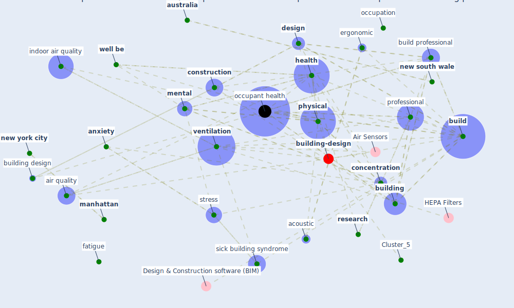

# Article: Occupant health in buildings: Impact of the COVID-19 pandemic on the opinions of building professionals and implications on research (awada_occupant_2022)

* Source: [10.1016/j.buildenv.2021.108440](https://doi.org/10.1016/j.buildenv.2021.108440)
* Year: 2022
* Cluster: [building-energy](cluster_2)

## Keywords

 * acoustic, air quality, [analysis](keyword_analysis), [anxiety](keyword_anxiety), [architect](keyword_architect), attention, [australia](keyword_australia), awada, behaviour, [build](keyword_build), [build environment](keyword_build_environment), build professional, [building](keyword_building), building attribute, building design, building practitioner, [china](keyword_china), climb, cognitive performance, concentration, concentration loss, [construction](keyword_construction), [covid 19 pandemic](keyword_covid_19_pandemic), [covid-19](keyword_covid-19), [datum](keyword_datum), datum scientist, [depression](keyword_depression), [design](keyword_design), [environment](keyword_environment), ergon, ergonomic, fatigue, field study, genre, headache, [health](keyword_health), health in building, health professional, [hong kong](keyword_hong_kong), [hospital](keyword_hospital), indoor air, [indoor air quality](keyword_indoor_air_quality), [indoor environment](keyword_indoor_environment), indoor space, literature review, [manhattan](keyword_manhattan), [mental](keyword_mental), methodology, mood, musculoskeletal, [new south wale](keyword_new_south_wale), [new york city](keyword_new_york_city), [nigeria](keyword_nigeria), [noise](keyword_noise), nose, [occupant](keyword_occupant), [occupant health](keyword_occupant_health), occupant health in building, occupation, officair, [office](keyword_office), office building, office space, operation, [pandemic](keyword_pandemic), performance, [physical](keyword_physical), [pollutant](keyword_pollutant), practitioner, [productivity](keyword_productivity), profession, [professional](keyword_professional), [psychological](keyword_psychological), publ, publ subj publ, questionnaire, recent, recent pandemic, [research](keyword_research), selangor, sick building syndrome, [social](keyword_social), [stress](keyword_stress), [study](keyword_study), [survey](keyword_survey), [sustainability](keyword_sustainability), [symptom](keyword_symptom), thermal, tiredness, [unesco](keyword_unesco), [united nations](keyword_united_nations), [united states](keyword_united_states), [ventilation](keyword_ventilation), ventilation system, [well be](keyword_well_be), [wellbee](keyword_wellbee), [work](keyword_work), work environment, [world health organization](keyword_world_health_organization), [world heritage site](keyword_world_heritage_site)

## Concepts

 

## Neighbours

### Closest articles

* Ten questions concerning occupant health in buildings during normal operations and extreme events including the COVID-19 pandemic - [LINK](article_awada_ten_2021)
* Health, Wellbeing \& Productivity in Offices - [LINK](article_world_green_building_council_health_2014)
* Smart buildings: how a virus might lead to healthier buildings - Arup - [LINK](article_lam_smart_2021)
* Designing Post COVID-19 Buildings: Approaches for Achieving Healthy Buildings - [LINK](article_navaratnam_designing_2022)
* COVID-19 Experience Transforming the Protective Environment of Office Buildings and Spaces - [LINK](article_phapant_covid-19_2021)
* A study on office workplace modification during the COVID-19 pandemic in The Netherlands - [LINK](article_hou_study_2021)
* It’s time to reimagine where and how work will get done (PwC’s US Remote Work Survey) - [LINK](article_pricewaterhousecoopers_its_2021)
* Assessment of Building Automation and Control Systems in Danish Healthcare Facilities in the COVID-19 Era - [LINK](article_pedersen_assessment_2022)
* Reflecting on Impacts of COVID19 on Sustainable Buildings and Cities - [LINK](article_gonzalez_reflecting_2021)
* Will a pandemic change building codes? - [LINK](article_rozgus_will_2020)

### Closest BPs

* Blueprint: Building Adaptation during a pandemic - [LINK](bp_14)
* Blueprint: Architecture design - [LINK](bp_2)
* Blueprint: Tender support at building stage - [LINK](bp_9)
