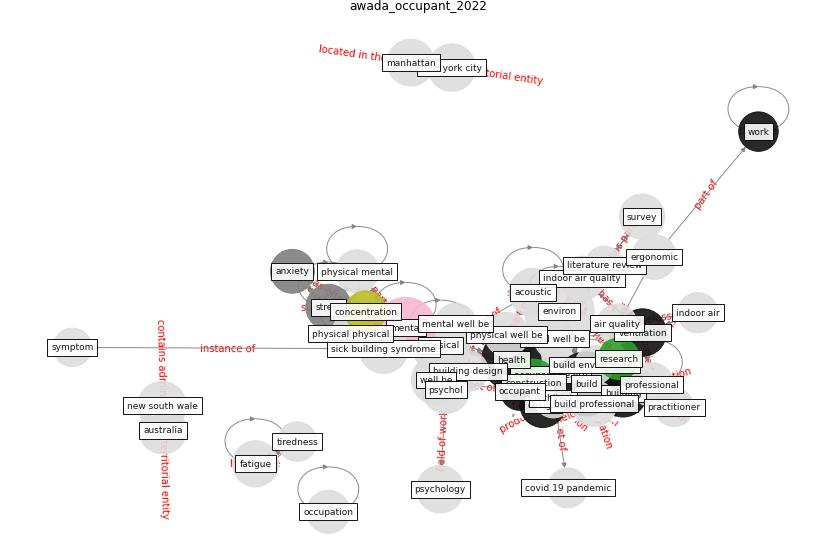

# Article: Occupant health in buildings: Impact of the COVID-19 pandemic on the opinions of building professionals and implications on research (awada_occupant_2022)

* Source: [10.1016/j.buildenv.2021.108440](https://doi.org/10.1016/j.buildenv.2021.108440)
* Year: 2022
* Cluster: [building-space](cluster_1)

## Keywords

 * acoustic, air quality, analysis, [anxiety](keyword_anxiety), [architect](keyword_architect), [australia](keyword_australia), awada, behaviour, [build](keyword_build), [build environment](keyword_build_environment), build professional, [building](keyword_building), building attribute, building design, building practitioner, building type, [china](keyword_china), cognitive performance, concentration, [construction](keyword_construction), [covid 19 pandemic](keyword_covid_19_pandemic), [covid-19](keyword_covid-19), datum scientist, [depression](keyword_depression), [design](keyword_design), [environment](keyword_environment), ergon, ergonomic, fatigue, headache, [health](keyword_health), health in building, health issue, health professional, [hong kong](keyword_hong_kong), indoor air, [indoor air quality](keyword_indoor_air_quality), [indoor environment](keyword_indoor_environment), literature review, [manhattan](keyword_manhattan), [mental](keyword_mental), [mental health](keyword_mental_health), mental mental, mental well be, mood, musculoskeletal, musculoskeletal disorder, [new south wale](keyword_new_south_wale), [new york city](keyword_new_york_city), [nigeria](keyword_nigeria), [noise](keyword_noise), nose, [occupant](keyword_occupant), [occupant health](keyword_occupant_health), occupant health in building, occupation, officair, [office](keyword_office), office building, office space, [operation](keyword_operation), [pandemic](keyword_pandemic), [physical](keyword_physical), physical mental, physical physical, physical well be, physiological, [pollutant](keyword_pollutant), practitioner, profession, [professional](keyword_professional), psychol, [psychological](keyword_psychological), psychology, publ, publ subj publ, questionnaire, recent, recent pandemic, [research](keyword_research), sick building syndrome, [social](keyword_social), social well be, [stress](keyword_stress), [study](keyword_study), survey, [sustainability](keyword_sustainability), [symptom](keyword_symptom), thermal, [thermal comfort](keyword_thermal_comfort), tiredness, [unesco](keyword_unesco), [united nations](keyword_united_nations), [united states](keyword_united_states), [ventilation](keyword_ventilation), [ventilation system](keyword_ventilation_system), [well be](keyword_well_be), [wellbee](keyword_wellbee), [work](keyword_work), [world heritage site](keyword_world_heritage_site)

## Concepts

 

## Neighbours

### Closest articles

* Ten questions concerning occupant health in buildings during normal operations and extreme events including the COVID-19 pandemic - [LINK](article_awada_ten_2021)
* Health, Wellbeing \& Productivity in Offices - [LINK](article_world_green_building_council_health_2014)
* Smart buildings: how a virus might lead to healthier buildings - Arup - [LINK](article_lam_smart_2021)
* The effect of a redesigned floor plan, occupant density and the quality of indoor climate on the cost of space, productivity and sick leave in an office building–A case study - [LINK](article_saari_effect_2006)
* Designing Post COVID-19 Buildings: Approaches for Achieving Healthy Buildings - [LINK](article_navaratnam_designing_2022)
* COVID-19 Experience Transforming the Protective Environment of Office Buildings and Spaces - [LINK](article_phapant_covid-19_2021)
*  - [LINK](article_yakubu_aminu_dodo_green_2020)
* The contribution of green buildings in the fight against COVID-19 - [LINK](article_world_green_building_council_contribution_2020)
* It’s time to reimagine where and how work will get done (PwC’s US Remote Work Survey) - [LINK](article_pricewaterhousecoopers_its_2021)
* Architectural Design Drives the Biogeography of Indoor Bacterial Communities - [LINK](article_kembel_architectural_2014)

### Closest BPs

* Blueprint: Building Adaptation during a pandemic - [LINK](bp_14)
* Blueprint: Architecture design - [LINK](bp_2)
* Blueprint: Tender support at building stage - [LINK](bp_9)
