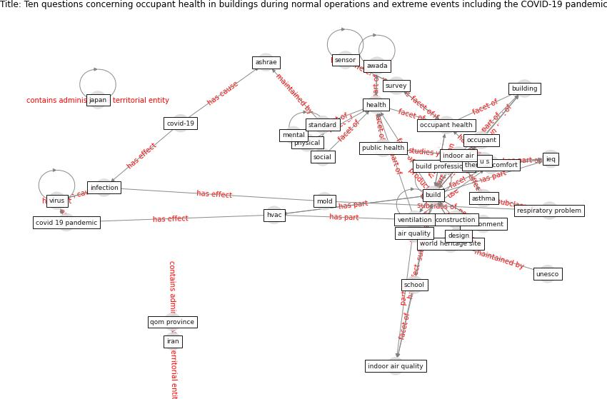

# Article: __Ten questions concerning occupant health in buildings during normal operations and extreme events including the COVID-19 pandemic__ (awada_ten_2021)

* [10.1016/j.buildenv.2020.107480](https://doi.org/10.1016/j.buildenv.2020.107480)
* Cluster: [health-building](cluster_9)

## Keywords

* [build](keyword_build), [health](keyword_health), [ventilation](keyword_ventilation), [occupant health](keyword_occupant_health), [covid 19 pandemic](keyword_covid_19_pandemic), [physical](keyword_physical), [mental](keyword_mental), [building](keyword_building), [ashrae](keyword_ashrae), [asthma](keyword_asthma), indoor air, occupant, [sensor](keyword_sensor), [covid-19](keyword_covid-19), mold

## Keywords at large

* [build](keyword_build), [health](keyword_health), [ventilation](keyword_ventilation), [occupant health](keyword_occupant_health), [covid 19 pandemic](keyword_covid_19_pandemic), [physical](keyword_physical), [mental](keyword_mental), [building](keyword_building), [ashrae](keyword_ashrae), [asthma](keyword_asthma)

## Concepts

 

### Closest articles 

* [Occupant health in buildings: Impact of the COVID-19 pandemic on the opinions of building professionals and implications on research](article_awada_occupant_2022)
* [Smart buildings: how a virus might lead to healthier
buildings - Arup](article_lam_smart_2021)
* [Health, Wellbeing \& Productivity in Offices](article_world_green_building_council_health_2014)
* [The effect of a redesigned floor plan, occupant density and the quality of indoor climate on the cost of space, productivity and sick leave in an office building–A case study](article_saari_effect_2006)
* [A comprehensive review on indoor air quality monitoring systems for enhanced public health](article_saini_comprehensive_2020)
* [Designing Post COVID-19 Buildings: Approaches for Achieving Healthy Buildings](article_navaratnam_designing_2022)
* 
* [The contribution of green buildings in the fight against
COVID-19](article_world_green_building_council_contribution_2020)
* [Characterization and performance evaluation of a full-scale activated carbon-based dynamic botanical air filtration system for improving indoor air quality](article_wang_characterization_2011)
* [The Effect of Opening Windows on Air Change Rates in Two Homes](article_howard-reed_effect_2002)

### References 

* [Assessing the health and hygiene performance of apartment
buildings](article_ho_assessing_2004)
* [Aerosol and Surface Stability of SARS-CoV-2 as
Compared with SARS-CoV-1](article_van_doremalen_aerosol_2020)
* [2019 Novel Coronavirus (COVID-19) Pandemic:
Built Environment Considerations To Reduce
Transmission](article_dietz_2019_2020)

### Cited by 

* [A Review on Building Design as a Biomedical
System for Preventing COVID-19 Pandemic](article_amran_review_2022)
* [Occupant health in buildings: Impact of the COVID-19
pandemic on the opinions of building professionals and
implications on research](article_awada_occupant_2022)
* [Prophylactic Architecture: Formulating the Concept
of Pandemic-Resilient Homes](article_elrayies_prophylactic_2022)
* [COVID-19 and Green Housing: A Review of
Relevant Literature](article_kaklauskas_covid-19_2021)
* [Designing Post COVID-19 Buildings: Approaches for
Achieving Healthy Buildings](article_navaratnam_designing_2022)
* [COVID-19 Experience Transforming the Protective
Environment of Office Buildings and Spaces](article_phapant_covid-19_2021)
* [A review of facilities management interventions to
mitigate respiratory infections in existing buildings](article_zhang_review_2022)
