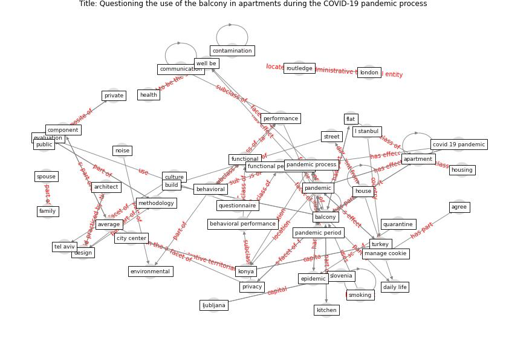

# Article: __Questioning the use of the balcony in apartments during the COVID-19 pandemic process__ (aydin_questioning_2020)

* [10.1108/ARCH-09-2020-0202](https://doi.org/10.1108/ARCH-09-2020-0202)
* Cluster: [space-urban](cluster_13)

## Keywords

* [balcony](keyword_balcony), [cookie](keyword_cookie), [manage cookie](keyword_manage_cookie), [pandemic](keyword_pandemic), [accept](keyword_accept), [house](keyword_house), [setting](keyword_setting), [apartment](keyword_apartment), [epidemic](keyword_epidemic), [konya](keyword_konya), [privacy](keyword_privacy), [methodology](keyword_methodology), [kitchen](keyword_kitchen), [noise](keyword_noise), ljubljana

## Keywords at large

* [biophilic design](keyword_biophilic_design), [architecture](keyword_architecture), [sustainable architecture](keyword_sustainable_architecture), [nature](keyword_nature), [design](keyword_design), [biophilic](keyword_biophilic), [environ](keyword_environ), [biophilia](keyword_biophilia), [wellbeing](keyword_wellbeing), [health](keyword_health)

## Abstract

Purpose The purpose of this paper is to assess using of
balconies in apartment buildings. In the research, by
questioning the use of balconies as to the coronavirus
disease 2019 (COVID-19) process and before, the place and
importance of the balcony in the apartment house were
questioned.

Design/methodology/approach Balcony performance dimensions
and components, which were revealed based on the studies
conducted, were analyzed with questions directed to the
individuals living in the apartment (one person every
flat). In the research in which behavioral and functional
performance is questioned through users, the survey method
was used and the data were analyzed in the Statistical
Product and Service Solutions (SPSS) program. Apart from
the performance dimensions, data on the characteristics of
the balconies were also obtained from the answers of the
users.

Findings The use of balconies has increased during the
pandemic process and has become more important in
apartments. The size of the balcony is related to the size
of the house. The functional performance of the balcony is
linked to the size of the balcony, behavioral and
environmental values. The balcony should be large enough to
accommodate equipment for daily activities, the proximity
to the surrounding buildings, view, noise affect the
performance of the balcony.

Research limitations/implications The research is limited
to the questionnaire applied to apartment users in Konya
(Turkey) city center. Male and female users participated in
the study, and the use of the balcony was questioned.

Practical implications Apartment design includes results
that contribute to architects regarding the location and
use of the balcony. It also includes the results that can
be evaluated by local governments in terms of binding rules
on balconies in zoning regulations.

Social implications The balcony is one of the rooms of the
house, which is mainly designed in connection with the
kitchen and living room / living room and shared by the
household. The balcony is used as a socializing place for
the common actions of the house users. This space that
opens to the outside is valuable in terms of providing
communication with people outside.

Originality/value The fact that no study has been conducted
to question the use of the balcony over the user makes this
study valuable. In addition, questioning the use of the
balcony during the pandemic process is important in terms
of revealing the importance of the need for open space in
an apartment. The results will contribute to architects and
local administrations in terms of binding rules in design
regarding the location of the balcony in the house.

## Concepts

 

