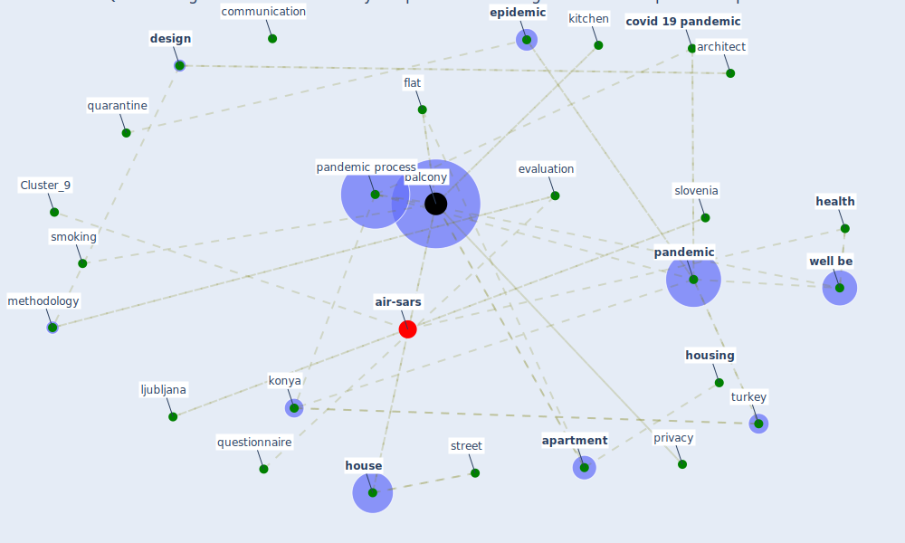

# Article: Questioning the use of the balcony in apartments during the COVID-19 pandemic process (aydin_questioning_2020)

* Source: [10.1108/ARCH-09-2020-0202](https://doi.org/10.1108/ARCH-09-2020-0202)
* Year: 2020
* Cluster: [health-city](cluster_1)

## Keywords

 * I stanbul, acoustic, [agree](keyword_agree), [analysis](keyword_analysis), [apartment](keyword_apartment), [architect](keyword_architect), [architecture](keyword_architecture), auditory, average, aydın, [balcony](keyword_balcony), behavioral, [build](keyword_build), [building](keyword_building), circulation, city center, communication, component, [contamination](keyword_contamination), [covid 19 pandemic](keyword_covid_19_pandemic), culture, daily life, dependent variable, [design](keyword_design), dicle aydin, disagree, eat, emerald, [environmental](keyword_environmental), [epidemic](keyword_epidemic), evaluation, family, finding and evaluation, flat, floor, food, functional, [health](keyword_health), history, [home](keyword_home), [house](keyword_house), [housing](keyword_housing), independent variable, indoor area, iran, iranian culture, isolation center, kitchen, konya, l orfeo, lifestyle 4, ljubljana, [london](keyword_london), manage cookie, [market](keyword_market), methodology, mosque, necmettin erbakan university, neutral, [noise](keyword_noise), north, open, [pandemic](keyword_pandemic), pandemic period, pandemic process, performance, preiser, previous process, [privacy](keyword_privacy), private, [processing](keyword_processing), [public](keyword_public), [quarantine](keyword_quarantine), quarantine island, quarantine place, questionnaire, reliability, reliability analysis, search, [slovenia](keyword_slovenia), smoking, [society](keyword_society), sociological, south, spouse, stay at home, street, summer, sun, tehran, tel aviv, tomato paste, tuerkiye, turkey, türk I slâm medeniyeti akademik araştırmalar dergisi, [user](keyword_user), [ventilation](keyword_ventilation), visual, [well be](keyword_well_be), western civilization

## Concepts

 

## Neighbours

### Closest articles

* A Mixed Approach on Resilience of Spanish Dwellings and Households during COVID-19 Lockdown - [LINK](article_cuerdo-vilches_mixed_2020)
* Social distancing enhanced automated optimal design of physical spaces in the wake of the COVID-19 pandemic - [LINK](article_ugail_social_2021)
* COVID-ABS: An agent-based model of COVID-19 epidemic to simulate health and economic effects of social distancing interventions - [LINK](article_silva_covid-abs_2020)
* EXPOSED: An occupant exposure model for confined spaces to retrofit crowd models during a pandemic - [LINK](article_ronchi_exposed_2020)
* Housing Experience in Gated Communities in the Time of Pandemics: Lessons Learned from COVID-19 - [LINK](article_asfour_housing_2022)
* Eviction, Health Inequity, and the Spread of COVID-19: Housing Policy as a Primary Pandemic Mitigation Strategy - [LINK](article_benfer_eviction_2021)
* COVID19-Routes: A Safe Pedestrian Navigation Service - [LINK](article_cantarero_covid19-routes_2021)
* Dangerous liaisons? Applying the social harm perspective to the social inequality, housing and health trifecta during the Covid-19 pandemic - [LINK](article_gurney_dangerous_2021)
* Digital Twin of COVID-19 Mass Vaccination Centers - [LINK](article_pilati_digital_2021)
* Building occupancy estimation with people flow modeling in AnyLogic - [LINK](article_li_building_2016)

### Closest BPs

* Blueprint: Resilience in staffing and skills training - [LINK](bp_12)
* Blueprint: Monitoring of wastewater - [LINK](bp_21)
* Blueprint: Installing high-efficiency air filters - [LINK](bp_11)
