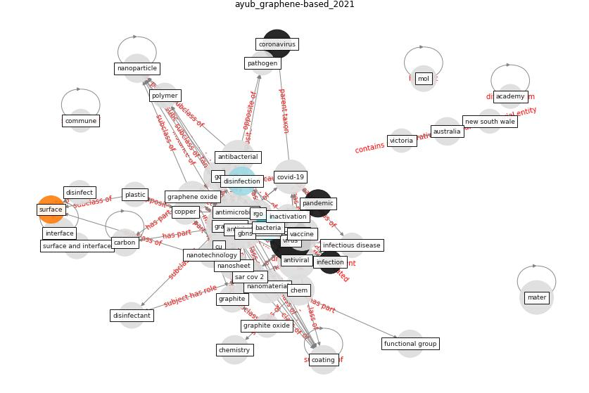

# Article: Graphene-based nanomaterials as antimicrobial surface coatings: A parallel approach to restrain the expansion of COVID-19 (ayub_graphene-based_2021)

* Source: [10.1016/j.surfin.2021.101460](https://doi.org/10.1016/j.surfin.2021.101460)
* Year: 2021
* Cluster: [city-health](cluster_14)

## Keywords

 * [academy](keyword_academy), [aerosol](keyword_aerosol), antibacterial, [antimicrobial](keyword_antimicrobial), [antiviral](keyword_antiviral), antiviral coating, antiviral drug, antiviral surface coating, au, [australia](keyword_australia), [bacteria](keyword_bacteria), bio mater, carbon, carbon nanomaterial, coat, [coating](keyword_coating), commune, [copper](keyword_copper), [coronavirus](keyword_coronavirus), coronavirus disease, [covid 19 pandemic](keyword_covid_19_pandemic), [covid-19](keyword_covid-19), cu, curcumin, current pandemic, cytotoxicity, das, disinfect, [disinfectant](keyword_disinfectant), [disinfection](keyword_disinfection), [droplet](keyword_droplet), e v, electrostatic interaction, envelope, fig al, fullerene, functional group, gbns, go, goel, [graphene](keyword_graphene), graphene oxide, graphite, graphite oxide, [health](keyword_health), [inactivation](keyword_inactivation), [infection](keyword_infection), [infectious disease](keyword_infectious_disease), [influenza](keyword_influenza), interface, [manhattan](keyword_manhattan), [mater](keyword_mater), mater mater, microbe, [microorganism](keyword_microorganism), mnps, mol, nanocomposite, nanomaterial, nanoparticle, nanosheet, nanosystem, nanotech, nanotechnol, nanotechnology, [new south wale](keyword_new_south_wale), [new york city](keyword_new_york_city), nucleic acid, organic, oxidative stress, oxygen, paint, [pandemic](keyword_pandemic), [pathogen](keyword_pathogen), physico chemical process, plastic, [polymer](keyword_polymer), protein, [public](keyword_public), rgo, [rna](keyword_rna), s protein, [sar cov 2](keyword_sar_cov_2), silver nanoparticle, skin, [stainless steel](keyword_stainless_steel), [surface](keyword_surface), surface and interface, surface coating, toxicity, [transmission](keyword_transmission), [vaccine](keyword_vaccine), varnish, victoria, [viral](keyword_viral), viral infection, viral membrane, [virus](keyword_virus), who, who int

## Concepts

 

## Neighbours

### Closest articles

* Sars-CoV-2 (COVID-19) inactivation capability of copper-coated touch surface fabricated by cold-spray technology - [LINK](article_hutasoit_sars-cov-2_2020)
* A Surface Coating that Rapidly Inactivates SARS-CoV-2 - [LINK](article_behzadinasab_surface_2020)
* A Continuously Active Antimicrobial Coating effective against Human Coronavirus 229E - [LINK](article_ikner_continuously_2020)
* KIX to apply antimicrobial coating in its fight against COVID-19 - [LINK](article_kansai_airport_kix_2021)
* Aerosol and Surface Stability of SARS-CoV-2 as Compared with SARS-CoV-1 - [LINK](article_van_doremalen_aerosol_2020)
* Persistence of coronaviruses on inanimate surfaces and their inactivation with biocidal agents - [LINK](article_kampf_persistence_2020)
* Sustainability of Coronavirus on Different Surfaces - [LINK](article_suman_sustainability_2020)
* Current knowledge of COVID-19: Advances, challenges and future perspectives - [LINK](article_wu_current_2021)
* COVID-19 Pandemic: Prevention and Protection Measures to Be Adopted at the Workplace - [LINK](article_cirrincione_covid-19_2020)
* COVID-19 and its Modes of Transmission - [LINK](article_karia_covid-19_2020)

### Closest BPs

* Blueprint: Antimicrobial Surfaces - [LINK](bp_5)
* Blueprint: Good hand hygiene practice - [LINK](bp_16)
* Blueprint: Reducing contact points - [LINK](bp_17)
