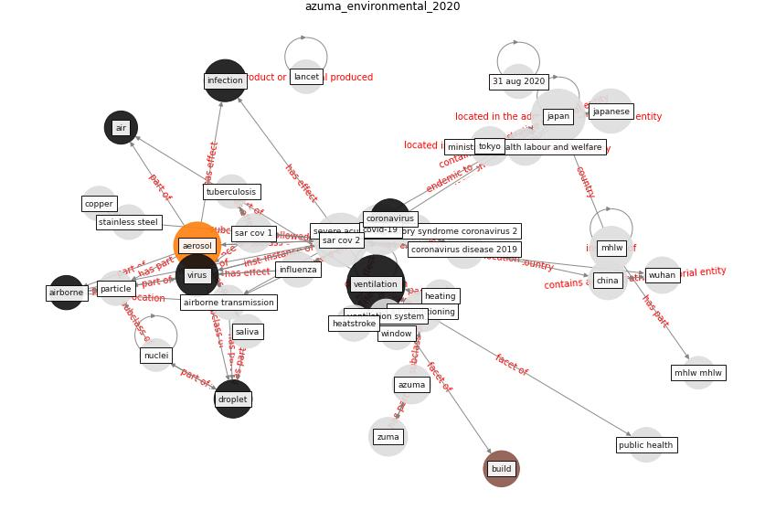

# Article: Environmental factors involved in SARS-CoV-2 transmission: effect and role of indoor environmental quality in the strategy for COVID-19 infection control (azuma_environmental_2020)

* Source: [10.1186/s12199-020-00904-2](https://doi.org/10.1186/s12199-020-00904-2)
* Year: 2020
* Cluster: [air-uv](cluster_2)

## Keywords

 * [aerosol](keyword_aerosol), aerosol size distribution, aerosol transmission, [air](keyword_air), [air conditioning](keyword_air_conditioning), [airborne](keyword_airborne), airborne transmission, airflow, asymptomatic, [australia](keyword_australia), azuma, biryukov j, breathing, [build](keyword_build), cabinet secretariat, carpet, [china](keyword_china), clean air, contact transmission, [copper](keyword_copper), copper sar cov 1 nr nr 8h 1 day 1 5 van doremalen et, copper sar cov 2 nr nr 4h 8h 0 8 van doremalen et, corona virus, [coronavirus](keyword_coronavirus), cough, [covid-19](keyword_covid-19), [disinfection](keyword_disinfection), [droplet](keyword_droplet), environmental health, environmental health and preventive medicine, epidemiol, escombe, filtration, gilman rh, guangzhou, [health](keyword_health), heating, heatstroke, [hospital](keyword_hospital), houston, [hubei](keyword_hubei), [indoor](keyword_indoor), indoor air, [indoor environment](keyword_indoor_environment), indoor environmental quality control, [infect](keyword_infect), [infection](keyword_infection), infectious, [influenza](keyword_influenza), [influenza virus](keyword_influenza_virus), [japan](keyword_japan), japanese, li y, [manhattan](keyword_manhattan), menzie d, mhlw, mhlw mhlw, ministry of health labour and welfare, montero da, [nature](keyword_nature), [new south wale](keyword_new_south_wale), [new york city](keyword_new_york_city), nuclei, paper, [particle](keyword_particle), pastorino b, precautionary principle, preventive medicine, prime minister of japan, probability of infection, [public health](keyword_public_health), qian, relative humidity, respiratory droplet, saliva, sar cov, [sar cov 1](keyword_sar_cov_1), [sar cov 2](keyword_sar_cov_2), sarscov 2, severe acute respiratory syndrome coronavirus 2, sneeze, speech, [spread](keyword_spread), [stainless steel](keyword_stainless_steel), summer, sunlight, surgical mask, [temperature](keyword_temperature), tissue paper, tokyo, [transmission](keyword_transmission), [tuberculosis](keyword_tuberculosis), [uvgi](keyword_uvgi), [ventilation](keyword_ventilation), ventilation rate, [ventilation system](keyword_ventilation_system), [virus](keyword_virus), [window](keyword_window), [wuhan](keyword_wuhan), zuma

## Concepts

 

## Neighbours

### Closest articles

* The ventilation of buildings and other mitigating measures for COVID-19: a focus on wintertime - [LINK](article_burridge_ventilation_2021)
* 2019 Novel Coronavirus (COVID-19) Pandemic: Built Environment Considerations To Reduce Transmission - [LINK](article_dietz_2019_2020)
* The efficacy of social distance and ventilation effectiveness in preventing COVID-19 transmission - [LINK](article_sun_efficacy_2020)
* Methods for air cleaning and protection of building occupants from airborne pathogens - [LINK](article_bolashikov_methods_2009)
* How can airborne transmission of COVID-19 indoors be minimised? - [LINK](article_morawska_how_2020)
* A review of facilities management interventions to mitigate respiratory infections in existing buildings - [LINK](article_zhang_review_2022)
* Heating, ventilation and air-conditioning systems in the context of COVID-19 - [LINK](article_ecdc_heating_2020)
* A Review on Building Design as a Biomedical System for Preventing COVID-19 Pandemic - [LINK](article_amran_review_2022)
* Architectural design strategies for infection prevention and control (IPC) in health-care facilities: towards curbing the spread of Covid-19 \textbar SpringerLink - [LINK](article_udomiaye_architectural_2020)

### Closest BPs

* Installing UV in ductwork - [LINK](bp_10)
* Indoor Environmental Quality (IEQ) monitoring system - [LINK](bp_3)
* Installing high-efficiency air filters - [LINK](bp_11)
