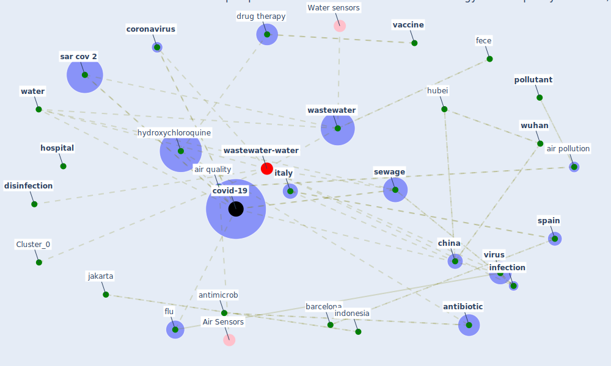

# Article: An environmental and health perspective for COVID-19 outbreak: Meteorology and air quality influence, sewage epidemiology indicator, hospitals disinfection, drug therapies and recommendations (barcelo_environmental_2020)

* Source: [10.1016/j.jece.2020.104006](https://doi.org/10.1016/j.jece.2020.104006)
* Year: 2020
* Cluster: [wastewater-water](cluster_0)

## Keywords

 * administrative region, [aerosol](keyword_aerosol), [air pollution](keyword_air_pollution), air quality, [antibiotic](keyword_antibiotic), antimicrob, [antimicrobial](keyword_antimicrobial), [australia](keyword_australia), az, [barcelona](keyword_barcelona), ben tscharke, bruno frediani, [china](keyword_china), [chlorine](keyword_chlorine), christian daugthon, [coronavirus](keyword_coronavirus), cough, covid 19 outbreak, [covid-19](keyword_covid-19), dario caro, declaration of interest, [disinfectant](keyword_disinfectant), [disinfection](keyword_disinfection), drug therapy, edoardo conticini, [environmental](keyword_environmental), [epidemiology](keyword_epidemiology), [europe](keyword_europe), european region, fece, flu, [france](keyword_france), heat sensitive, high no2 level, [hospital](keyword_hospital), [hubei](keyword_hubei), hydroxychloroquine, idaea csic, inactivation, [india](keyword_india), [indonesia](keyword_indonesia), [infection](keyword_infection), [italy](keyword_italy), ivermectin, jakarta, jiaying li, jordi girona, julian zaugg, leanne dierens, lockdown in barcelona, log inactivation, lopinavir, low covid 19 infection, luo bin, [malaria](keyword_malaria), [mater](keyword_mater), meteorology, [netherland](keyword_netherland), [new york city](keyword_new_york_city), no2, north, o3, paris, [pathogen](keyword_pathogen), [pcr](keyword_pcr), [pollen](keyword_pollen), [pollutant](keyword_pollutant), remdesivir, reprocess, [respiratory](keyword_respiratory), [result](keyword_result), sar 1 cov 2, [sar cov 2](keyword_sar_cov_2), sar cov 2 epidemic, satellite, science, seasonal, serum, [sewage](keyword_sewage), sneeze, [spain](keyword_spain), spring, [taiwan](keyword_taiwan), technol sci, [tempe](keyword_tempe), [temperature](keyword_temperature), uv irradiation, [vaccine](keyword_vaccine), [virus](keyword_virus), warm temperature, waste water, [wastewater](keyword_wastewater), wastewater treatment, wastewater treatment plant, [water](keyword_water), water re, william a rutalab, [wuhan](keyword_wuhan), zhejiang, zhou

## Concepts

 

## Neighbours

### Closest articles

* Computational analysis of SARS-CoV-2/COVID-19 surveillance by wastewater-based epidemiology locally and globally: Feasibility, economy, opportunities and challenges - [LINK](article_hart_computational_2020)
* Future perspectives of wastewater-based epidemiology: Monitoring infectious disease spread and resistance to the community level - [LINK](article_sims_future_2020)
* When the fourth water and digital revolution encountered COVID-19 - [LINK](article_poch_when_2020)
* Designing a Multi-Agent Occupant Simulation System to Support Facility Planning and Analysis for COVID-19 - [LINK](article_lee_designing_2021)
* How the Coronavirus Will Reshape Architecture - [LINK](article_chayka_how_2020)
* China adapts survey drones to enforce world’s largest quarantine - [LINK](article_liu_china_2020)

### Closest BPs

* Blueprint: Monitoring of wastewater - [LINK](bp_21)
* Blueprint: Indoor Environmental Quality (IEQ) monitoring system - [LINK](bp_3)
* Blueprint: Air Cleaning Plants - [LINK](bp_15)
