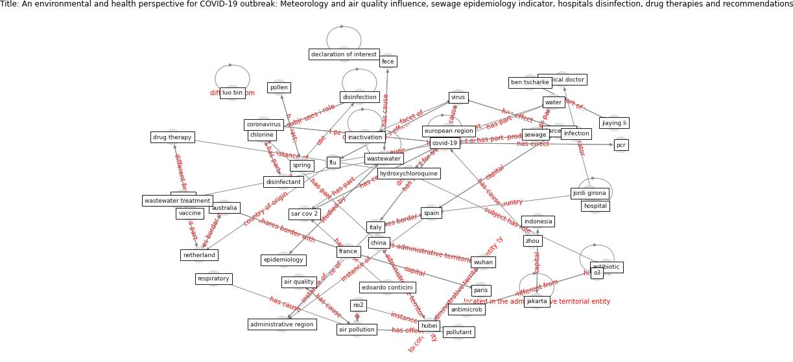

# Article: An environmental and health perspective for COVID-19 outbreak: Meteorology and air quality influence, sewage epidemiology indicator, hospitals disinfection, drug therapies and recommendations (barcelo_environmental_2020)

* Source: [10.1016/j.jece.2020.104006](https://doi.org/10.1016/j.jece.2020.104006)
* Year: 2020
* Cluster: [wastewater-sars](cluster_2)

## Keywords

 * administrative region, [aerosol](keyword_aerosol), [air pollution](keyword_air_pollution), air quality, [antibiotic](keyword_antibiotic), antimicrob, [antimicrobial](keyword_antimicrobial), aristide lemaître, [australia](keyword_australia), az, [barcelona](keyword_barcelona), ben tscharke, bruno frediani, [china](keyword_china), [chlorine](keyword_chlorine), christian daugthon, [coronavirus](keyword_coronavirus), cough, covid 19 outbreak, [covid-19](keyword_covid-19), dario caro, declaration of interest, [disinfectant](keyword_disinfectant), [disinfection](keyword_disinfection), drug therapy, edoardo conticini, environmental, [epidemiology](keyword_epidemiology), [europe](keyword_europe), european region, favipiravir, fece, financial interest, flu, [france](keyword_france), healthcare worker, heat sensitive, high no2 level, [hospital](keyword_hospital), hospital personnel, [hubei](keyword_hubei), hydroxychloroquine, idaea csic, [inactivation](keyword_inactivation), [india](keyword_india), [indonesia](keyword_indonesia), [infection](keyword_infection), iran, [italy](keyword_italy), ivermectin, jakarta, jiaying li, jordi girona, julian zaugg, low covid 19 infection, luo bin, [malaria](keyword_malaria), [mater](keyword_mater), medical doctor, meteorology, neil rowan, [netherland](keyword_netherland), [new york city](keyword_new_york_city), no2, north, o3, [pandemic](keyword_pandemic), paris, [pathogen](keyword_pathogen), [pcr](keyword_pcr), personal relationship, [pollen](keyword_pollen), [pollutant](keyword_pollutant), remdesivir, reprocess, respiratory, result, [sar cov 2](keyword_sar_cov_2), science, serum, [sewage](keyword_sewage), sneeze, [spain](keyword_spain), spring, stool, technol sci, [tempe](keyword_tempe), [temperature](keyword_temperature), uv irradiation, [vaccine](keyword_vaccine), [virus](keyword_virus), warm temperature, waste water, [wastewater](keyword_wastewater), wastewater treatment, [water](keyword_water), william a rutalab, [wuhan](keyword_wuhan), zhejiang, zhou

## Concepts

 

## Neighbours

### Closest articles

* Disinfection technology of hospital wastes and wastewater: Suggestions for disinfection strategy during coronavirus Disease 2019 (COVID-19) pandemic in China - [LINK](article_wang_disinfection_2020)
* When the fourth water and digital revolution encountered COVID-19 - [LINK](article_poch_when_2020)
* Wastewater surveillance for population-wide Covid-19: The present and future - [LINK](article_daughton_wastewater_2020)
* SARS-CoV-2 in wastewater: potential health risk, but also data source - [LINK](article_lodder_sars-cov-2_2020)
* Computational analysis of SARS-CoV-2/COVID-19 surveillance by wastewater-based epidemiology locally and globally: Feasibility, economy, opportunities and challenges - [LINK](article_hart_computational_2020)
* Future perspectives of wastewater-based epidemiology: Monitoring infectious disease spread and resistance to the community level - [LINK](article_sims_future_2020)
* Wastewater-Based Epidemiology to monitor COVID-19 outbreak: Present and future diagnostic methods to be in your radar - [LINK](article_barcelo_wastewater-based_2020)
* Presence of SARS-Coronavirus-2 RNA in Sewage and Correlation with Reported COVID-19 Prevalence in the Early Stage of the Epidemic in The Netherlands - [LINK](article_medema_presence_2020)
* First detection of SARS-CoV-2 in untreated wastewaters in Italy - [LINK](article_la_rosa_first_2020)
* Indirect effects of COVID-19 on the environment - [LINK](article_zambrano-monserrate_indirect_2020)

### Closest BPs

* Blueprint: Monitoring of wastewater [CID] - [LINK](bp_21)
* Blueprint: Negative pressure rooms - [LINK](bp_13)
* Blueprint: Resilience in staffing and skills training - [LINK](bp_12)
