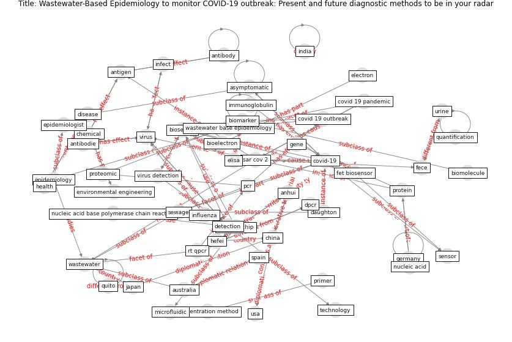

# Article: __Wastewater-Based Epidemiology to monitor COVID-19 outbreak: Present and future diagnostic methods to be in your radar__ (barcelo_wastewater-based_2020)

* [10.1016/j.cscee.2020.100042](https://doi.org/10.1016/j.cscee.2020.100042)
* Cluster: [wastewater-sars](cluster_12)

## Keywords

* [covid-19](keyword_covid-19), [virus](keyword_virus), [sar cov 2](keyword_sar_cov_2), [environ](keyword_environ), [biosensor](keyword_biosensor), [biomarker](keyword_biomarker), [total environ](keyword_total_environ), wang, [pcr](keyword_pcr), [detection](keyword_detection), [wastewater](keyword_wastewater), chemical, [china](keyword_china), environmental engineering, [asymptomatic](keyword_asymptomatic)

## Keywords at large

* [biophilic design](keyword_biophilic_design), [architecture](keyword_architecture), [sustainable architecture](keyword_sustainable_architecture), [nature](keyword_nature), [design](keyword_design), [biophilic](keyword_biophilic), [environ](keyword_environ), [biophilia](keyword_biophilia), [wellbeing](keyword_wellbeing), [health](keyword_health)

## Concepts

 

### References 

* [Wastewater surveillance for population-wide Covid-19:
The present and future](article_daughton_wastewater_2020)
* [An environmental and health perspective for COVID-19
outbreak: Meteorology and air quality influence, sewage
epidemiology indicator, hospitals disinfection, drug
therapies and recommendations](article_barcelo_environmental_2020)
* [Presence of SARS-Coronavirus-2 RNA in Sewage and
Correlation with Reported COVID-19 Prevalence in
the Early Stage of the Epidemic in The
Netherlands](article_medema_presence_2020)
* [First detection of SARS-CoV-2 in untreated wastewaters
in Italy](article_la_rosa_first_2020)
* [First confirmed detection of SARS-CoV-2 in untreated
wastewater in Australia: A proof of concept for the
wastewater surveillance of COVID-19 in the community](article_ahmed_first_2020)

### Cited by 

