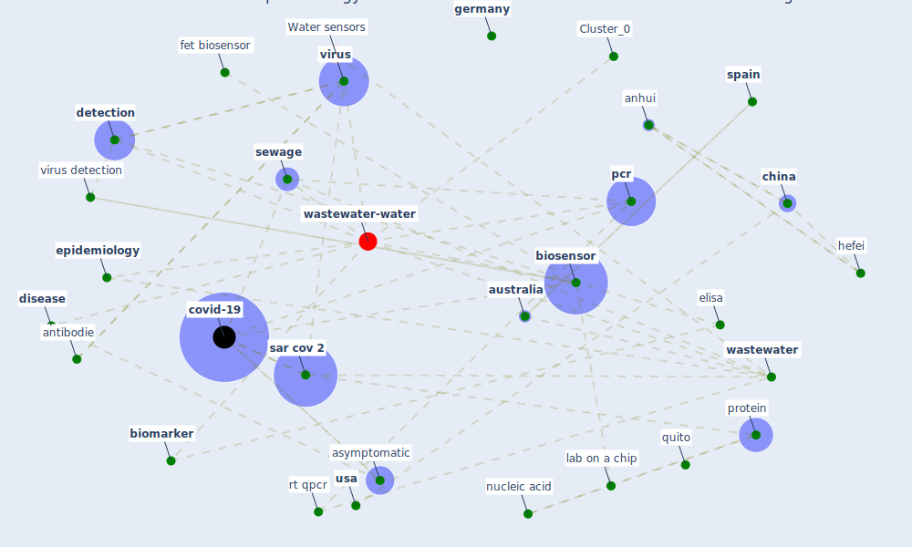

# Article: Wastewater-Based Epidemiology to monitor COVID-19 outbreak: Present and future diagnostic methods to be in your radar (barcelo_wastewater-based_2020)

* Source: [10.1016/j.cscee.2020.100042](https://doi.org/10.1016/j.cscee.2020.100042)
* Year: 2020
* Cluster: [wastewater-water](cluster_0)

## Keywords

 * anhui, antibodie, antibody, antigen, asymptomatic, [australia](keyword_australia), biochem, biochemical, bioelectron, [biomarker](keyword_biomarker), biomerieux, biomolecule, [biosensor](keyword_biosensor), biotechnol, [china](keyword_china), concentration method, covid 19 outbreak, [covid 19 pandemic](keyword_covid_19_pandemic), [covid-19](keyword_covid-19), crispr, daughton, [detection](keyword_detection), [device](keyword_device), diagnostic, diagnostic method, disadvantage, [disease](keyword_disease), dpcr, ecuador, effluent, electron, elisa, [epidemic](keyword_epidemic), epidemiologist, [epidemiology](keyword_epidemiology), fece, fet, fet biosensor, [france](keyword_france), [gene](keyword_gene), gene editing, genetic information, genexpert, [genome](keyword_genome), [germany](keyword_germany), [health](keyword_health), hefei, immunoglobulin, [india](keyword_india), [infect](keyword_infect), inflammatory response biomarker, [influent](keyword_influent), influenza, isoprostane, [japan](keyword_japan), lab on a chip, lionx, loc, louisiana, [manhattan](keyword_manhattan), [mer cov](keyword_mer_cov), microfluidic, ms, nucleic acid, nucleic acid base polymerase chain reaction, nucleic acid extraction, [pandemic](keyword_pandemic), paris, [pcr](keyword_pcr), pcr assay, [primer](keyword_primer), protein, proteomic, pump, quantitative analysis, quantification, quito, rna extraction, rt qpcr, [russia](keyword_russia), [sar cov 2](keyword_sar_cov_2), science of the environment, [sensor](keyword_sensor), ser biosensor, [sewage](keyword_sewage), [smartphone](keyword_smartphone), [spain](keyword_spain), surface plasmon resonance, [technology](keyword_technology), [transmission](keyword_transmission), urine, [usa](keyword_usa), [virus](keyword_virus), virus detection, [wastewater](keyword_wastewater), wastewater base epidemiology, wastewater matrix, zhejiang, field effect transistor, fluid

## Concepts

 

## Neighbours

### Closest articles

* First detection of SARS-CoV-2 in untreated wastewaters in Italy - [LINK](article_la_rosa_first_2020)
* SARS-CoV-2 RNA in wastewater anticipated COVID-19 occurrence in a low prevalence area - [LINK](article_randazzo_sars-cov-2_2020)
* Detection of SARS-CoV-2 in raw and treated wastewater in Germany – Suitability for COVID-19 surveillance and potential transmission risks - [LINK](article_westhaus_detection_2021)
* Presence of SARS-Coronavirus-2 RNA in Sewage and Correlation with Reported COVID-19 Prevalence in the Early Stage of the Epidemic in The Netherlands - [LINK](article_medema_presence_2020)
* First confirmed detection of SARS-CoV-2 in untreated wastewater in Australia: A proof of concept for the wastewater surveillance of COVID-19 in the community - [LINK](article_ahmed_first_2020)
* SARS-CoV-2 Titers in Wastewater Are Higher than Expected from Clinically Confirmed Cases - [LINK](article_wu_sars-cov-2_2020)
* A Continuously Active Antimicrobial Coating effective against Human Coronavirus 229E - [LINK](article_ikner_continuously_2020)
* Coronavirus and Climate Change - [LINK](article_harvard_th_chan_schoold_of_public_health_coronavirus_2020)
* Sars-CoV-2 (COVID-19) inactivation capability of copper-coated touch surface fabricated by cold-spray technology - [LINK](article_hutasoit_sars-cov-2_2020)

### Closest BPs

* Blueprint: Negative pressure rooms - [LINK](bp_13)
* Blueprint: Smart Locker System - [LINK](bp_1)
* Blueprint: Rotational Shift System - [LINK](bp_0)
