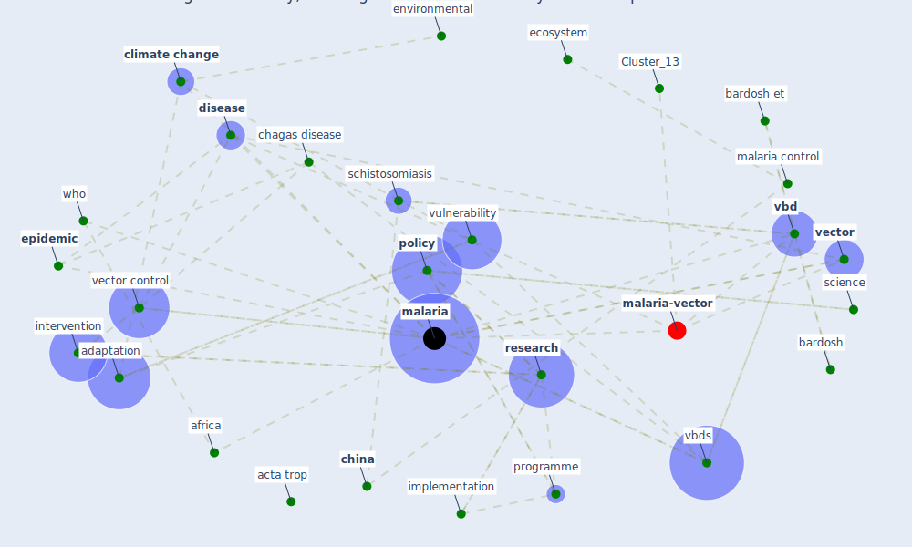

# Article: Addressing vulnerability, building resilience: community-based adaptation to vector-borne diseases in the context of global change (bardosh_addressing_2017)

* Source: [10.1186/s40249-017-0375-2](https://doi.org/10.1186/s40249-017-0375-2)
* Year: 2017
* Cluster: [malaria-vector](cluster_13)

## Keywords

 * acta trop, action, adaptation, aedes vectors, [africa](keyword_africa), agricultural, [australia](keyword_australia), bardosh, bardosh et, [brazil](keyword_brazil), cambridge, cambridge university press, [chagas disease](keyword_chagas_disease), chikungunya, [child](keyword_child), [china](keyword_china), [climate change](keyword_climate_change), climatic, [community](keyword_community), community participation, [control](keyword_control), cost, decision make, [dengue](keyword_dengue), ding g, [disease](keyword_disease), disease ecology, dokken, ecohealth, ecology, [ecosystem](keyword_ecosystem), editor, environmental, [epidemic](keyword_epidemic), [epidemiological](keyword_epidemiological), geneva, ghana, [health](keyword_health), [health system](keyword_health_system), houston, implementation, [infection](keyword_infection), [infectious disease](keyword_infectious_disease), integrate vector management, intervention, irrigation, latin america, leishmaniasis, [low](keyword_low), mach kj, main body, [malaria](keyword_malaria), malaria control, malaria control in china, [manhattan](keyword_manhattan), manila, mc, mediterranean, [mosquito](keyword_mosquito), [new south wale](keyword_new_south_wale), [new york city](keyword_new_york_city), ngo, organization, parasit, parasite, parasitol, paris agreement, [pathogen](keyword_pathogen), [policy](keyword_policy), poverty, programme, [public health](keyword_public_health), [research](keyword_research), [resilience](keyword_resilience), [sanitation](keyword_sanitation), sauerborn r, schistosomiasis, science, [semenza](keyword_semenza), [social](keyword_social), [surveillance](keyword_surveillance), [system](keyword_system), systematic review, [tanzania](keyword_tanzania), [technology](keyword_technology), uganda, uncertainty, university of florida, [vbd](keyword_vbd), vbds, [vector](keyword_vector), [vector borne disease](keyword_vector_borne_disease), vector control, vector illnesses, vectorborne diseases, [vulnerability](keyword_vulnerability), [water](keyword_water), who, who press, [world health organization](keyword_world_health_organization)

## Concepts

 

## Neighbours

### Closest articles

* Prototype Early Warning Systems for Vector-Borne Diseases in Europe - [LINK](article_semenza_prototype_2015)
* Decision Making within the Built Environment as a Strategy for Mitigating the Risk of Malaria and Other Vector-Borne Diseases - [LINK](article_obonyo_decision_2018)
* Integrating rapid risk mapping and mobile phone call record data for strategic malaria elimination planning - [LINK](article_tatem_integrating_2014)
* The impact of climate change on the epidemiology and control of Rift Valley fever - PubMed - [LINK](article_martin_impact_2008)
* Vector-borne disease, climate change and urban design - [LINK](article_ogden_vector-borne_2016)
* Challenges to Mitigating the Urban Health Burden of Mosquito-Borne Diseases in the Face of Climate Change - [LINK](article_ligsay_challenges_2021)
* Global policy challenges for urban vector-borne disease risks - [LINK](article_alabaster_global_2016)
* Making green infrastructure healthier infrastructure - [LINK](article_lohmus_making_2015)
* Green infrastructure through the lens of “One Health”: A systematic review and integrative framework uncovering synergies and trade-offs between mental health and wildlife support in cities - [LINK](article_felappi_green_2020)
* The Emergence of Anti-Privacy and Control at the Nexus between the Concepts of Safe City and Smart City - [LINK](article_allam_emergence_2019)

### Closest BPs

* Blueprint: Mental health – Act: Do something - [LINK](bp_18)
* Blueprint: Mental health – Commit: Do something meaningfull - [LINK](bp_20)
* Blueprint: Mental health – Belong: Do something with someone - [LINK](bp_19)
