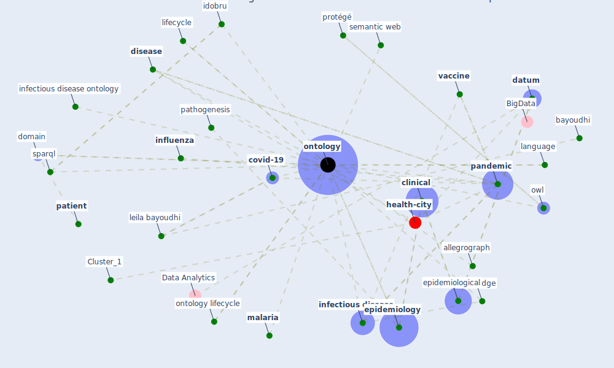

# Article: An Overview of Biomedical Ontologies for Pandemics and Infectious Diseases Representation (bayoudhi_overview_2021)

* Source: [10.1016/j.procs.2021.09.201](https://doi.org/10.1016/j.procs.2021.09.201)
* Year: 2021
* Cluster: [ontology-datum](cluster_12)

## Keywords

 * [agent](keyword_agent), allegrograph, application ontology, b smith, bayoudhi, bfo, bioinformatic, brucellosis, [cido](keyword_cido), class, clinical, codo, codo ontology, communication, computer science, contagious, core layer, cough, [covid 19 pandemic](keyword_covid_19_pandemic), [covid-19](keyword_covid-19), [datum](keyword_datum), decision support system, [dengue](keyword_dengue), deployment, discourse, [disease](keyword_disease), dl, [domain](keyword_domain), domain knowledge, economic damage, emerge pandemic, en ligne, [environment](keyword_environment), [epidemiological](keyword_epidemiological), [epidemiology](keyword_epidemiology), evaluation, evolution, fact, formalism, framework, graph, host, [human](keyword_human), ido core, idobru, increase disease, infectious, infectious agent carrier, [infectious disease](keyword_infectious_disease), infectious disease informatic, infectious disease ontology, [influenza](keyword_influenza), information system, inter perspective relation, [interoperability](keyword_interoperability), intra perspective relation, [knowledge](keyword_knowledge), knowledge engineering, language, leila bayoudhi, lifecycle, ligne, literature, ljubljana, m k jayawardhana, [malaria](keyword_malaria), moreover, [mosquito](keyword_mosquito), ncbi, [ontology](keyword_ontology), ontology editor, ontology language, ontology lifecycle, owl, [pandemic](keyword_pandemic), [pathogen](keyword_pathogen), pathogenesis, [patient](keyword_patient), protégé, protégé ontology editor, [public health](keyword_public_health), query language, risk factor, [sar cov 2](keyword_sar_cov_2), sbissi, [semantic](keyword_semantic), semantic web, [service](keyword_service), snap sparql, sparql, [spread](keyword_spread), [symptom](keyword_symptom), taxonomy, [unesco](keyword_unesco), [vaccine](keyword_vaccine), vector biology, [virus](keyword_virus), w3 org, w3c, [world heritage site](keyword_world_heritage_site)

## Concepts

 

## Neighbours

### Closest articles

* The COVID-19 epidemiology and monitoring ontology - [LINK](article_queralt-rosinach_covid-19_2021)
* An Overview of Ontologies and Tool Support for COVID-19 Analytics - [LINK](article_ahmad_overview_2021)
* CIDO, a community-based ontology for coronavirus disease knowledge and data integration, sharing, and analysis - [LINK](article_he_cido_2020)
* Covid-19 and the politics of sustainable energy transitions - [LINK](article_kuzemko_covid-19_2020)
* Contextualizing the Covid-19 pandemic for a carbon-constrained world: Insights for sustainability transitions, energy justice, and research methodology - [LINK](article_sovacool_contextualizing_2020)
* How to Make Green Building Certification &amp; Rating Systems More Pandemic-Sustainable? - [LINK](article_ujikawa_how_2022)
* Assessment method for new sustainability indicators providing pandemic resilience for residential buildings - [LINK](article_tokazhanov_assessment_2021)
* Readiness Assessment of Green Building Certification Systems for Residential Buildings during Pandemics - [LINK](article_tleuken_readiness_2021)
* Validity of energy social research during and after COVID-19: challenges, considerations, and responses - [LINK](article_fell_validity_2020)
* Addressing the impact of COVID-19 lockdown on energy use in municipal buildings: A case study in Florianópolis, Brazil - [LINK](article_geraldi_addressing_2021)

### Closest BPs

* Blueprint: nan - [LINK](bp_34)
* Blueprint: Building Adaptation during a pandemic - [LINK](bp_14)
* Blueprint: Tender support at building stage - [LINK](bp_9)
