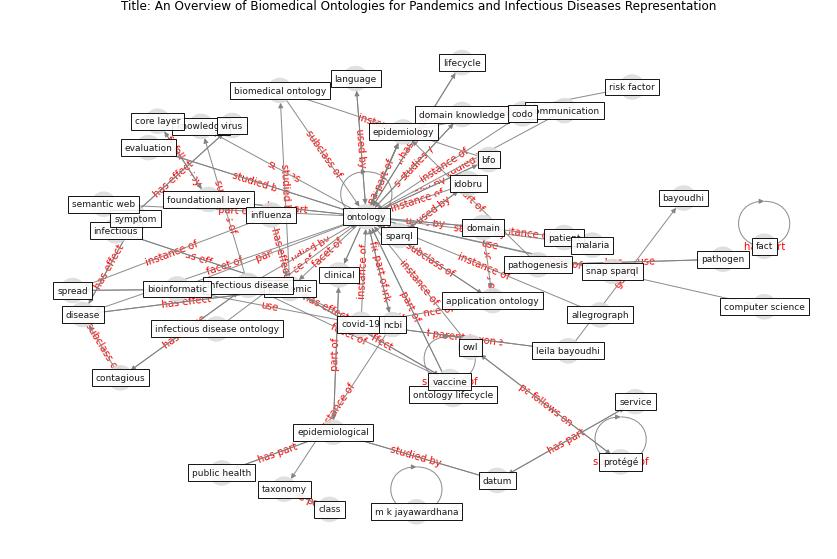

# Article: __An Overview of Biomedical Ontologies for Pandemics and Infectious Diseases Representation__ (bayoudhi_overview_2021)

* [10.1016/j.procs.2021.09.201](https://doi.org/10.1016/j.procs.2021.09.201)
* Cluster: [city-smart](cluster_10)

## Keywords

* [ontology](keyword_ontology), [pandemic](keyword_pandemic), [infectious disease](keyword_infectious_disease), [covid-19](keyword_covid-19), [epidemiological](keyword_epidemiological), [disease](keyword_disease), [host](keyword_host), [owl](keyword_owl), [protege](keyword_protege), [epidemiology](keyword_epidemiology), sparql, leila bayoudhi, [domain](keyword_domain), [lifecycle](keyword_lifecycle), clinical

## Keywords at large

* [ontology](keyword_ontology), [pandemic](keyword_pandemic), [infectious disease](keyword_infectious_disease), [covid-19](keyword_covid-19), [epidemiological](keyword_epidemiological), [disease](keyword_disease), [protege](keyword_protege), [owl](keyword_owl), [host](keyword_host), [epidemiology](keyword_epidemiology)

## Concepts

 

### Closest articles 

* [The COVID-19 epidemiology and monitoring ontology](article_queralt-rosinach_covid-19_2021)
* [CIDO, a community-based ontology for coronavirus disease knowledge and data integration, sharing, and analysis](article_he_cido_2020)
* [An Overview of Ontologies and Tool Support for COVID-19 Analytics](article_ahmad_overview_2021)
* [Exploring the Potential of Artificial Intelligence and Machine Learning to Combat COVID-19 and Existing Opportunities for LMIC: A Scoping Review](article_naseem_exploring_2020)
* [Pandemic Analytics: How Countries are Leveraging Big Data Analytics and Artificial Intelligence to Fight COVID-19?](article_mehta_pandemic_2021)
* [Digital technology and COVID-19](article_ting_digital_2020)
* [Air pollution linked with higher COVID-19 death rates](article_harvard_th_chan_schoold_of_public_health_air_2020)
* [COVID-19 Higher Mortality in Chinese Regions With Chronic Exposure to Lower Air Quality](article_pansini_covid-19_2021)
* [The Smart City and Covid‐19](article_webb_smart_2020)
* [The Emergence of Anti-Privacy and Control at the Nexus between the Concepts of Safe City and Smart City](article_allam_emergence_2019)

### References 

* [CIDO, a community-based ontology for coronavirus disease
knowledge and data integration, sharing, and analysis](article_he_cido_2020)

### Cited by 

