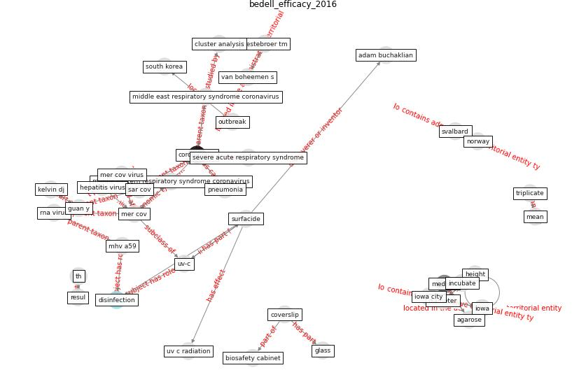

# Article: Efficacy of an Automated Multiple Emitter Whole-Room Ultraviolet-C Disinfection System Against Coronaviruses MHV and MERS-CoV (bedell_efficacy_2016)

* Source: [10.1017/ice.2015.348](https://doi.org/10.1017/ice.2015.348)
* Year: 2016
* Cluster: [health-patient](cluster_14)

## Keywords

 * 2 medium, 37 c, adam buchaklian, agarose, america, baker sc, baric rs, bestebroer tm, biosafety cabinet, bleach, carcinoembryonic antigen, cell line, cluster analysis, conflict, [coronavirus](keyword_coronavirus), coverslip, d10, [decontamination](keyword_decontamination), diameter, dilution, [disinfection](keyword_disinfection), dulbecco, [epidemic](keyword_epidemic), farooqui, glass, glycoprotein, guan y, height, hela cell, hepatitis virus, hui, human tohuman transmission, incubate, infective, iowa, iowa city, kelvin dj, laser, mean, medium, [mer cov](keyword_mer_cov), mer cov outbreak, mer cov virus, mer outbreak, mhv a59, mhv receptor7, middle east respiratory syndrome coronavirus, middle eastern respiratory syndrome coronavirus, modified eagle s medium, naperville, near field object, no conflict of interest, norway, [outbreak](keyword_outbreak), phosphate buffer saline, pneumonia, prepare, recent outbreak, replicate, replicate experiment, resul, resul ts m e th o, resuspension, rna virus, rotate, rotate 360, [sample](keyword_sample), sar cov, severe acute respiratory syndrome, severe acute respiratory syndrome sar, smather, smather e, society for healthcare epidemiology, solidify, [south korea](keyword_south_korea), stanley perlman, sterile, [surfacide](keyword_surfacide), surfacide disinfection system, surfacide multiple emitter, surfacide multiple emitter system, surfacide system, surfacide uv c, svalbard, th, triplicate, triplicate sample, ultraviolet c, ultraviolet c emit, ultraviolet c emit device, university of iowa, uv c radiation, [uv-c](keyword_uv-c), van boheemen s, vero81, [virus](keyword_virus), virus spread, wash, zumla, β coronavirus

## Concepts

 

## Neighbours

### Closest articles

* Far-UVC light (222 nm) efficiently and safely inactivates airborne human coronaviruses - [LINK](article_buonanno_far-uvc_2020)
* Effect of Ultraviolet Germicidal Irradiation on Viral Aerosols - [LINK](article_walker_effect_2007)
* Recently employed engineering techniques to reduce the spread of COVID-19 (corona virus disease 2019): a review study - [LINK](article_saman_recently_2021)
* Upper-room ultraviolet air disinfection might help to reduce COVID-19 transmission in buildings: a feasibility study - [LINK](article_beggs_upper-room_2020)
* Case Study: Using Germicidal UV-C to Mitigate COVID-19 - HVAC - [LINK](article_healthcare_facilities_today_case_2021)
* Behind the Update: ASHRAE Handbook Chapters on UV-C to Include Updated Best Practices, Guidance - [LINK](article_ashrae_behind_2020)
* Upper-Room Ultraviolet Light and Negative Air Ionization to Prevent Tuberculosis Transmission - [LINK](article_escombe_upper-room_2009)
* Applications of ultraviolet germicidal irradiation disinfection in health care facilities: Effective adjunct, but not stand-alone technology - [LINK](article_memarzadeh_applications_2010)
* Air Disinfection for Airborne Infection Control with a Focus on COVID‐19: Why Germicidal UV is Essential             † - [LINK](article_nardell_air_2021)
* The efficacy of social distance and ventilation effectiveness in preventing COVID-19 transmission - [LINK](article_sun_efficacy_2020)

### Closest BPs

* Blueprint: Installing UV in ductwork - [LINK](bp_10)
* Blueprint: Monitoring of wastewater - [LINK](bp_21)
* Blueprint: Resilience in staffing and skills training - [LINK](bp_12)
