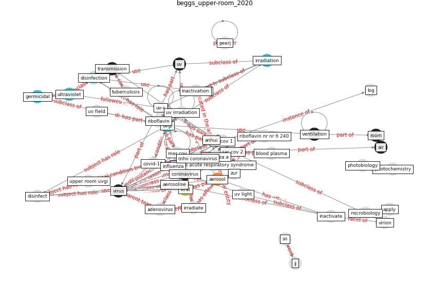

# Article: __Upper-room ultraviolet air disinfection might help to reduce COVID-19 transmission in buildings: a feasibility study__ (beggs_upper-room_2020)

* [10.7717/peerj.10196](https://doi.org/10.7717/peerj.10196)
* Cluster: [air-ventilation](cluster_8)

## Keywords

[coronavirus](keyword_coronavirus), [virus](keyword_virus), [uv](keyword_uv), [air](keyword_air)

## Abstract

As the world’s economies come out of the lockdown
imposed by the COVID-19 pandemic, there is an urgent need
for technologies to mitigate COVID-19 transmission in
confined spaces such as buildings. This feasibility study
looks at one such technology, upper-room ultraviolet (UV)
air disinfection, that can be safely used while humans are
present in the room space, and which has already proven its
efficacy as an intervention to inhibit the transmission of
airborne diseases such as measles and tuberculosis. Using
published data from various sources, it is shown that the
SARS-CoV-2 virus, the causative agent of COVID-19, is
highly likely to be susceptible to UV-C damage when
suspended in air, with a UV susceptibility constant likely
to be in the region 0.377–0.590 m 2 /J, similar to that
for other aerosolised coronaviruses. As such, the UV-C flux
required to disinfect the virus is expected to be
acceptable and safe for upper-room applications. Through
analysis of expected and worst-case scenarios, the efficacy
of the upper-room UV-C approach for reducing COVID-19
transmission in confined spaces (with moderate but
sufficient ceiling height) is demonstrated. Furthermore, it
is shown that with SARS-CoV-2, it should be possible to
achieve high equivalent air change rates using upper-room
UV air disinfection, suggesting that the technology might
be particularly applicable to poorly ventilated spaces.

## Concepts

 

### References 

* [How can airborne transmission of COVID-19 indoors be
minimised?](article_morawska_how_2020-1)

### Cited by 

* [The ventilation of buildings and other mitigating measures
for COVID-19: a focus on wintertime](article_burridge_ventilation_2021)* [Designing Post COVID-19 Buildings: Approaches for
Achieving Healthy Buildings](article_navaratnam_designing_2022)
