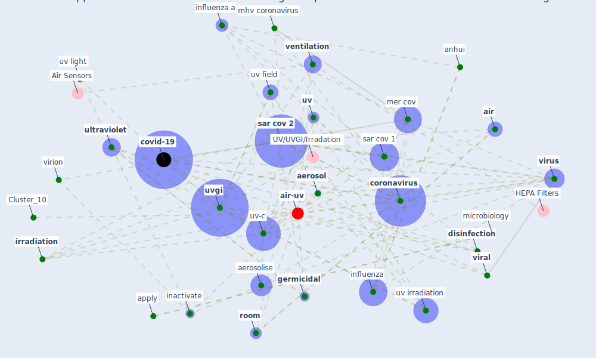

# Article: Upper-room ultraviolet air disinfection might help to reduce COVID-19 transmission in buildings: a feasibility study (beggs_upper-room_2020)

* Source: [10.7717/peerj.10196](https://doi.org/10.7717/peerj.10196)
* Year: 2020
* Cluster: [uv-air](cluster_15)

## Keywords

 * absorption, adenovirus, [aerosol](keyword_aerosol), aerosolise, [air](keyword_air), [air conditioning](keyword_air_conditioning), [airborne](keyword_airborne), airborne disease, anhui, apply, bacilli, bad case scenario, bedell, biology, blood, blood plasma, chia py, coleman kk, compute, [coronavirus](keyword_coronavirus), [covid-19](keyword_covid-19), datum availability, decouple, deep uv, [design](keyword_design), disinfect, [disinfection](keyword_disinfection), efficacy, eid2607, emerge infectious disease, [germicidal](keyword_germicidal), gilman rh, heating, [inactivate](keyword_inactivate), [inactivation](keyword_inactivation), [infection](keyword_infection), inhalation, influenza, influenza a, irradiate, [irradiation](keyword_irradiation), keil, liguid, liquid, log reduction, lytle, marschner, [medium](keyword_medium), [mer cov](keyword_mer_cov), mer cov irradiation, [mhv](keyword_mhv), mhv coronavirus, microbe, microbiology, middle east respiratory syndrome, mycobacterium tuberculosis, navincopa m, operation, [particle](keyword_particle), [pathogen](keyword_pathogen), photobiology, photochemistry, plasma, platelet, respiratory droplet, riboflavin, riboflavin nr nr 6 240, [room](keyword_room), [sar cov 1](keyword_sar_cov_1), [sar cov 2](keyword_sar_cov_2), secondary airborne infection, severe acute respiratory syndrome, shield, signify, sn, source material, [study](keyword_study), substrate, [transmission](keyword_transmission), tubercle, [tuberculosis](keyword_tuberculosis), [ultraviolet](keyword_ultraviolet), upper room uvgi, [uv](keyword_uv), uv b, uv c light, uv irradiation, [uv light](keyword_uv_light), uv field, [uv-c](keyword_uv-c), [uvgi](keyword_uvgi), uvgi system, [ventilation](keyword_ventilation), ventilation rate, [viral](keyword_viral), virion, [virus](keyword_virus), [water](keyword_water), zur, fluid dynamic

## Concepts

 

## Neighbours

### Closest articles

* Effect of Ultraviolet Germicidal Irradiation on Viral Aerosols - [LINK](article_walker_effect_2007)
* Upper-Room Ultraviolet Light and Negative Air Ionization to Prevent Tuberculosis Transmission - [LINK](article_escombe_upper-room_2009)
* Behind the Update: ASHRAE Handbook Chapters on UV-C to Include Updated Best Practices, Guidance - [LINK](article_ashrae_behind_2020)
* Applications of ultraviolet germicidal irradiation disinfection in health care facilities: Effective adjunct, but not stand-alone technology - [LINK](article_memarzadeh_applications_2010)
* Case Study: Using Germicidal UV-C to Mitigate COVID-19 - HVAC - [LINK](article_healthcare_facilities_today_case_2021)
* Far-UVC light (222 nm) efficiently and safely inactivates airborne human coronaviruses - [LINK](article_buonanno_far-uvc_2020)
* Efficacy of an Automated Multiple Emitter Whole-Room Ultraviolet-C Disinfection System Against Coronaviruses MHV and MERS-CoV - [LINK](article_bedell_efficacy_2016)
* Air Disinfection for Airborne Infection Control with a Focus on COVID‐19: Why Germicidal UV is Essential             † - [LINK](article_nardell_air_2021)
* Recently employed engineering techniques to reduce the spread of COVID-19 (corona virus disease 2019): a review study - [LINK](article_saman_recently_2021)
* The efficacy of social distance and ventilation effectiveness in preventing COVID-19 transmission - [LINK](article_sun_efficacy_2020)

### Closest BPs

* Blueprint: Installing UV in ductwork - [LINK](bp_10)
* Blueprint: Negative pressure rooms - [LINK](bp_13)
* Blueprint: Installing high-efficiency air filters - [LINK](bp_11)
